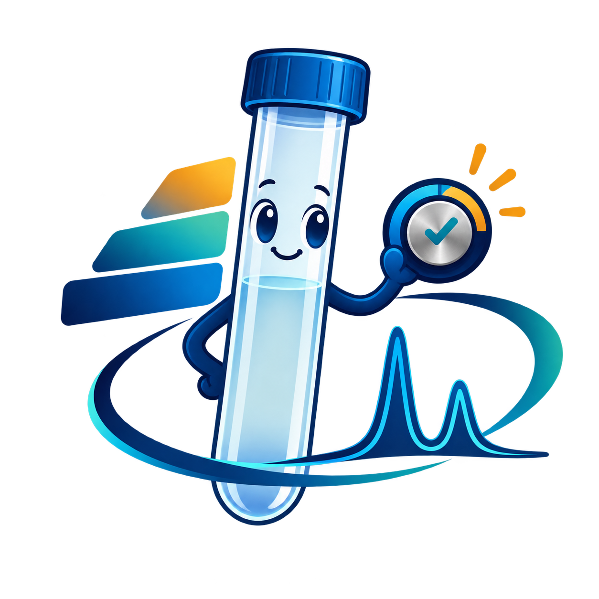

# How to do diffusion NMR experiments

[Español](README_ES.md) · [Full workshop content](docs/en/presentation-content.md) · [Bruker step-by-step guide](docs/en/bruker-step-by-step.md)

A bilingual teaching repository on preparing, acquiring, processing and interpreting diffusion NMR experiments. It contains the complete English and Spanish workshop, including its appendices, speaker notes, videos and supporting numerical material, plus Python tools for Bruker TopSpin.

Workshop authors: **Ignacio Fernández** ([ORCID](https://orcid.org/0000-0001-8355-580X)) and **Francisco Manuel Arrabal-Campos** ([ORCID](https://orcid.org/0000-0002-5510-6297)), University of Almería. The workshop is a 20-minute main presentation with additional technical appendices. The repository name preserves the spelling requested by its maintainer: `how-to-do-diffusion-experimets`.

## Spectrometer calibration GUI — English and Spanish



A guided desktop interface for instrument preparation, **90° pulse calibration from signed nutation data**, and **DOSY scale calibration from a reference signal**. Follow the plan through parameter-only preparation, explicit acquisition/processing, fitting and residual review. Optional LOCK, ATMA, TopShim and temperature actions require a reviewed working copy and separately enabled capabilities.

[Download the public GUI package](python/calibration_gui/output/DiffAtOnce_Calibration_GUI_ES_EN_v1_public.zip) · [English illustrated manual](python/calibration_gui/output/pdf/Spectrometer_Calibration_Manual_EN.pdf) · [Manual ilustrado en español](python/calibration_gui/output/pdf/Manual_Calibracion_Espectrometro_ES.pdf) · [Source, launch and demo instructions](python/calibration_gui/)

Copy the standalone `spectrometer_calibration_gui.py` from the package's `dist` directory to `<TopSpin>/exp/stan/nmr/py/user`, then run `xpy spectrometer_calibration_gui.py`. To explore without an instrument, run `run_demo.ps1` with an installed Java/Jython runtime; use `-TopSpinRoot` to select its directory. Demo curves come from explicitly synthetic Bruker files, not acquired samples.

The public build passes **51 Jython tests**; CPython passes **41 tests**, with **10 Java-only tests skipped**. The source GUI also passed a **read-only TopSpin 3.8.0** launch and current-dataset callback check. That does not validate hardware acquisition, the rebuilt public bundle on an instrument, or TopSpin 3.6.4. Original experiments remain unchanged; new EXPNOs and provenance receipts keep preparation and results reviewable. [Validation and redacted native receipts](python/calibration_gui/RELEASE_VERIFICATION.json).

## Presentations and complete content

| Material | English | Español |
|---|---|---|
| PowerPoint, 45 slides including 20 hidden appendices | [Download PPTX](presentations/en/workshop-en.pptx) | [Descargar PPTX](presentations/es/workshop-es.pptx) |
| Static PDF, all 45 pages | [Read PDF](presentations/en/workshop-en.pdf) | [Leer PDF](presentations/es/workshop-es.pdf) |
| Complete slide text, tables/chart values, images and full notes | [Read on GitHub](docs/en/presentation-content.md) | [Leer en GitHub](docs/es/presentation-content.md) |
| Full speaker notes | [Speaker notes](materials/presenter/SPEAKER_NOTES_EN.txt) | [Notas del ponente](materials/presenter/NOTAS_PONENTE_ES.txt) |
| Spoken script for the 25 main slides | [20-minute script](materials/presenter/SPOKEN_SCRIPT_20MIN_EN.txt) | [Guion de 20 minutos](materials/presenter/GUION_HABLADO_20MIN_ES.txt) |

The PPTX files preserve editable charts/tables, seven embedded videos per language and the original slide appearance. Use desktop PowerPoint for playback: F5 starts the presentation, Shift+F5 starts at the current slide. The PDF is static. [Separate MP4 videos](presentations/media/) provide playback backups. [Timing](materials/presenter/TIEMPOS_ES_EN.txt) covers the 25 main slides; appendices are outside the 20-minute talk.

The course covers sample and instrument preparation, pulse-width and gradient calibration, sequence-dependent diffusion encoding, gradient ramps, temperature stability, consistent spectral processing, attenuation and residual checks, inverse-Laplace ambiguity, regularisation and joint fitting, DOSY interpretation, references, apparent molecular weights, SPEN-DOSY and ultrafast diffusion/relaxation. Practical cases distinguish numerical consistency from independent experimental validation.

## Python tools for Bruker

| Tool | Environment | What it does |
|---|---|---|
| [Calibration GUI ES/EN](python/calibration_gui/) | Integrated Jython 2.7 + Swing; offline demo | Guided instrument preparation, signed P1 fitting and reference DOSY calibration with separate prepare/acquire/analyze actions |
| [Ramp generator](python/ramp_generator/) | External Python 3, CLI or Tk GUI | Plans configurable 1D gradient ramps, previews EXPNO/GPZ/times, exports CSV/JSON and a guarded TopSpin preparation script |
| [TopSpin helper v2](python/topspin_console/) | TopSpin's integrated Jython 2.7 | Prepares parameter-only experiment copies; integrates existing processed 1D reference series; proposes empirical b scaling and a reviewed gradient-constant update |
| [TopSpin helper v3](python/topspin_console_v3/) | TopSpin's integrated Jython 2.7 | Adds P1 nutation and reference-gradient sweeps, with explicit prepare-only or prepare/acquire/process/analyse modes and execution journals |
| [Offline reference-series calibration](python/calibrate_series.py) | External Python 3 | Reads existing processed Bruker data without changing them and uses the same calibration core to export JSON/CSV/HTML reports |
| [Bundle builder](python/build_bundles.py) | External Python 3 | Rebuilds the standalone TopSpin scripts from the included source and records source hashes |
| [Offline test runner](python/run_tests.py) | External Python 3 | Runs the supplied synthetic and mocked-TopCmds checks without an instrument |

Bruker distinguishes the integrated Jython environment from its newer external Python 3 API. These helpers target the historical **Jython/TopCmds** interface. They do not require the newer network API or distribute Bruker libraries. See [Bruker's official interface documentation](https://www.bruker.com/en/products-and-solutions/mr/nmr-software/topspin/topspin-python-interface.html).

### Start without an instrument

1. Clone the repository, or use GitHub **Code → Download ZIP** and extract it.

   ```console
   git clone https://github.com/fmarrabal/how-to-do-diffusion-experimets.git
   cd how-to-do-diffusion-experimets
   ```

2. Use Python 3 for the external tools. The core tools and tests use the standard library. The ramp-generator GUI additionally requires Tkinter, which may be a separate operating-system package. The calibration GUI uses Java Swing and Jython from an installed TopSpin runtime. No Python installation is needed solely to run the standalone Jython helpers inside a compatible TopSpin installation.

3. Run the offline checks and view the generator's help:

   ```console
   python python/run_tests.py
   python python/ramp_generator/generate_ramps.py --help
   python python/ramp_generator/generate_ramps.py --gui
   python python/calibrate_series.py --help
   ```

4. Generate an explicitly blocked teaching example in a **new** directory:

   ```console
   python python/ramp_generator/generate_ramps.py --config python/ramp_generator/config_ejemplo_tres_Delta.json --out my-first-teaching-plan
   ```

5. Review `plan.csv`, `plan.json` and `config.json`. The teaching example uses three ramps of 23 points and distinct diffusion delays. Its values are editable examples, not settings prescribed for your sample or probe. Both supplied example configurations block execution until deliberately reviewed and regenerated.

### Use inside TopSpin

After reading the [complete step-by-step guide](docs/en/bruker-step-by-step.md), copy `python/topspin_console/dist/dosy_workshop.py` and, if needed, `python/topspin_console_v3/dist/dosy_workshop_v3.py` to:

```text
<TopSpin>/exp/stan/nmr/py/user/
```

Open the correct dataset and run one of these commands **in the TopSpin console**:

```text
xpy dosy_workshop.py
xpy dosy_workshop_v3.py
```

The v2/v3 native helper dialogs are currently in Spanish; the new calibration GUI provides both languages; the English guide explains each operation. **v2 does not acquire data. v3 can start real ZG/EFP commands only when the operator explicitly selects and confirms the acquisition mode.** Read the template, destination, RF, timing and gradient checks before using that mode. Do not run a Jython bundle with ordinary CPython expecting a TopSpin connection.

## Scientific and operational limits

- Check the actual pulse program, probe, nucleus, solvent, temperature, gradient shape and timings. For the documented `stebpgp1s1d` example, D20 is in seconds, P30 in microseconds, δ = 2 × P30 and GPZ6 is the variable diffusion gradient. These mappings are not universal.
- Preserve original experiments. Preparation requires new destinations and copies parameters rather than FID/SER data. Offline calibration writes reports outside the input dataset. Existing or partial destinations are not silently deleted or reused.
- GPZ is a percentage, not a calibrated gradient. A gradient ramp does not itself calibrate the instrument. Reference D must match the specified standard, solvent and temperature; the supplied software does not apply the author's historical calibration to your instrument.
- Numerical convergence, high R² or a narrow Gaussian component does not confirm a species or eliminate convection. Component area is a fraction of NMR signal unless an appropriate quantitative response model has been established.
- Molecular-weight results are calibration-dependent apparent values. A linear-polymer calibration does not validate absolute masses for branched architectures.
- The ultrafast D–T₂ figure is a historical experimental reconstruction with **four scans**, 32 echoes and **27.768 seconds for the complete acquisition**. It is not a single-scan result or quantitative validation of the current prototype. Its reconstructed D maximum reaches a grid boundary; that limitation is retained.
- Offline software checks and Jython stub checks do not validate a real spectrometer. Live TopSpin 3.6.4 operation and acquisition remain unverified. Arrange a controlled pilot with the instrument operator before acquiring anything.

## Supporting material, sources and provenance

- [Bilingual references](materials/presenter/REFERENCIAS_ES_EN.txt) and [reference guide](references/README.md).
- [72 overlapping algorithm/method records](materials/catalogo/ILT_Algorithm_Catalog_ES_EN.csv), with separate [English](materials/catalogo/ILT_Algorithm_Catalog_EN.txt) and [Spanish](materials/catalogo/ILT_Algorithm_Catalog_ES.txt) catalogues. This is not a claim of 72 independent DOSY algorithms.
- [Bilingual slide story](materials/story.json), [derived case data](materials/casos/), [simulation data](materials/simulaciones/), and [ultrafast figure provenance](materials/ultrafast/ultrafast_image_provenance.json).
- [Public-edition provenance](provenance/README.md), [presentation hashes](provenance/presentation-manifest.json), and [verification instructions](docs/en/verification.md).
- [Troubleshooting](docs/en/troubleshooting.md), [contributing](CONTRIBUTING.md), and [rights/attribution](RIGHTS.md).

This public edition removes private textual paths and the probe serial from metadata. Screenshots retain their original scientific labels, including generic local-folder/sample labels. Original experimental datasets, full publisher papers, application binaries, credentials and private QA logs are not included. The workshop originals were not modified. Author and third-party attribution remain intact; public visibility does not establish a blanket licence for all referenced works.
