# Complete presentation content

[English](../en/presentation-content.md) · [Español](../es/presentation-content.md)

45 slides: 25 main slides and 20 hidden appendices. Text and notes are extracted from the public PPTX. PowerPoint retains editable charts and videos.

## 01. DOSY in practice

Main slide

### Slide text

DOSY

How to address

its difficulties

A practical walkthrough · 20 minutes

Ignacio Fernández

Francisco Manuel Arrabal-Campos

University of Almería · CIAIMBITAL / CIMEDES

### Full speaker notes

00:00–00:20 · 20 s

This is the story of turning a spectral series into a result we can explain and repeat. Before showing our software, we will examine the two obstacles that motivated its development: preparing the spectrometer properly and processing without changing diffusion information. We then use the tools in three concrete examples. Let us start with the whole route.

Sources:

## 02. Measuring, processing and checking DOSY

Main slide

### Slide text

02

Measuring, processing and checking DOSY

01

PREPARE THE MEASUREMENT

Calibration and parameter selection

02

UNDERSTAND THE DATA

Processing and inversion can be misleading

03

USE THE TOOLS

Our software and practical cases

04

CHECK THE RESULT

Documented successes and the next ultrafast step

### Full speaker notes

00:20–00:45 · 25 s

The workshop has four parts but tells one story. First, we need intensity that reflects diffusion and a correct b scale. We then need to preserve that intensity and understand why inversion has no unique answer. Only then will I show how our programs make the work more manageable, using saved examples that can be reviewed. The first operation is to calibrate the 90-degree pulse.

Sources:

## 03. First difficulty: is this really a 90° pulse?

Main slide

### Slide text

03

First difficulty: is this really a 90° pulse?

Fixed phase and power

p1 → zg → efp · fixed phase · first null → P1 / 2 → verify

Confusing 180° with 360° changes P90. Use sufficient D1 and fixed RG; inspect artefacts and coherences.

### Chart values

- tx: Ideal zg model
- xVal: 0, 0.4, 0.8, 1.2, 1.6, 2, 2.4, 2.8, 3.2, 3.6, 4, 4.4, 4.8, 5.2, 5.6, 6, 6.4, 6.8, 7.2, 7.6, 8, 8.4, 8.8, 9.2, 9.6, 10, 10.4, 10.8, 11.2, 11.6, 12, 12.4, 12.8, 13.2, 13.6, 14, 14.4, 14.8, 15.2, 15.6, 16, 16.4, 16.8, 17.2, 17.6, 18, 18.4, 18.8, 19.2, 19.6, 20, 20.4, 20.8, 21.2, 21.6, 22, 22.4, 22.8, 23.2, 23.6, 24, 24.4, 24.8, 25.2, 25.6, 26, 26.4, 26.8, 27.2, 27.6, 28, 28.4, 28.8, 29.2, 29.6, 30, 30.4, 30.8, 31.2, 31.6, 32, 32.4, 32.8, 33.2, 33.6, 34, 34.4, 34.8, 35.2, 35.6, 36, 36.4, 36.8, 37.2, 37.6, 38, 38.4, 38.8, 39.2, 39.6, 40, 40.4, 40.8, 41.2, 41.6, 42, 42.4, 42.8, 43.2, 43.6, 44, 44.4, 44.8, 45.2, 45.6, 46, 46.4, 46.8, 47.2, 47.6, 48
- yVal: 0, 0.0570888108628, 0.113991409891, 0.170522192633, 0.226496767426, 0.281732556841, 0.336049393215, 0.389270106317, 0.441221101243, 0.491732924646, 0.540640817456, 0.587785252292, 0.633012453809, 0.676174900274, 0.717131804759, 0.755749574354, 0.791902245922, 0.825471896963, 0.856349030252, 0.884432930998, 0.909631995355, 0.931864029211, 0.951056516295, 0.967146854702, 0.980082561092, 0.989821441881, 0.996331730863, 0.999592192828, 0.999592192828, 0.996331730863, 0.989821441881, 0.980082561092, 0.967146854702, 0.951056516295, 0.931864029211, 0.909631995355, 0.884432930998, 0.856349030252, 0.825471896963, 0.791902245922, 0.755749574354, 0.717131804759, 0.676174900274, 0.633012453809, 0.587785252292, 0.540640817456, 0.491732924646, 0.441221101243, 0.389270106317, 0.336049393215, 0.281732556841, 0.226496767426, 0.170522192633, 0.113991409891, 0.0570888108628, 5.66553889765E-16, -0.0570888108628, -0.113991409891, -0.170522192633, -0.226496767426, -0.281732556841, -0.336049393215, -0.389270106317, -0.441221101243, -0.491732924646, -0.540640817456, -0.587785252292, -0.633012453809, -0.676174900274, -0.717131804759, -0.755749574354, -0.791902245922, -0.825471896963, -0.856349030252, -0.884432930998, -0.909631995355, -0.931864029211, -0.951056516295, -0.967146854702, -0.980082561092, -0.989821441881, -0.996331730863, -0.999592192828, -0.999592192828, -0.996331730863, -0.989821441881, -0.980082561092, -0.967146854702, -0.951056516295, -0.931864029211, -0.909631995355, -0.884432930998, -0.856349030252, -0.825471896963, -0.791902245922, -0.755749574354, -0.717131804759, -0.676174900274, -0.633012453809, -0.587785252292, -0.540640817456, -0.491732924646, -0.441221101243, -0.389270106317, -0.336049393215, -0.281732556841, -0.226496767426, -0.170522192633, -0.113991409891, -0.0570888108628, -1.13310777953E-15, 0.0570888108628, 0.113991409891, 0.170522192633, 0.226496767426, 0.281732556841, 0.336049393215, 0.389270106317, 0.441221101243, 0.491732924646, 0.540640817456
- tx: 90°
- xVal: 11
- yVal: 1
- tx: 180° / 360°
- xVal: 22, 44
- yVal: 0, 0

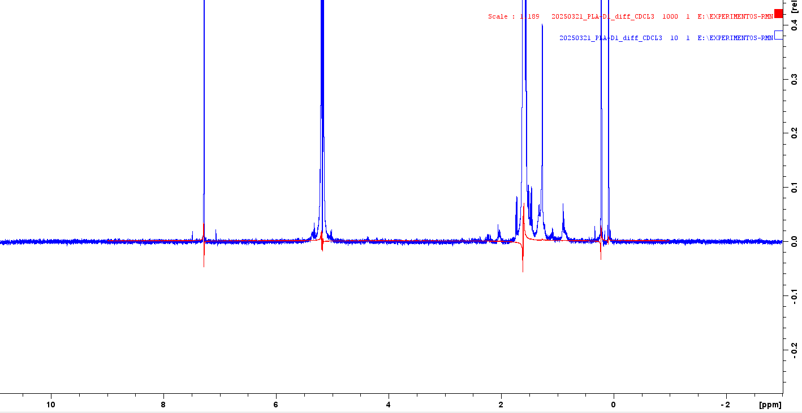

### Full speaker notes

00:45–01:35 · 50 s

Pulse length depends on the sample, tuning and power. Copying P1 from another preparation can lose signal and alter sequence behaviour. At fixed power, find the first positive-to-negative crossing after the maximum: the 180-degree null. Keep phase, gain and D1 fixed; separate automatic phasing would lose the sign. The sine curve is an ideal model explaining the procedure, not a new spectrometer measurement. Now we do this with your experiment 1000.

Sources:

PLA-D1 pulse calibration: user screenshots and saved experiments 1000 / 10

[local-source: 20250321_PLA-D1_diff_CDCL3]

Bruker TopSpin 3.6 Basic Experiments, pp.109-116; UCSB NMR pulse width calibration

https://nmr.chem.ucsb.edu/protocols/pw90cal.html

&lt;TopSpin&gt;/prog/docu/English/topspin/pdf/step_basic.pdf

Read-only audit of pulse calibration and sequence-dependent timing parameters

[local-source: parameters_pulse_evidence.json]

## 04. Case 1 · from 22 µs to P90 = 11 µs

Main slide

### Slide text

04

Case 1 · from 22 µs to P90 = 11 µs

EXPNO 1000 · zg

22 µs

÷ 2

P90 = 11 µs

User-identified 180° null. Blue: 90°. Different RG/NS in the screenshots: qualitative comparison.

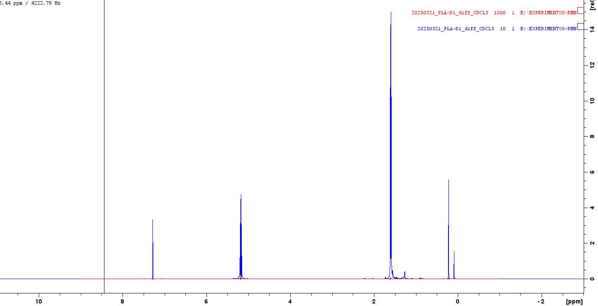

### Full speaker notes

01:35–02:25 · 50 s

This is the actual PLA/CDCl3 example. In zg, experiment 1000, P1 is 22 microseconds at PLW1 of 22 watts; the user identifies this first null as 180 degrees. Halving it gives 11 microseconds. DOSY experiment 10 stores P1=11 and P2=22 at the same power. The practical result is a documented value transferable under the same conditions; verify the 90-degree maximum in zg before acquisition. Red and blue use different gain, scans and sequences, so this comparison is qualitative, not an absolute sensitivity-recovery measurement. We now have RF; next the diffusion axis needs a physical scale.

Sources:

PLA-D1 pulse calibration: user screenshots and saved experiments 1000 / 10

[local-source: 20250321_PLA-D1_diff_CDCL3]

Bruker TopSpin 3.6 Basic Experiments, pp.109-116; UCSB NMR pulse width calibration

https://nmr.chem.ucsb.edu/protocols/pw90cal.html

&lt;TopSpin&gt;/prog/docu/English/topspin/pdf/step_basic.pdf

Read-only audit of pulse calibration and sequence-dependent timing parameters

[local-source: parameters_pulse_evidence.json]

p1 evidence

[local-source: parameters_pulse_evidence.json]

## 05. Gradients: calibrate a scale that enters quadratically

Main slide

### Slide text

05

Gradients: calibrate a scale that enters quadratically

HYPOTHETICAL ERROR EXAMPLE

G actual = 1.10 G used

Apparent D = 1.21 D

HDO / TBO

|slope| = 1.58627

Standard at actual T · fixed region · residuals · check a second ramp

G new = G previous √(D measured / Dref). TBO profile: Δ = 50 ms, δ = 1.20 ms, SMSQ10.100.

### Chart values

- tx: Measured HDO
- xVal: 0.0064, 0.0144, 0.0256, 0.04, 0.0576, 0.0784, 0.1024, 0.1296, 0.16, 0.1936, 0.2304, 0.2704, 0.3136, 0.36, 0.4096, 0.4624, 0.5184, 0.5776, 0.64, 0.7056, 0.7744, 0.8464, 0.9216
- yVal: 0, 0.00434557991417, 0.0226195463623, 0.0454872877104, 0.0796079214162, 0.102780571484, 0.145347196992, 0.190778271256, 0.24179088834, 0.288431276242, 0.353820238552, 0.414148373105, 0.494519237685, 0.560923156696, 0.6481989569, 0.726040915482, 0.809033128399, 0.907466016238, 1.00168822472, 1.10693033448, 1.219643171, 1.32377101174, 1.4334963509
- tx: Fit
- xVal: 0, 1
- yVal: -0.0136077066163, 1.57266562822

### Full speaker notes

02:25–03:45 · 80 s

Gradient scale enters b quadratically. In the hypothetical example, actual G ten percent above the value used gives apparent D twenty-one percent higher without spoiling the exponential. Calibrate using a reference ramp at actual temperature, uniform processing, a fixed region and a compatible sequence model. Inspect signed signal, residuals and drift rather than R squared alone. The retained experimental HDO/TBO example has slope 1.58627 at Delta=50 ms, delta=1.20 ms and SMSQ10.100. That historical profile uses point-height extraction, not the new helper integral. HDO value 1.902 times ten to the minus nine applies at 298.15 K; the actual ramp has a different temperature and uses a documented thermal approximation. With a compatible model, new G equals old G times the square root of measured D over reference D. We later replay the helper offline using integrals, retaining the two extractions separately without replacing protected calibration. A compatible equation is not a detail: it changes what b means.

Sources:

DiffAtOnce DOSY TopSpin console assistant

[local-source: README_ES.md]

TBO HDO experimental calibration, 4 September 2026

[local-source: TBO_HDO_20260904.json]

Calibración DOSY según la sonda, secuencia, gradiente, temperatura y referencia interna

[local-source: CALIBRACION_SONDA_SECUENCIA_GRADIENTE.md]

tbo calibration

[local-source: TBO_HDO_20260904.json]

tbo calculation

[local-source: calibracion_tbo.py]

topspin readme

[local-source: README_ES.md]

topspin verification

[local-source: VERIFICACION.txt]

## 06. The sequence determines what b means

Main slide

### Slide text

06

The sequence determines what b means

R² = 1

D / 10⁻⁹ m² s⁻¹

SMSQ / bipolar: 1.000

PGSE: 0.802

Inspect sequence + shape + δ + RF gaps before fitting D

NOISELESS SIMULATION, fixed physical G and no recalibration. The fit checks the decay, not the b scale.

### Chart values

- tx: Simulated data
- xVal: 0.0064, 0.0144, 0.0256, 0.04, 0.0576, 0.0784, 0.1024, 0.1296, 0.16, 0.1936, 0.2304, 0.2704, 0.3136, 0.36, 0.4096, 0.4624, 0.5184, 0.5776, 0.64, 0.7056, 0.7744, 0.8464, 0.9216
- yVal: 0.993462211855, 0.985350050771, 0.974104187519, 0.959833610628, 0.942675398473, 0.922792527515, 0.900371296183, 0.875618421318, 0.848757870403, 0.820027497349, 0.789675552281, 0.757957136571, 0.725130673291, 0.691454460442, 0.657183369857, 0.622565748799, 0.587840574185, 0.553234901347, 0.518961640542, 0.48521768532, 0.452182407684, 0.420016525949, 0.388861342557
- tx: Both models
- xVal: 0, 0.0166666666667, 0.0333333333333, 0.05, 0.0666666666667, 0.0833333333333, 0.1, 0.116666666667, 0.133333333333, 0.15, 0.166666666667, 0.183333333333, 0.2, 0.216666666667, 0.233333333333, 0.25, 0.266666666667, 0.283333333333, 0.3, 0.316666666667, 0.333333333333, 0.35, 0.366666666667, 0.383333333333, 0.4, 0.416666666667, 0.433333333333, 0.45, 0.466666666667, 0.483333333333, 0.5, 0.516666666667, 0.533333333333, 0.55, 0.566666666667, 0.583333333333, 0.6, 0.616666666667, 0.633333333333, 0.65, 0.666666666667, 0.683333333333, 0.7, 0.716666666667, 0.733333333333, 0.75, 0.766666666667, 0.783333333333, 0.8, 0.816666666667, 0.833333333333, 0.85, 0.866666666667, 0.883333333333, 0.9, 0.916666666667, 0.933333333333, 0.95, 0.966666666667, 0.983333333333, 1
- yVal: 1, 0.983063671545, 0.966414182312, 0.950046674297, 0.933956371774, 0.918138579899, 0.902588683343, 0.887302144942, 0.872274504377, 0.857501376868, 0.842978451899, 0.828701491957, 0.814666331298, 0.80086887473, 0.787305096419, 0.773971038712, 0.760862810985, 0.74797658851, 0.73530861133, 0.722855183173, 0.710612670365, 0.698577500776, 0.686746162772, 0.675115204194, 0.663681231351, 0.652440908027, 0.641390954512, 0.630528146638, 0.619849314847, 0.609351343258, 0.599031168764, 0.588885780135, 0.578912217141, 0.569107569685, 0.559468976958, 0.549993626604, 0.540678753896, 0.531521640932, 0.52251961584, 0.513670052002, 0.504970367284, 0.496418023284, 0.48801052459, 0.479745418057, 0.471620292082, 0.463632775909, 0.455780538934, 0.448061290023, 0.440472776847, 0.433012785223, 0.425679138468, 0.418469696762, 0.41138235653, 0.404415049819, 0.397565743703, 0.390832439685, 0.384213173116, 0.377706012619, 0.37130905953, 0.36502044734, 0.358838341151

### Full speaker notes

03:45–04:30 · 45 s

Diffusion equations are not interchangeable. This simulation uses SMSQ-shaped bipolar gradients and fixed physical G. Its proper model gives D=1; rectangular PGSE gives approximately 0.802 with the same decay and R squared equal to one. Check pulse program, shape, units, total delta and RF gaps. In stebpgp1s1d, delta equals twice P30. A reference can absorb a constant b factor in an empirical calibration, but this does not justify transferring it across sequences or timings. Full equations remain in the appendix. Even with correct b, the ramp may lack sufficient information.

Sources:

Read-only comparison of the TBO software profile and acquired pulse program

[local-source: local_equation_audit.json]

D. Sinnaeve (2012), The Stejskal–Tanner Equation Generalized for Any Gradient Shape. Table 2, p.58; definitions pp.50–51

https://doi.org/10.1002/cmr.a.21223

[local-source: Mendeley] Reference Manager\userfiles\35ec08f9-3640-0c4b-0bcc-fe3f454aba96.pdf

TBO HDO experimental calibration, 4 September 2026

[local-source: TBO_HDO_20260904.json]

Ghent University repository — Sinnaeve 2012

https://biblio.ugent.be/publication/2109280

## 07. Two ramps that fit well but measure poorly

Main slide

### Slide text

[Video or asset 7](../../presentations/assets/2bb0166fde8dc794fb51.mp4)

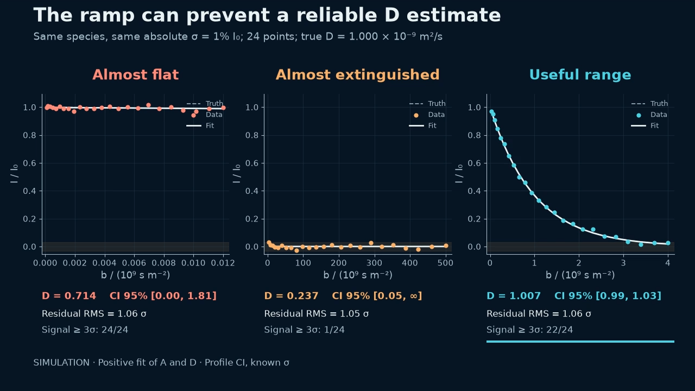

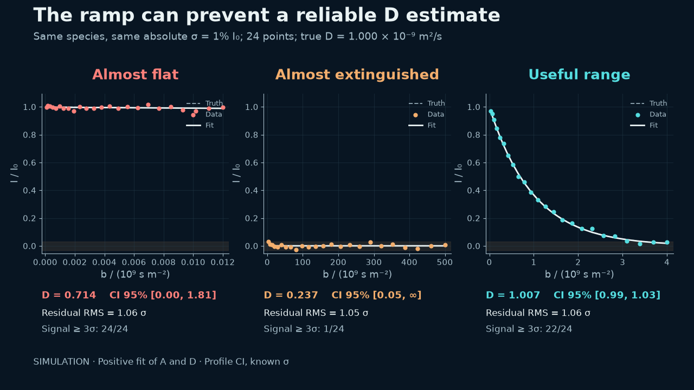

### Full speaker notes

04:30–05:30 · 60 s

The three simulated ramps have the same true D of one times ten to the minus nine and one-percent absolute noise. The nearly flat ramp estimates 0.714 with a nominal interval from zero to 1.81. The extinguished ramp estimates 0.237 with an interval from 0.05 to an unidentifiable upper endpoint. The useful ramp estimates 1.007 with an interval from 0.986 to 1.029. Residuals are similar, around one sigma. Acquisition information, not fit appearance, has changed. These intervals are conditional on the simulation model and known noise, not universal limits. Repeat the pilot with different P30/D20 or sensitivity, rather than ask an algorithm for information absent from the data. That is why we choose P30 and D20 from a pilot.

Sources:

P30/D20 teaching simulation and fixed-noise model

[local-source: parameter_simulation_model.json]

Generador configurable de rampas DOSY para TopSpin

[local-source: README.md]

V6 controlled ramp and preprocessing simulations

[local-source: problem_simulations.json]

## 08. Choosing P30 and D20 is a trade-off, not a recipe

Main slide

### Slide text

[Video or asset 8](../../presentations/assets/92fc4ce1f3a2efe24ded.mp4)

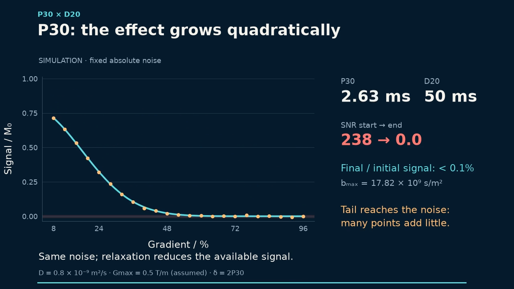

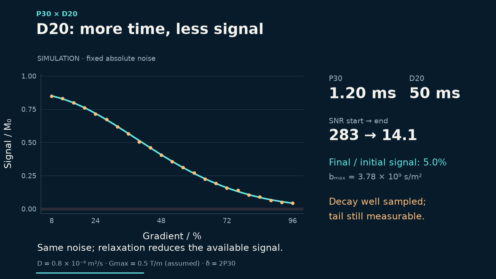

### Full speaker notes

05:30–06:40 · 70 s

We do not enter P30 and D20 simply because they worked for a previous sample. Low-, medium- and high-gradient pilots show attenuation of fast and slow signals. Increasing delta or Delta adds diffusion weighting but costs relaxation and sensitivity; Delta also increases exposure to motion, exchange and other dynamics. The animation separates normalized attenuation from absolute signal and uses hypothetical relaxation times; it does not prescribe limits for the real probe. Keep power, temperature and treatment comparable and seek appreciable decay with points remaining above noise. Recovery delays need their own checks too.

Sources:

Read-only audit of pulse calibration and sequence-dependent timing parameters

[local-source: parameters_pulse_evidence.json]

P30/D20 teaching simulation and fixed-noise model

[local-source: parameter_simulation_model.json]

## 09. LED and double STE: recover signal without copying delays

Main slide

### Slide text

09

LED and double STE: recover signal without copying delays

Sequence

Relevant delay

Problem to control

ledbpgp2s / 1d

LED = D21

Eddy-current recovery

dstebpgp3s / 1d

D20 total · D21 LED

Convection / more RF / sensitivity loss

diffSteLED

D5 ≠ LED · LED = D19

D5: remaining diffusion interval

Double STE: δ = 2P30 · 8 lobes · NS = 16×n

Read the acquired pulseprogram and its constraints before copying parameters

Inspect D1, D16, P19 and DELTA1. Convection compensation has limits and a signal cost.

### Full speaker notes

06:40–07:35 · 55 s

The next problem is phase and line shape after gradients. LED permits recovery but also costs time and signal. LED is D21 and D5 is unused in ledbpgp2s and dstebpgp3s; in diffSteLED, LED is D19 and D5 is the remaining diffusion interval. For double STE, check two DELTA1 blocks, eight lobes, additional RF pulses and the sixteen-step phase cycle. Convection compensation covers a motion model, not every flow. Three comparable Delta values and temperature controls help investigate Delta-dependent D, but do not identify the cause alone. There is no universal optimizer for these delays. We also repeat different Delta values to look beyond one ramp fit.

Sources:

Read-only audit of pulse calibration and sequence-dependent timing parameters

[local-source: parameters_pulse_evidence.json]

D. Sinnaeve (2012), The Stejskal–Tanner Equation Generalized for Any Gradient Shape. Table 2, p.58; definitions pp.50–51

https://doi.org/10.1002/cmr.a.21223

[local-source: Mendeley] Reference Manager\userfiles\35ec08f9-3640-0c4b-0bcc-fe3f454aba96.pdf

## 10. Changing Δ helps reveal that diffusion is not the only process

Main slide

### Slide text

10

Changing Δ helps reveal that diffusion is not the only process

Δ ↑

Apparent D ↑

Convection

Exchange

Restricted diffusion

Compare three Δ values, T and ramp-specific amplitudes; check the standard

SIMULATION: Gaussian velocities, σv = 100 µm/s, narrow pulses. The cause needs additional evidence.

### Chart values

- tx: Pure diffusion
- xVal: 50, 100, 150
- yVal: 0.8, 0.8, 0.8
- tx: Velocity dispersion
- xVal: 50, 100, 150
- yVal: 1.05, 1.3, 1.55

### Full speaker notes

07:35–08:10 · 35 s

SPOKEN ROUTE (35 s):

If D changes with Delta, diffusion may not be the only cause of attenuation. The simulation shows dispersed velocities: apparent D increases while true D is constant, and the fit remains excellent. This observation alone does not diagnose convection; inspect temperature, amplitudes and the reference, and consider exchange or restriction. Three Delta values help define the next check.

CONSULTATION DETAILS (do not read during the talk):

In this idealized simulation, Gaussian velocity dispersion of 100 micrometres per second makes apparent D increase from 1.05 to 1.30 and 1.55 as Delta increases from 50 to 100 and 150 ms while true D remains 0.8. The exponential still fits perfectly. This follows from a narrow-pulse model with velocities constant during each encoding, not a universal convection law or the exact acquired pulse program. Experimental Delta dependence can have several causes. Inspect temperature, ramp-specific amplitudes and reference controls before attributing it to convection. After instrument preparation, the second difficulty begins: processing.

Sources:

Idealised velocity-distribution attenuation and Delta dependence

[local-source: convection_idealized_model.json]

prime readme

[local-source: README.md]

Read-only audit of pulse calibration and sequence-dependent timing parameters

[local-source: parameters_pulse_evidence.json]

Williamson et al. (2020), Limits to flow detection in phase contrast MRI

https://pmc.ncbi.nlm.nih.gov/articles/PMC7745993/

Gottwald et al. (2003), Separation of velocity distribution and diffusion using PFG NMR

https://pubmed.ncbi.nlm.nih.gov/12810021/

## 11. The second major obstacle: preserving attenuation

Main slide

### Slide text

[Video or asset 11](../../presentations/assets/b8f38f413c1517f3bcca.mp4)

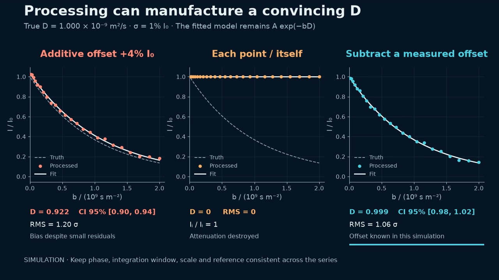

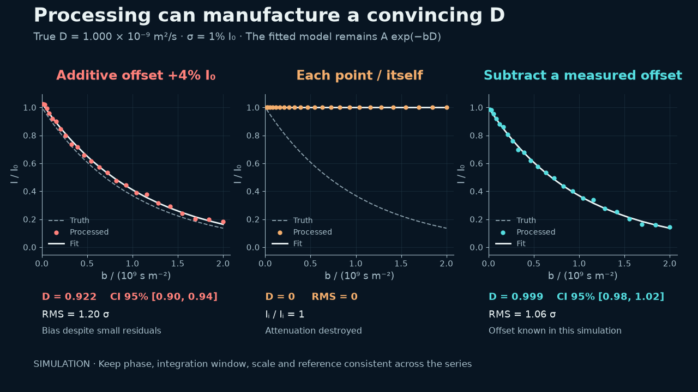

### Full speaker notes

08:10–09:10 · 60 s

A DOSY series is not a collection of independent spectra optimized for appearance. Phase, baseline, ppm axis, gain, scans and NC_PROC scaling must permit intensity comparison. In the simulation, a background of just four percent of the first point changes D from one to 0.922 without conspicuous residual failure. Removing the known background recovers 0.999. Normalizing each spectrum by its own signal destroys attenuation and gives artificial D=0. In experiments, background is not known by decree: inspect signal-free regions, overlays and peak shifts. If a signal moves outside the window, extraction is no longer measuring diffusion alone. Correct processing on a derived copy while retaining originals. With comparable intensities, we still need to decide what information can be reconstructed.

Sources:

V6 controlled ramp and preprocessing simulations

[local-source: problem_simulations.json]

prime guide

[local-source: GUIA_PRIME.md]

V6 audit of software actions, observable checks and limitations

[local-source: solutions_mapping.json]

## 12. One decay does not determine a unique distribution

Main slide

### Slide text

[Video or asset 12](../../presentations/assets/b949e9e4400b033b210c.mp4)

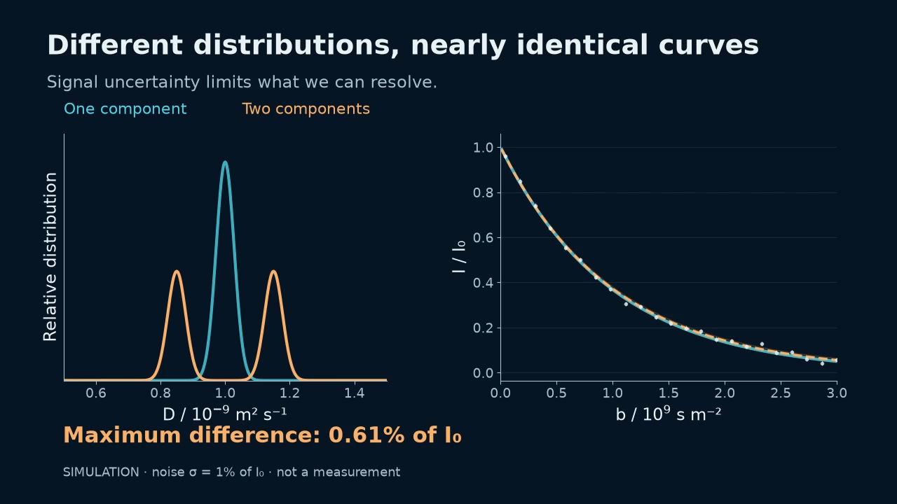

### Full speaker notes

09:10–10:20 · 70 s

This is the central difficulty of ILT. A narrow distribution and two nearby components produce curves differing by at most about 0.61 percent of the first point in this design; simulated noise has one-percent sigma. This is not a universal impossibility proof, but shows how easily requested resolution exceeds acquisition support. Inverting the Laplace kernel amplifies noise along weak directions. The useful question is not which algorithm draws two peaks, but whether data, repetition and controls support two diffusion behaviours. We need an explicit preference and a way to check its effect.

Sources:

Reproducible v5 ILT ambiguity and regularization simulations

[local-source: ilt_simulations.json]

## 13. How we solve it: regularize and compare assumptions

Main slide

### Slide text

[Video or asset 13](../../presentations/assets/3836d7b92890ba5f7246.mp4)

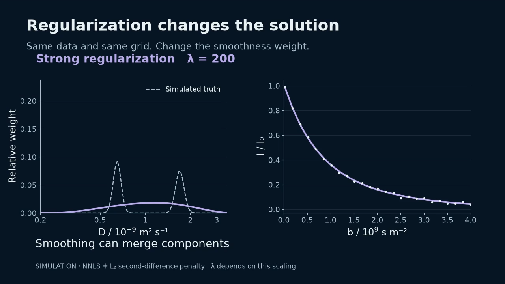

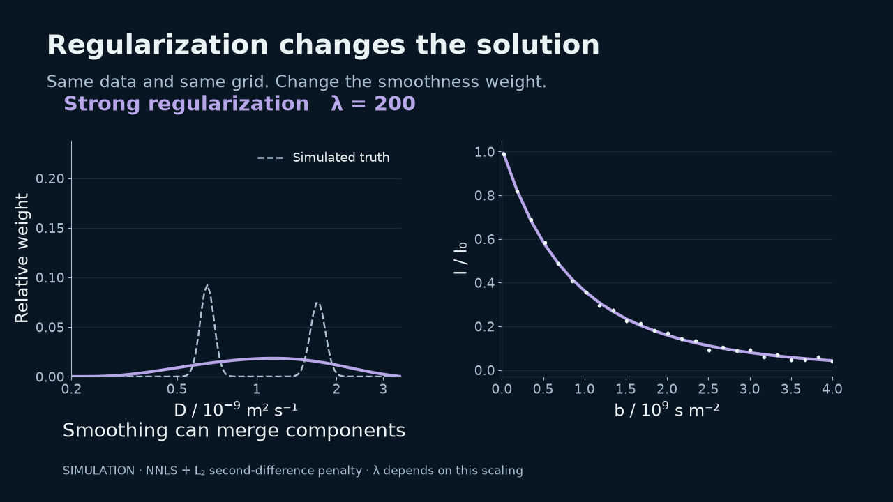

### Full speaker notes

10:20–11:15 · 55 s

Regularization stabilizes inversion by imposing a preference. In this computed simulation, three lambda values give RMS residuals around 0.00833, 0.00834 and 0.00842 while producing spiky, moderate or excessively broad solutions. Do not choose using an isolated minimum residual. Start with a minimal model for a simple signal; compare smoothness or entropy for broad distributions, sparsity or model order for few components, and shared structure for overlap. NNLS, Tikhonov, MaxEnt/PALMA, L1/ITAMeD, VP/SCORE and MF/TRAIn-MF/SILT embody different assumptions. SVD, FISTA and ADMM are numerical engines, not evidence of species. The uses-and-limits catalogue remains reference material rather than interrupting the story. We do not always need to solve every frequency independently.

Sources:

Reproducible v5 ILT ambiguity and regularization simulations

[local-source: ilt_simulations.json]

ILT method-choice and appendix guidance

[local-source: ilt_teaching_guidance.json]

## 14. The spectrum offers shared information

Main slide

### Slide text

[Video or asset 14](../../presentations/assets/144881c1092b935be21f.mp4)

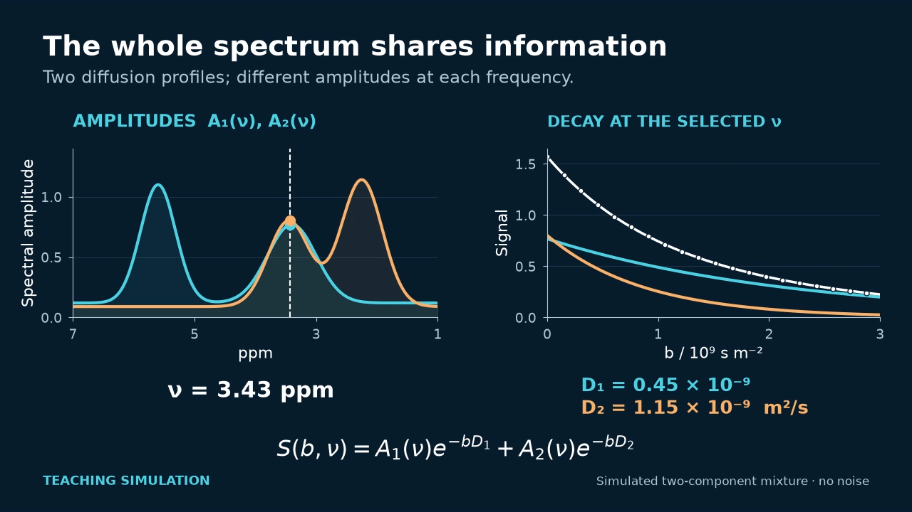

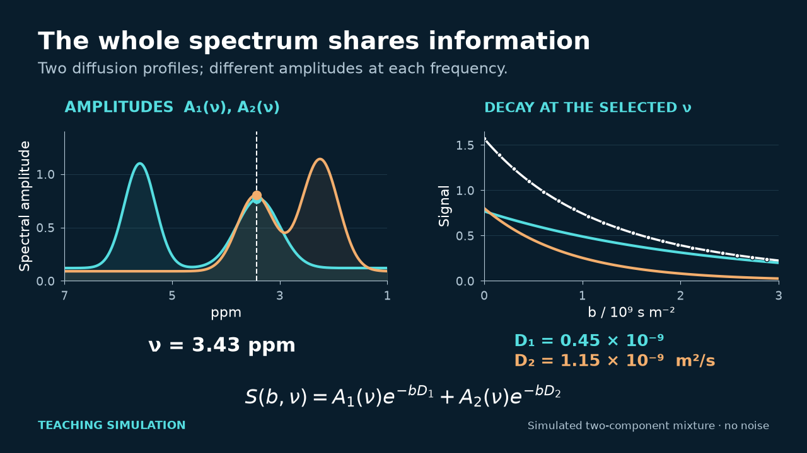

### Full speaker notes

11:15–11:50 · 35 s

Several signals can share diffusion profiles with different amplitudes. A joint calculation uses that redundancy: a strong region can help a weak one. We do not impose one D on the whole spectrum. MF and TRAIn-MF share factors, while per-bin TRAIn provides an independent comparison. This movie is conceptual, without added noise. Correlation establishes neither interaction nor chemical identity, and rank is not a molecule count. We will keep the local decay visible while working with the map. We can now explain why we developed our tools.

Sources:

Native signed TRAIn-MF and rank selection

ILT method-choice and appendix guidance

[local-source: ilt_teaching_guidance.json]

Audited bilingual catalogue of local inversion methods and context families

[local-source: ilt_algorithm_catalog_bilingual.json]

University of Manchester NMR — Multivariate DOSY

https://www.nmr.chemistry.manchester.ac.uk/?q=node%2F26

## 15. The work our programs help us handle

Main slide

### Slide text

15

The work our programs help us handle

We know what needs to be checked.

Now we put it into practice with our tools:

prepare, analyse and preserve the result.

Ramp and calibration

One signal and the whole spectrum

Sample series and controls

These are the problems we developed our tools to address.

### Full speaker notes

11:50–12:10 · 20 s

SPOKEN ROUTE (20 s):

We now understand the obstacles and how to review them. This is why we developed the programs: prepare without transcription, preserve the measurement, analyse a signal or a spectrum, and check the result. Each case starts with an input, performs an operation and retains its output.

CONSULTATION DETAILS (do not read during the talk):

These programs were developed for precisely these obstacles. They automate preparation, reading and comparison while retaining steps needing review. The concrete advantages are less transcription, traceable calibration, progression from one decay to a spectrum and controls alongside the result. A tool cannot rescue an uninformative ramp or replace calibration. Each program addresses a concrete task along the route.

Sources:

## 16. Our programs and their functions

Main slide

### Slide text

16

Our programs and their functions

Tool

Input

What it provides

TopSpin · xpy

Template and 1D series

Prepare ramps and integrate the standard

DiffAtOnce Prime

Processed Bruker series

Local decay, map and diagnostics

ResinAtOnce

Resin / polymer series

Guided workflow, references and export

DALTAIL · MATLAB

Data and saved configuration

Process batches and reproduce tables

The next cases show the input, the operations and the result.

### Full speaker notes

12:10–12:45 · 35 s

SPOKEN ROUTE (35 s):

The TopSpin helper prepares ramps and records calibration. Prime lets us explore one signal, a map and diagnostics. ResinAtOnce guides resin/polymer analysis, separating references from conditional results. DALTAIL runs MATLAB/Python batches and reproduces tables from saved settings. These are workflow tools; TRAIn, MF and SILT are engines they use. Let us see the work they save and the output they retain.

CONSULTATION DETAILS (do not read during the talk):

The TopSpin helper prepares ramps and calibrates a reference signal in the console. Prime brings together general DOSY analysis: local signal, whole spectrum, methods and checks. ResinAtOnce organizes resin/polymer samples and ramps, separates references and presents D, Rh and apparent mass with assumptions. DALTAIL is the reproducible MATLAB/Python batch route, sharing functions and saving tables, factors and diagnostics. These are products and workflows, not four new ILT algorithms: TRAIn, MF, SILT and RAI-S are engines within the analysis. We now follow cases showing the work addressed at each stage. First we return to HDO calibration.

Sources:

V6 audit of software actions, observable checks and limitations

[local-source: solutions_mapping.json]

prime readme

[local-source: README.md]

prime guide

[local-source: GUIA_PRIME.md]

Read-only audit of pulse calibration and sequence-dependent timing parameters

[local-source: parameters_pulse_evidence.json]

## 17. TopSpin: an HDO calibration report

Main slide

### Slide text

17

TopSpin: an HDO calibration report

xpy dosy_workshop.py

1  Select the series and a fixed region

2  Integrate and provide Dref(T)

3  Review the fit and save the proposal

REAL HDO · OFFLINE REPLAY

R² = 0.999775

ΔTE = 0.77 K

Configured limit: 0.50 K

The program detects drift: stabilize and repeat before calibrating

Offline replay. Illustrative candidate at 0.80 K; the usual 0.50 K limit rejects the series.

### Full speaker notes

12:45–13:50 · 65 s

SPOKEN ROUTE (65 s):

Select HDO series 10 through 32 and a fixed 4.5–4.9 ppm window. The helper integrates, fits and reports. Offline replay gives R squared of 0.99977, but detects 0.77 K temperature drift above the 0.5 K limit and warns about varying phase and dummy scans. Success is preventing an attractive fit from being mistaken for accepted calibration. The illustrative integral candidate does not replace historical height-based calibration. Review, stabilize and repeat; the instrument remains unchanged.

CONSULTATION DETAILS (do not read during the talk):

Open xpy dosy_workshop.py and Calibrate from 1D series. Enter experiments 10 through 32, window 4.5 to 4.9 ppm, the HDO reference and documented reference D. The helper integrates signed areas and checks metadata before accepting a fit. We show an offline replay on actual experimental data: its candidate has slope 1.55703 and R squared of 0.99977, but the default thermal review rejects the ramp because recorded TE spans 0.77 K, above the 0.5 K tolerance. It also detects varying phase and DS. The tolerance was explicitly raised to 0.8 K to produce an illustrative report; that is not calibration acceptance. Success is turning a reassuring-looking fit into a traceable decision. The report retains input, integral, residuals, warnings and a scale proposal. The protected historical profile uses point height and slope 1.58627; it is not replaced or confused with this integral. This is neither a new 3.6.4 console run nor an instrument-constant update. Stabilize temperature and review phase and preparation before using the candidate as calibration. The same console removes manual transcription of three ramps.

Sources:

DiffAtOnce DOSY TopSpin console assistant

[local-source: README_ES.md]

V6 audit of software actions, observable checks and limitations

[local-source: solutions_mapping.json]

prime readme

[local-source: README.md]

prime guide

[local-source: GUIA_PRIME.md]

Read-only audit of pulse calibration and sequence-dependent timing parameters

[local-source: parameters_pulse_evidence.json]

HDO signed-area offline calibration summary

[local-source: summary.json]

HDO signed-area candidate with thermal rejection

[local-source: calibracion_integral_offline.json]

HDO signed-area extracted attenuation

[local-source: atenuacion_integral_residuos.csv]

HDO offline calibration report

[local-source: informe_integral_offline.html]

integral replay summary

[local-source: summary.json]

integral replay result

[local-source: calibracion_integral_offline.json]

integral replay csv

[local-source: atenuacion_integral_residuos.csv]

integral replay script

[local-source: replay_integral_calibration.py]

integral replay spectrum

[local-source: HDO_spectral_inspection.png]

topspin calibration source

[local-source: dosy_calibration.py]

topspin console source

[local-source: dosy_console_ui.py]

tbo calibration

[local-source: TBO_HDO_20260904.json]

## 18. TopSpin: three ramps with configurable Δ

Main slide

### Slide text

18

TopSpin: three ramps with configurable Δ

xpy dosy_workshop.py

Configurable example

D20 / s

EXPNO

Δ 50 ms

0.050

100–122

Δ 100 ms

0.100

200–222

Δ 150 ms

0.150

300–322

Same template · fixed P30 · complete gradient list · integrate the standard

The assistant prepares parameters and calibrates from the 1D series. Check destinations, units and limits before acquisition.

### Full speaker notes

13:50–14:35 · 45 s

SPOKEN ROUTE (45 s):

Start from a reviewed template and choose three configurable Delta values. The example uses 50, 100 and 150 ms, fixed P30 and 23 gradients from 8 to 96 percent. That is 69 destinations without transcription. Inspect the plan and collisions before creation; retain CSV and JSON. Prepare in the console or export a macro/Python plan. This demonstrates preparation, not a new acquisition.

CONSULTATION DETAILS (do not read during the talk):

Start with a reviewed template. Define three Delta values, shown as editable examples of 50, 100 and 150 ms, and GPZ6 from 8 to 96 in increments of four. That is 23 points per ramp, 69 experiments, with configurable destinations. Before creation, inspect the plan, ms-to-s units and experiment collisions. The program preserves P30, inherits the template, saves the plan and returns to the open experiment. It does not acquire or decide probe limits. The same generator can export macros or prepare through Python. This demonstration succeeds in producing a coherent, auditable plan without repetitive transcription; it is not a new acquisition of 69 spectra. With acquired, consistently processed data, we open Prime.

Sources:

DiffAtOnce DOSY TopSpin console assistant

[local-source: README_ES.md]

V6 audit of software actions, observable checks and limitations

[local-source: solutions_mapping.json]

prime readme

[local-source: README.md]

prime guide

[local-source: GUIA_PRIME.md]

Read-only audit of pulse calibration and sequence-dependent timing parameters

[local-source: parameters_pulse_evidence.json]

topspin readme

[local-source: README_ES.md]

topspin verification

[local-source: VERIFICACION.txt]

topspin console source

[local-source: dosy_console_ui.py]

## 19. Prime: fit a real signal before the map

Main slide

### Slide text

19

Prime: fit a real signal before the map

1  Open the series

2  Fix the region

3  Fit and review

D final = 0.3267

Result saved with its points, calibration and corrections

TP194 · 4.4182 ± 0.04 ppm · 23 points, 0 excluded · D / 10⁻⁹ m² s⁻¹, conditional on calibration and model.

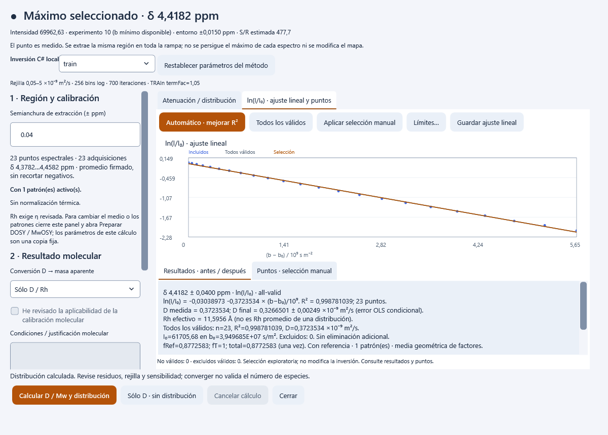

### Full speaker notes

14:35–15:30 · 55 s

For TP194, select 4.4182 plus/minus 0.04 ppm. Prime displays signed extraction and all 23 points with no exclusions, giving final D around 0.327 times ten to the minus nine. This is a local monoexponential fit, different from the distribution peak we will see at another region. First inspect all points, tail and residuals; compare methods when information supports it. The panel signed point mean is not the calibrator trapezoidal integral. The saved result retains parameters and calibration: measured D=0.3723534, reference factor=0.8772583, temperature factor=1 and final D=0.3266501. Displayed OLS error=0.00249 is conditional rather than total uncertainty. Success is moving from a spectrum to a traceable, reviewable decay, not identifying a molecule from R squared or optimizing by excluding points. Another difficulty appears when two routes draw different distributions for the same point.

Sources:

prime guide

[local-source: GUIA_PRIME.md]

prime readme

[local-source: README.md]

V6 audit of software actions, observable checks and limitations

[local-source: solutions_mapping.json]

Read-only audit of pulse calibration and sequence-dependent timing parameters

[local-source: parameters_pulse_evidence.json]

## 20. Prime and ResinAtOnce: consistency between signal and map

Main slide

### Slide text

20

Prime and ResinAtOnce: consistency between signal and map

Ramp / EXPNO

Local peak D

Map peak D

Shape difference

10:32

0.3270

0.3270

0.0 %

33:55

0.3426

0.3426

0.0 %

56:78

0.3806

0.3806

0.0 %

TP194 · ≈7.736 ppm · 2048-point D grid

Before: 84.87% shape difference between the local TRAIn signal and the MF map

The same extraction, grid, algorithm and calibration in both paths

D / 10⁻⁹ m² s⁻¹ · internal check on real data. Agreement does not establish species identity.

### Full speaker notes

15:30–16:30 · 60 s

SPOKEN ROUTE (60 s):

At about 7.736 ppm in TP194, the old map and local curve appeared to have similar means but very different distributions. The solution was identical extraction, a 2048-point grid and TRAIn protocol rather than factor changes to force agreement. Peak positions and shapes now match between routes in all three ramps, as the table shows. This succeeds in analysis consistency on real data. Differences across ramps remain visible; numerical agreement neither identifies molecules nor establishes absolute accuracy.

CONSULTATION DETAILS (do not read during the talk):

We now use a different TP194 experimental point, around 7.736 ppm. In the archived comparison, the old map had peak D=0.2982 and mean D=0.3673; the mean looked close to the local route, but normalized shape difference was 84.87 percent. The solution was not to modify factors to force agreement. With identical extraction, a 2048-point grid and TRAIn protocol, local and map routes agree numerically in all three documented ramps. Their peaks are 0.3270, 0.3426 and 0.3806 times ten to the minus nine; between-route shape difference is zero. Success is removing a numerical analysis inconsistency and detecting when another route needs review. Differences across ramps remain visible; route agreement neither establishes chemical identity nor validates absolute D. A 256-bin screenshot has other values and must not be mixed with the 2048-point table. ResinAtOnce and DALTAIL extend that care to the entire batch.

Sources:

ILT method-choice and appendix guidance

[local-source: ilt_teaching_guidance.json]

Read-only comparison of the TBO software profile and acquired pulse program

[local-source: local_equation_audit.json]

prime guide

[local-source: GUIA_PRIME.md]

V6 audit of software actions, observable checks and limitations

[local-source: solutions_mapping.json]

prime readme

[local-source: README.md]

Read-only audit of pulse calibration and sequence-dependent timing parameters

[local-source: parameters_pulse_evidence.json]

local coherence doc

[local-source: DOSY_COHERENCIA_0.46.0.md]

tp194 parity

[local-source: real-tp194-parity.json]

local signal screenshot

[local-source: resin-local-signal.png]

local signal ui check

[local-source: local-signal-ui.json]

## 21. DALTAIL: a reproducible KK2 batch

Main slide

### Slide text

21

DALTAIL: a reproducible KK2 batch

1  Read FIDs and parameters

2  Process each block consistently

3  Extract and export decays

KK2-50 · OCH₃

3.45–3.70 ppm

Batch: 230 spectra · 10 ramps

DALTAIL repeats the analysis from a saved configuration

Archived decays. Primary D incorporates TTMS and temperature together; molecular masses remain model-dependent.

### Chart values

- tx: Δ 75 ms
- xVal: 0.0685762998078, 0.154296674568, 0.274305199231, 0.428601873799, 0.61718669827, 0.840059672645, 1.09722079692, 1.38867007111, 1.71440749519, 2.07443306919, 2.46874679308, 2.89734866688, 3.36023869058, 3.85741686419, 4.3888831877, 4.95463766111, 5.55468028443, 6.18901105765, 6.85762998078, 7.56053705381, 8.29773227674, 9.06921564958, 9.87498717232
- yVal: 1, 0.984813707185, 0.961385350058, 0.940433796897, 0.910124426195, 0.872415755608, 0.841199538826, 0.798340807415, 0.751406104049, 0.712133028694, 0.662532667294, 0.616454791877, 0.568991026631, 0.52494140114, 0.476974077153, 0.43554312328, 0.398382831889, 0.35521865344, 0.318128395405, 0.284410629113, 0.252847511853, 0.224260792505, 0.197732257656
- tx: Δ 100 ms
- xVal: 0.0919248648244, 0.206830945855, 0.367699459298, 0.574530405153, 0.82732378342, 1.1260795941, 1.47079783719, 1.86147851269, 2.29812162061, 2.78072716094, 3.30929513368, 3.88382553883, 4.5043183764, 5.17077364637, 5.88319134876, 6.64157148357, 7.44591405078, 8.29621905041, 9.19248648244, 10.1347163469, 11.1229086438, 12.157063373, 13.2371805347
- yVal: 1, 0.983775772572, 0.955662114868, 0.921338355631, 0.879438209732, 0.835942928689, 0.786810924578, 0.736563920545, 0.685144108298, 0.627462501069, 0.572136659558, 0.520877161564, 0.467363616784, 0.416974624969, 0.371566462236, 0.32718233106, 0.286487604023, 0.248724020972, 0.214805178098, 0.18453632497, 0.157992934039, 0.134507878226, 0.112686116413
- tx: Δ 125 ms
- xVal: 0.115273429841, 0.259365217142, 0.461093719364, 0.720458936507, 1.03746086857, 1.41209951555, 1.84437487746, 2.33428695428, 2.88183574603, 3.48702125269, 4.14984347428, 4.87030241079, 5.64839806221, 6.48413042856, 7.37749950983, 8.32850530602, 9.33714781713, 10.4034270432, 11.5273429841, 12.70889564, 13.9480850108, 15.2449110965, 16.5993738971
- yVal: 1, 0.977532485881, 0.945283007011, 0.90277968356, 0.85573930472, 0.802511336499, 0.740859622288, 0.681235995359, 0.622429157655, 0.560609583812, 0.501007940654, 0.443652877455, 0.388418698365, 0.339287238145, 0.291913806275, 0.250501709049, 0.212379462572, 0.177687468235, 0.149556065758, 0.12281196579, 0.102244824719, 0.084551871128, 0.0665560025127

### Full speaker notes

16:30–17:25 · 55 s

SPOKEN ROUTE (55 s):

DALTAIL retains settings, decays, factors and tables. This KK2 case is an archived report of 230 spectra and ten ramps. KK2-50 and KK2-51 are summarized by block; KK2-52 keeps an exploratory case rather than averaging artefactual ramps. Reference and temperature factors are applied together once and retained. Success is automating the batch while keeping failures visible. It is neither a current-processing replay nor absolute-mass validation; ResinAtOnce offers the complementary guided workflow.

CONSULTATION DETAILS (do not read during the talk):

ResinAtOnce organizes samples, references and ramps for this analysis. The displayed case was calculated through DALTAIL MATLAB/Python and is not attributed to a ResinAtOnce replay. The archived KK2 report covers 230 spectra and ten ramps. It saves fTTMS, fT=293/T and their product, applied once to the complete axis. KK2-50 and KK2-51 summarize three blocks each; KK2-52 retains one exploratory block rather than averaging long artefactual ramps. Archived TTMS-corrected results at 293 K give D=0.1433 for KK2-50 and 0.08861 for KK2-51, times ten to the minus nine. Between-block SD values are 0.00826 and 0.00658, not population intervals. Success is processing the batch without concealing failures. Masses remain apparent for branched architectures. The current audit finds 213 processed files differing from the archived manifest; checked FIDs and acquired metadata match. These numbers are therefore archived results, not a new run on every current file. The result must also retain what the model does not yet explain.

Sources:

V6 audit of software actions, observable checks and limitations

[local-source: solutions_mapping.json]

prime readme

[local-source: README.md]

prime guide

[local-source: GUIA_PRIME.md]

Read-only audit of pulse calibration and sequence-dependent timing parameters

[local-source: parameters_pulse_evidence.json]

root readme

[local-source: README.md]

kk2 results

[local-source: resumen_principal.csv]

kk2 factors

[local-source: factores_TTMS_temperatura.csv]

kk2 verification

[local-source: validacion.json]

kk2 source manifest

[local-source: fuentes_sha256.csv]

kk2 fid check

[local-source: verificacion_FID.csv]

kk2 region fits

[local-source: ajustes_todas_senales.csv]

## 22. TP194 case · keep what the model cannot explain visible

Main slide

### Slide text

22

TP194 case · keep what the model cannot explain visible

≈6%

unassigned

Retain the signal

Compare methods

Hold out gradients

A useful map lets us review the fit and what remains unresolved

Real TP194 · archived projection case. Predictive checks are a subsequent Scientific Workbench step.

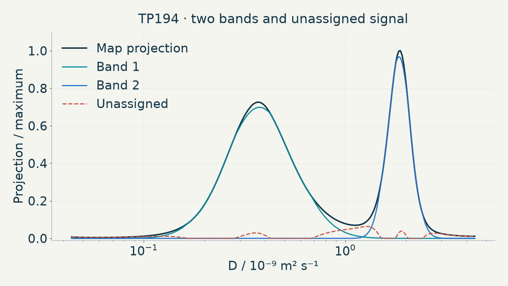

### Full speaker notes

17:25–18:10 · 45 s

SPOKEN ROUTE (45 s):

The model describes two bands while retaining about six percent of signal unassigned. We neither erase it nor invent another species to complete the story. Prime lets us revisit signals, compare methods and open Scientific Workbench to explore stability and held-out gradient prediction. These are subsequent checks, not tests claimed to have run in this example. Success is retaining both explained and unresolved signal alongside the saved result.

CONSULTATION DETAILS (do not read during the talk):

The modeled TP194 projection has two descriptive bands centred around 0.375 and 1.847 times ten to the minus nine, but 5.96 percent of area remains unassigned and status remains review_residuals. The original projection gives close results with 6.42 percent unassigned. Residual signal is neither erased nor conveniently converted into another species. Success is representation that retains doubt and lets us trace which signals support each band. Open Prime Scientific Workbench to compare methods, grids and settings and inspect held-out b prediction when design and convergence permit. These checks are implemented; we do not claim every check was run on TP194. QA screenshots of controls are labelled as such. Saving a review does not overwrite D or calibration. After making the conventional route checkable, we consider its next bottleneck: time.

Sources:

ILT method-choice and appendix guidance

[local-source: ilt_teaching_guidance.json]

Read-only comparison of the TBO software profile and acquired pulse program

[local-source: local_equation_audit.json]

prime guide

[local-source: GUIA_PRIME.md]

V6 audit of software actions, observable checks and limitations

[local-source: solutions_mapping.json]

prime readme

[local-source: README.md]

Read-only audit of pulse calibration and sequence-dependent timing parameters

[local-source: parameters_pulse_evidence.json]

tp194 projection doc

[local-source: DOSY_PROJECTION_0.46.1.md]

tp194 projection audit

[local-source: audit.json]

tp194 projection screenshot

[local-source: prime-projection-map.png]

tp194 projection ui check

[local-source: projection-ui.json]

tp194 saved project

[local-source: DiffAtOnce] Prime Results\Calibracion_20260929_084154_43b4f1\calibrado.prime.json

## 23. When repeated gradients take too long: ultrafast / SPEN-DOSY

Main slide

### Slide text

[Video or asset 23](../../presentations/assets/2ac59c3020a7ac479b83.mp4)

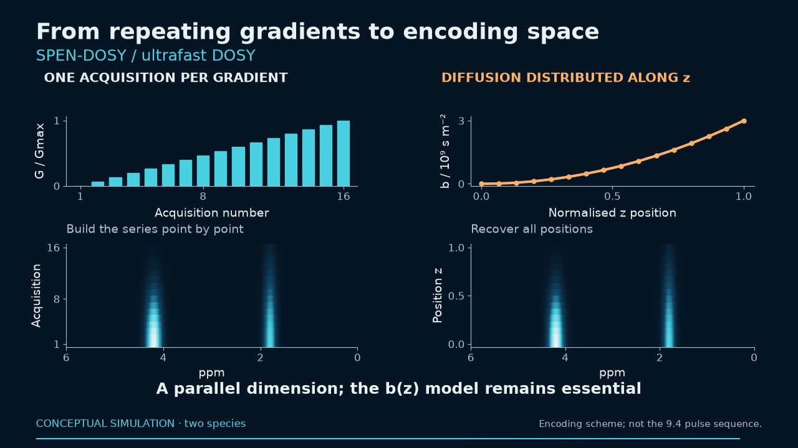

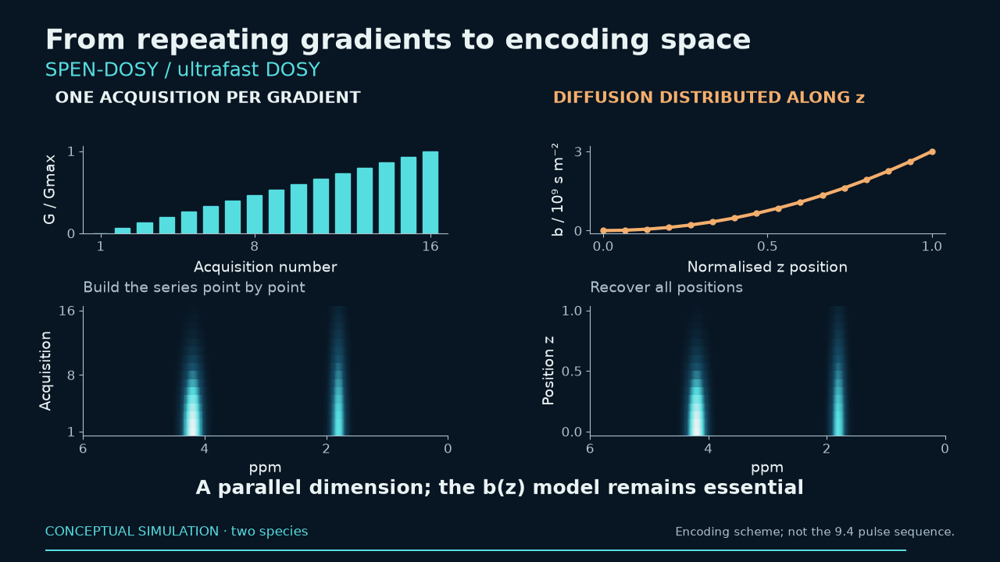

### Full speaker notes

18:10–19:10 · 60 s

Conventional acquisition repeats gradients and assumes the preparation remains comparable throughout the series. Time may be limiting for rapid processes, reactions and hyperpolarized signals. Ultrafast DOSY uses spatial encoding: different positions receive different weighting followed by spatial readout. SPEN is the spatial encoding used in these routes, not a wholly separate competitor. Faster acquisition shifts difficulties to phase, spatial sensitivity, bandwidth and b(z) calibration. Cited literature demonstrates applications; these are not attributed to our prototype. Prime’s guided route prompts echo-order, profile and kernel review against conventional controls. This is also the direction of our development for z-gradient probes.

Sources:

Single-scan 2D DOSY NMR spectroscopy

https://pubmed.ncbi.nlm.nih.gov/18835796/

Spatially encoded 2D and 3D diffusion-ordered NMR spectroscopy

https://pubs.rsc.org/en/content/articlehtml/2017/cc/c6cc09028a

Spatially encoded diffusion-ordered NMR spectroscopy of reaction mixtures in organic solvents

https://pubs.rsc.org/en/content/articlelanding/2018/an/c8an00434j

Single-Scan 13C Diffusion-Ordered NMR Spectroscopy of DNP-Hyperpolarised Substrates

https://chemistry-europe.onlinelibrary.wiley.com/doi/10.1002/chem.201703300

Ultrafast diffusion-based unmixing of 1H NMR spectra

https://pubs.rsc.org/en/content/articlehtml/2021/cc/d0cc07757g

Accounting for gradient non-uniformity in spatially-encoded diffusion-ordered NMR spectroscopy

https://www.sciencedirect.com/science/article/pii/S1090780723001787

## 24. Ultrafast: diffusion and relaxation in one map

Main slide

### Slide text

24

Ultrafast: diffusion and relaxation in one map

UF D–T₂

Experiment 10

4 scans · 32 echoes

≈28 seconds

CURRENT DEVELOPMENT

z gradient

+ EPSI readout

Validate b(z)

and sensitivity

TRAIN2D · 2025 experiment, preceding EPSI v9.4 · D and T₂ accuracy remains to be validated

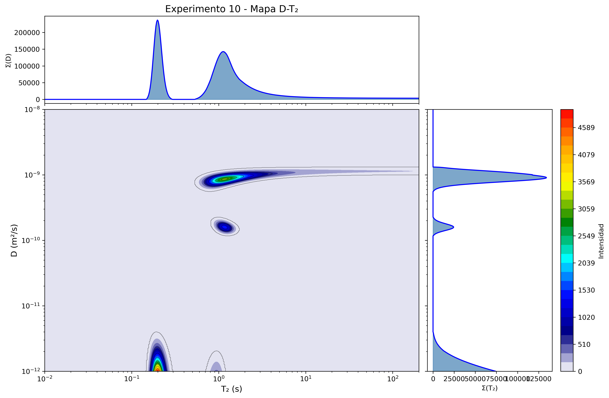

### Full speaker notes

19:10–19:50 · 40 s

This image is a TRAIN2D reconstruction of UF D–T2 experiment 10, acquired on 3 June 2025 using 4 scans and 32 echoes in 27.768 s. Diffusion is on the vertical axis and T2 on the horizontal axis; the projections summarize both axes. This experimental example precedes UF_DT2_CS_EPSI v9.4 development: it is neither an output of that program nor a D–ppm map. The notebook uses a nominal maximum gradient and a 1% graphical threshold; the dominant peak reaches the lower D boundary. Do not interpret that boundary as a validated species. Absolute D and T2 accuracy requires calibration controls. Our current development uses a z gradient and EPSI readout; b(z), sensitivity and accuracy with standards remain pending.

Technical reference for EPSI development:

SPOKEN ROUTE (40 s):

We are developing ultrafast for conventional probes with z gradients and shaped RF. Chirp/STE, CPMG and EPSI pulse programs, a calculator and diagnostic reconstruction exist. The difficulty shifts to b(z) calibration and checking sensitivity and accuracy with references and conventional controls. Quantitative experimental validation remains pending: this is a concrete development route, not a new absolute single-scan DOSY demonstration.

CONSULTATION DETAILS (do not read during the talk):

Our current development implements chirp stimulated-echo encoding, CPMG and bipolar EPSI readout, with programs for PABBO, TBI and TBO, a calculator and diagnostic reconstruction. A conventional probe here requires a z gradient and shaped RF, not a gradient-free probe. Current target is Avance III 500 with TopSpin 3.8.0 and scan counts in multiples of sixteen, separate from the helper prepared for 3.6.4. Pulse programs and software exist; quantitative experimental validation of absolute DOSY remains pending. The next success to demonstrate is reference b(z) calibration and accuracy/stability against conventional DOSY. This is a concrete prospect rather than an announced experimental result. Let us return to what the audience can use tomorrow.

Sources:

local_readme

[local-source: README.md]

local_audit

[local-source: AUDITORIA_METODO_UF_DT2_CS_2026-09-19.md]

local_pp

[local-source: UF_DT2_CS_EPSI_v9_4_TBO]

local_calc

[local-source: UF_DT2_CS_calculator_v9_4.py]

local_recon

[local-source: reconstruct_uf_dt2_cs_v9_4.py]

Spatially encoded diffusion-ordered NMR spectroscopy of reaction mixtures in organic solvents

https://pubs.rsc.org/en/content/articlelanding/2018/an/c8an00434j

Single-Scan 13C Diffusion-Ordered NMR Spectroscopy of DNP-Hyperpolarised Substrates

https://chemistry-europe.onlinelibrary.wiley.com/doi/10.1002/chem.201703300

Experimental UF D–T2 experiment 10 (2025), TRAIN2D reconstruction

[local-source: DT2_map_10.png]

## 25. A result we can reproduce and check

Main slide

### Slide text

25

A carefully acquired signal.

A reproducible analysis.

A result we can check.

Calibrate and retain useful information

Automate repetitive steps

Review the result with examples and controls

DiffAtOnce Prime · ifernan@ual.es · fmarrabal@ual.es

### Full speaker notes

19:50–20:00 · 10 s

DOSY calibration and processing are difficult. These examples show how to do the work and where our programs help. A defensible result retains the measurement, assumptions and checks.

Sources:

## 26. Prime · local ILT 1/4

Hidden appendix

### Slide text

26

Prime · local ILT 1/4

Method / component

What it is used for

Main caution

NNLS

Positive baseline without smoothing; diagnose minimum residual.

SciPy NNLS / active-set NNLS; explicit dictionary

Tikhonov

Continuous distributions with controlled smoothness; polymers/polydispersity.

Fixed λ; check penalty order and grid scaling.

FLINT quadratic objective

Positive L2 objective for stable inversion; this library uses NNLS.

Same positive L2 objective; NNLS engine, not FLINT original iteration

GNAT ILT NNLS

Compare GNAT positive ILT branch at a manual lambda.

Manual lambda squared; excludes GNAT GCV/L-curve/UI peak picking

TRAIn-style trust region

Iterative positive trust-region inversion; control its stopping criterion.

Prime uses termFac × NNLS residual; do not interchange it with noise radii.

Reference catalogue · details, availability and sources in notes and accompanying CSV / TXT

### Full speaker notes

Reference / consulta · 0 s

Positive least squares [nnls]

Use: Positive baseline without smoothing; diagnose minimum residual.

Limitations: SciPy NNLS / active-set NNLS; explicit dictionary

Availability: Prime ILT selector

Objective: `0.5 ‖AC-Y‖F², C&gt;=0`.

Source: [local-source: METHOD_REFERENCE.es.md#nnls]

Positive Tikhonov [tikhonov]

Use: Continuous distributions with controlled smoothness; polymers/polydispersity.

Limitations: Fixed user lambda and order 0/1/2; no automatic CONTIN selection

Availability: Prime ILT selector

Objective: `0.5 ‖AC-Y‖F² + lambda/2 ‖RC‖F², C&gt;=0`.

Source: [local-source: METHOD_REFERENCE.es.md#tikhonov]

FLINT quadratic objective [flint]

Use: Positive L2 objective for stable inversion; this library uses NNLS.

Limitations: Same positive L2 objective; NNLS engine, not FLINT original iteration

Availability: Prime ILT selector

Objective: `0.5 ‖AC-Y‖F² + lambda/2 ‖C‖F², C&gt;=0`.

Source: [local-source: METHOD_REFERENCE.es.md#flint]

GNAT positive ILT branch [gnat_ilt_nnls]

Use: Compare GNAT positive ILT branch at a manual lambda.

Limitations: Manual lambda squared; excludes GNAT GCV/L-curve/UI peak picking

Availability: Prime ILT selector

Objective: `0.5 ‖AC-Y‖F² + lambda²/2 ‖RC‖F², C&gt;=0`.

Source: [local-source: METHOD_REFERENCE.es.md#gnat_ilt_nnls]

TRAIn-style trust region [train]

Use: Iterative positive trust-region inversion; control its stopping criterion.

Limitations: Prime TRAIn uses the shared original engine: termFac × NNLS residual. The library record describes a separate explicit-noise-radius variant; do not interchange parameters.

Availability: Prime ILT selector

Objective: `RSS(A*(eta elementwise squared),Y); discrepancy stopping`.

Source: [local-source: METHOD_REFERENCE.es.md#train]

Sources: [ilt_catalog] Audited bilingual catalogue of local inversion methods and context families: [local-source: ilt_algorithm_catalog_bilingual.json]

[catalog_nnls] Positive least squares: [local-source: METHOD_REFERENCE.es.md#nnls]

[catalog_tikhonov] Positive Tikhonov: [local-source: METHOD_REFERENCE.es.md#tikhonov]

[catalog_flint] FLINT quadratic objective: [local-source: METHOD_REFERENCE.es.md#flint]

[catalog_gnat_ilt_nnls] GNAT positive ILT branch: [local-source: METHOD_REFERENCE.es.md#gnat_ilt_nnls]

[catalog_train] TRAIn-style trust region: [local-source: METHOD_REFERENCE.es.md#train]

nnls — Positive least squares

Prime ILT selector

Positive baseline without smoothing; diagnose minimum residual.

SciPy NNLS / active-set NNLS; explicit dictionary

`0.5 ‖AC-Y‖F², C&gt;=0`.

[local-source: METHOD_REFERENCE.es.md#nnls]

tikhonov — Positive Tikhonov

Prime ILT selector

Continuous distributions with controlled smoothness; polymers/polydispersity.

Fixed user lambda and order 0/1/2; no automatic CONTIN selection

`0.5 ‖AC-Y‖F² + lambda/2 ‖RC‖F², C&gt;=0`.

[local-source: METHOD_REFERENCE.es.md#tikhonov]

flint — FLINT quadratic objective

Prime ILT selector

Positive L2 objective for stable inversion; this library uses NNLS.

Same positive L2 objective; NNLS engine, not FLINT original iteration

`0.5 ‖AC-Y‖F² + lambda/2 ‖C‖F², C&gt;=0`.

[local-source: METHOD_REFERENCE.es.md#flint]

gnat_ilt_nnls — GNAT positive ILT branch

Prime ILT selector

Compare GNAT positive ILT branch at a manual lambda.

Manual lambda squared; excludes GNAT GCV/L-curve/UI peak picking

`0.5 ‖AC-Y‖F² + lambda²/2 ‖RC‖F², C&gt;=0`.

[local-source: METHOD_REFERENCE.es.md#gnat_ilt_nnls]

train — TRAIn-style trust region

Prime ILT selector

Iterative positive trust-region inversion; control its stopping criterion.

Prime TRAIn uses the shared original engine: termFac × NNLS residual. The library record describes a separate explicit-noise-radius variant; do not interchange parameters.

`RSS(A*(eta elementwise squared),Y); discrepancy stopping`.

[local-source: METHOD_REFERENCE.es.md#train]

Sources:

Audited bilingual catalogue of local inversion methods and context families

[local-source: ilt_algorithm_catalog_bilingual.json]

Positive least squares

[local-source: METHOD_REFERENCE.es.md#nnls]

Positive Tikhonov

[local-source: METHOD_REFERENCE.es.md#tikhonov]

FLINT quadratic objective

[local-source: METHOD_REFERENCE.es.md#flint]

GNAT positive ILT branch

[local-source: METHOD_REFERENCE.es.md#gnat_ilt_nnls]

TRAIn-style trust region

[local-source: METHOD_REFERENCE.es.md#train]

## 27. Prime · local ILT 2/4

Hidden appendix

### Slide text

27

Prime · local ILT 2/4

Method / component

What it is used for

Main caution

ITAMeD positive FISTA

Sparse distributions with few peaks through L1 and FISTA.

Fixed grid; check objective scaling before comparing lambda.

Positive smooth sparse inversion

Compromise between few peaks and smoothness.

L1 plus finite-difference quadratic

Positive maximum entropy

Positive distributions regularized by entropy relative to a reference.

Reference depends on data; check convergence and implementation.

PALMA entropy/L1 PPXA+

Combine peaks and broad distributions with entropy/L1 and a noise radius.

First observation must be positive; verify final feasibility.

Local curvature reweighted Tikhonov

Adapt local smoothing to curvature; compare sensitivity.

Not authentic UPEN2D/MUPEN2D

Reference catalogue · details, availability and sources in notes and accompanying CSV / TXT

### Full speaker notes

Reference / consulta · 0 s

ITAMeD positive FISTA [itamed]

Use: Sparse distributions with few peaks through L1 and FISTA.

Limitations: Pure diffusion kernel, lambda L1, scaled step and Nesterov; no original GUI

Availability: Prime ILT selector

Objective: `RSS + lambda sum(C), C&gt;=0`.

Source: [local-source: METHOD_REFERENCE.es.md#itamed]

Positive smooth sparse inversion [elastic_net]

Use: Compromise between few peaks and smoothness.

Limitations: L1 plus finite-difference quadratic

Availability: Prime ILT selector

Objective: `0.5 ‖AC-Y‖F² + lambda/2 ‖RC‖F² + l1 sum(C), C&gt;=0`.

Source: [local-source: METHOD_REFERENCE.es.md#elastic_net]

Positive maximum entropy [maxent]

Use: Positive distributions regularized by entropy relative to a reference.

Limitations: Fixed reference; Python L-BFGS and MATLAB/C# projected line search differ

Availability: Prime ILT selector

Objective: `0.5 ‖AC-Y‖F² + lambda sum(C log(C/ref)-C)`.

Source: [local-source: METHOD_REFERENCE.es.md#maxent]

PALMA entropy/L1 PPXA+ [palma]

Use: Combine peaks and broad distributions with entropy/L1 and a noise radius.

Limitations: Positive entropy weight 0&lt;lambda&lt;=1; per-curve ball; lambda=0 signed variant excluded

Availability: Prime ILT selector

Objective: `(1-w)‖x‖1 + w sum(x log x), ‖Ax-Y/scale‖2&lt;=eta/scale`.

Source: [local-source: METHOD_REFERENCE.es.md#palma]

Local curvature reweighted Tikhonov [curvature_reweighted]

Use: Adapt local smoothing to curvature; compare sensitivity.

Limitations: Not authentic UPEN2D/MUPEN2D

Availability: Prime ILT selector

Objective: `Sequence of positive quadratic fits with local curvature weights`.

Source: [local-source: METHOD_REFERENCE.es.md#curvature_reweighted]

Sources: [ilt_catalog] Audited bilingual catalogue of local inversion methods and context families: [local-source: ilt_algorithm_catalog_bilingual.json]

[catalog_itamed] ITAMeD positive FISTA: [local-source: METHOD_REFERENCE.es.md#itamed]

[catalog_elastic_net] Positive smooth sparse inversion: [local-source: METHOD_REFERENCE.es.md#elastic_net]

[catalog_maxent] Positive maximum entropy: [local-source: METHOD_REFERENCE.es.md#maxent]

[catalog_palma] PALMA entropy/L1 PPXA+: [local-source: METHOD_REFERENCE.es.md#palma]

[catalog_curvature_reweighted] Local curvature reweighted Tikhonov: [local-source: METHOD_REFERENCE.es.md#curvature_reweighted]

itamed — ITAMeD positive FISTA

Prime ILT selector

Sparse distributions with few peaks through L1 and FISTA.

Pure diffusion kernel, lambda L1, scaled step and Nesterov; no original GUI

`RSS + lambda sum(C), C&gt;=0`.

[local-source: METHOD_REFERENCE.es.md#itamed]

elastic_net — Positive smooth sparse inversion

Prime ILT selector

Compromise between few peaks and smoothness.

L1 plus finite-difference quadratic

`0.5 ‖AC-Y‖F² + lambda/2 ‖RC‖F² + l1 sum(C), C&gt;=0`.

[local-source: METHOD_REFERENCE.es.md#elastic_net]

maxent — Positive maximum entropy

Prime ILT selector

Positive distributions regularized by entropy relative to a reference.

Fixed reference; Python L-BFGS and MATLAB/C# projected line search differ

`0.5 ‖AC-Y‖F² + lambda sum(C log(C/ref)-C)`.

[local-source: METHOD_REFERENCE.es.md#maxent]

palma — PALMA entropy/L1 PPXA+

Prime ILT selector

Combine peaks and broad distributions with entropy/L1 and a noise radius.

Positive entropy weight 0&lt;lambda&lt;=1; per-curve ball; lambda=0 signed variant excluded

`(1-w)‖x‖1 + w sum(x log x), ‖Ax-Y/scale‖2&lt;=eta/scale`.

[local-source: METHOD_REFERENCE.es.md#palma]

curvature_reweighted — Local curvature reweighted Tikhonov

Prime ILT selector

Adapt local smoothing to curvature; compare sensitivity.

Not authentic UPEN2D/MUPEN2D

`Sequence of positive quadratic fits with local curvature weights`.

[local-source: METHOD_REFERENCE.es.md#curvature_reweighted]

Sources:

Audited bilingual catalogue of local inversion methods and context families

[local-source: ilt_algorithm_catalog_bilingual.json]

ITAMeD positive FISTA

[local-source: METHOD_REFERENCE.es.md#itamed]

Positive smooth sparse inversion

[local-source: METHOD_REFERENCE.es.md#elastic_net]

Positive maximum entropy

[local-source: METHOD_REFERENCE.es.md#maxent]

PALMA entropy/L1 PPXA+

[local-source: METHOD_REFERENCE.es.md#palma]

Local curvature reweighted Tikhonov

[local-source: METHOD_REFERENCE.es.md#curvature_reweighted]

## 28. Prime · local ILT 3/4

Hidden appendix

### Slide text

28

Prime · local ILT 3/4

Method / component

What it is used for

Main caution

BRD dual positive L2

Solve positive L2 via a dual formulation; explicit lambda.

Fixed alpha; no OSILAP automatic selection or compression.

Chambolle-Pock positive L1

Solve sparse L1 inversion by primal-dual splitting.

Not PDHGM2; inspect the projected-gradient residual.

Regularized block Kaczmarz

Solve regularized inversion using row/block updates.

Row order matters; the grid adapter uses internal defaults.

Positive L1-LS

Positive L1 solution by interior point; optimization reference.

Fixed lambda and dense Newton; not the original large-scale PCG.

FLINT-FISTA

Iteratively solve the positive FLINT quadratic objective.

Step and stopping differ from upstream; check convergence.

Reference catalogue · details, availability and sources in notes and accompanying CSV / TXT

### Full speaker notes

Reference / consulta · 0 s

BRD dual positive L2 [brd]

Use: Solve positive L2 via a dual formulation; explicit lambda.

Limitations: Fixed positive alpha and identity regularizer; damped semismooth Newton differs from Julia trust region. No OSILAP automatic alpha/compression pipeline.

Availability: Prime ILT selector

Objective: `0.5 ‖AC-Y‖F² + alpha/2 ‖C‖F², C&gt;=0, solved through dual`.

Source: [local-source: METHOD_REFERENCE.es.md#brd]

Chambolle-Pock positive L1 [pdhg_l1]

Use: Solve sparse L1 inversion by primal-dual splitting.

Limitations: Least-squares dual and positive L1 primal prox; not the archived PDHGM/PDHGM2 update.

Availability: Prime ILT selector

Objective: `0.5 ‖AC-Y‖F² + alpha sum(C), C&gt;=0`.

Source: [local-source: METHOD_REFERENCE.es.md#pdhg_l1]

Regularized block Kaczmarz [kaczmarz]

Use: Solve regularized inversion using row/block updates.

Limitations: The grid adapter uses the engine defaults. Use linear_fit / linearFit / LinearEngines.Fit for seed, block size, inner iterations and explicit row orders. Ordering is a portable generator, not the original NumPy generator; line-search failures are retained.

Availability: Prime ILT selector

Objective: `0.5 ‖AC-Y‖F² + alpha/2 ‖C‖F², C&gt;=0`.

Source: [local-source: METHOD_REFERENCE.es.md#kaczmarz]

Nonnegative L1 interior point [l1_ls_nonnegative]

Use: Positive L1 solution by interior point; optimization reference.

Limitations: Boyd barrier/primal-dual formulation; dense Newton, not original PCG. Fixed lambda; absolute-scaled gap near zero.

Availability: Prime ILT selector

Objective: `RSS + alpha ‖C‖1, C&gt;=0`.

Source: [local-source: METHOD_REFERENCE.es.md#l1_ls_nonnegative]

FLINT positive quadratic iterative core [flint_fista]

Use: Iteratively solve the positive FLINT quadratic objective.

Limitations: FISTA for FLINT objective; exact spectral step and projected-gradient stop differ from upstream power iteration/stagnation.

Availability: Prime ILT selector

Objective: `RSS + alpha ‖C‖F², C&gt;=0`.

Source: [local-source: METHOD_REFERENCE.es.md#flint_fista]

Sources: [ilt_catalog] Audited bilingual catalogue of local inversion methods and context families: [local-source: ilt_algorithm_catalog_bilingual.json]

[catalog_brd] BRD dual positive L2: [local-source: METHOD_REFERENCE.es.md#brd]

[catalog_pdhg_l1] Chambolle-Pock positive L1: [local-source: METHOD_REFERENCE.es.md#pdhg_l1]

[catalog_kaczmarz] Regularized block Kaczmarz: [local-source: METHOD_REFERENCE.es.md#kaczmarz]

[catalog_l1_ls_nonnegative] Nonnegative L1 interior point: [local-source: METHOD_REFERENCE.es.md#l1_ls_nonnegative]

[catalog_flint_fista] FLINT positive quadratic iterative core: [local-source: METHOD_REFERENCE.es.md#flint_fista]

brd — BRD dual positive L2

Prime ILT selector

Solve positive L2 via a dual formulation; explicit lambda.

Fixed positive alpha and identity regularizer; damped semismooth Newton differs from Julia trust region. No OSILAP automatic alpha/compression pipeline.

`0.5 ‖AC-Y‖F² + alpha/2 ‖C‖F², C&gt;=0, solved through dual`.

[local-source: METHOD_REFERENCE.es.md#brd]

pdhg_l1 — Chambolle-Pock positive L1

Prime ILT selector

Solve sparse L1 inversion by primal-dual splitting.

Least-squares dual and positive L1 primal prox; not the archived PDHGM/PDHGM2 update.

`0.5 ‖AC-Y‖F² + alpha sum(C), C&gt;=0`.

[local-source: METHOD_REFERENCE.es.md#pdhg_l1]

kaczmarz — Regularized block Kaczmarz

Prime ILT selector

Solve regularized inversion using row/block updates.

The grid adapter uses the engine defaults. Use linear_fit / linearFit / LinearEngines.Fit for seed, block size, inner iterations and explicit row orders. Ordering is a portable generator, not the original NumPy generator; line-search failures are retained.

`0.5 ‖AC-Y‖F² + alpha/2 ‖C‖F², C&gt;=0`.

[local-source: METHOD_REFERENCE.es.md#kaczmarz]

l1_ls_nonnegative — Nonnegative L1 interior point

Prime ILT selector

Positive L1 solution by interior point; optimization reference.

Boyd barrier/primal-dual formulation; dense Newton, not original PCG. Fixed lambda; absolute-scaled gap near zero.

`RSS + alpha ‖C‖1, C&gt;=0`.

[local-source: METHOD_REFERENCE.es.md#l1_ls_nonnegative]

flint_fista — FLINT positive quadratic iterative core

Prime ILT selector

Iteratively solve the positive FLINT quadratic objective.

FISTA for FLINT objective; exact spectral step and projected-gradient stop differ from upstream power iteration/stagnation.

`RSS + alpha ‖C‖F², C&gt;=0`.

[local-source: METHOD_REFERENCE.es.md#flint_fista]

Sources:

Audited bilingual catalogue of local inversion methods and context families

[local-source: ilt_algorithm_catalog_bilingual.json]

BRD dual positive L2

[local-source: METHOD_REFERENCE.es.md#brd]

Chambolle-Pock positive L1

[local-source: METHOD_REFERENCE.es.md#pdhg_l1]

Regularized block Kaczmarz

[local-source: METHOD_REFERENCE.es.md#kaczmarz]

Nonnegative L1 interior point

[local-source: METHOD_REFERENCE.es.md#l1_ls_nonnegative]

FLINT positive quadratic iterative core

[local-source: METHOD_REFERENCE.es.md#flint_fista]

## 29. Prime · shared structure

Hidden appendix

### Slide text

29

Prime · shared structure

Method / component

What it is used for

Main caution

Positive row-group sparse inversion

Shared D support across multiple frequencies.

Shared support is not molecular identity; one column reduces to L1.

Nonnegative sparse nuclear regularization

Joint map with few profiles and sparse significant coefficients.

ADMM; not branded ADSpLRU/LRSpILT

Reweighted nuclear heuristic

Strengthen rank/support selection through adaptive weights.

Changing weights; no fixed convex objective certificate

Orthogonal matching pursuit dictionary adapter

Select few D atoms from a dictionary; explicit support limit.

Column scaling affects selection; no automatic noise estimate.

Reference catalogue · details, availability and sources in notes and accompanying CSV / TXT

### Full speaker notes

Reference / consulta · 0 s

Positive row-group sparse inversion [group_sparse]

Use: Shared D support across multiple frequencies.

Limitations: Shared row L2 sparsity; not chemical identity

Availability: Prime ILT selector

Objective: `0.5 ‖AC-Y‖F² + lambda sum_k ‖C[k,:]‖2, C&gt;=0`.

Source: [local-source: METHOD_REFERENCE.es.md#group_sparse]

Nonnegative sparse nuclear regularization [lowrank_sparse]

Use: Joint map with few profiles and sparse significant coefficients.

Limitations: ADMM; not branded ADSpLRU/LRSpILT

Availability: Prime ILT selector

Objective: `0.5 ‖AC-Y‖F² + l1 sum(C) + low_rank ‖C‖*, C&gt;=0`.

Source: [local-source: METHOD_REFERENCE.es.md#lowrank_sparse]

Reweighted nuclear heuristic [reweighted_lowrank_sparse]

Use: Strengthen rank/support selection through adaptive weights.

Limitations: Changing weights; no fixed convex objective certificate

Availability: Prime ILT selector

Objective: `Adaptive singular-value thresholds inside ADMM`.

Source: [local-source: METHOD_REFERENCE.es.md#reweighted_lowrank_sparse]

Orthogonal matching pursuit dictionary adapter [omp]

Use: Select few D atoms from a dictionary; explicit support limit.

Limitations: Explicit dictionary, positive or signed refits; differs from original CS Fourier mapping. No automatic noise estimate.

Availability: Prime ILT selector

Objective: `Greedy dictionary correlation + restricted LS/NNLS refit`.

Source: [local-source: METHOD_REFERENCE.es.md#omp]

Sources: [ilt_catalog] Audited bilingual catalogue of local inversion methods and context families: [local-source: ilt_algorithm_catalog_bilingual.json]

[catalog_group_sparse] Positive row-group sparse inversion: [local-source: METHOD_REFERENCE.es.md#group_sparse]

[catalog_lowrank_sparse] Nonnegative sparse nuclear regularization: [local-source: METHOD_REFERENCE.es.md#lowrank_sparse]

[catalog_reweighted_lowrank_sparse] Reweighted nuclear heuristic: [local-source: METHOD_REFERENCE.es.md#reweighted_lowrank_sparse]

[catalog_omp] Orthogonal matching pursuit dictionary adapter: [local-source: METHOD_REFERENCE.es.md#omp]

group_sparse — Positive row-group sparse inversion

Prime ILT selector

Shared D support across multiple frequencies.

Shared row L2 sparsity; not chemical identity

`0.5 ‖AC-Y‖F² + lambda sum_k ‖C[k,:]‖2, C&gt;=0`.

[local-source: METHOD_REFERENCE.es.md#group_sparse]

lowrank_sparse — Nonnegative sparse nuclear regularization

Prime ILT selector

Joint map with few profiles and sparse significant coefficients.

ADMM; not branded ADSpLRU/LRSpILT

`0.5 ‖AC-Y‖F² + l1 sum(C) + low_rank ‖C‖*, C&gt;=0`.

[local-source: METHOD_REFERENCE.es.md#lowrank_sparse]

reweighted_lowrank_sparse — Reweighted nuclear heuristic

Prime ILT selector

Strengthen rank/support selection through adaptive weights.

Changing weights; no fixed convex objective certificate

`Adaptive singular-value thresholds inside ADMM`.

[local-source: METHOD_REFERENCE.es.md#reweighted_lowrank_sparse]

omp — Orthogonal matching pursuit dictionary adapter

Prime ILT selector

Select few D atoms from a dictionary; explicit support limit.

Explicit dictionary, positive or signed refits; differs from original CS Fourier mapping. No automatic noise estimate.

`Greedy dictionary correlation + restricted LS/NNLS refit`.

[local-source: METHOD_REFERENCE.es.md#omp]

Sources:

Audited bilingual catalogue of local inversion methods and context families

[local-source: ilt_algorithm_catalog_bilingual.json]

Positive row-group sparse inversion

[local-source: METHOD_REFERENCE.es.md#group_sparse]

Nonnegative sparse nuclear regularization

[local-source: METHOD_REFERENCE.es.md#lowrank_sparse]

Reweighted nuclear heuristic

[local-source: METHOD_REFERENCE.es.md#reweighted_lowrank_sparse]

Orthogonal matching pursuit dictionary adapter

[local-source: METHOD_REFERENCE.es.md#omp]

## 30. Prime · joint maps 1/2

Hidden appendix

### Slide text

30

Prime · joint maps 1/2

Method / component

What it is used for

Main caution

MF-NNLS

Joint distribution map with shared factors.

Predictive rank ≠ molecules; inspect lambdaS, lambdaA, bounds and residuals.

TRAIn-MF

Joint model with signed attenuations; explicit legacy replay.

Historical identifier label does not describe the revised route. Not per-bin TRAIn.

Per-bin TRAIn

Same local fit for every frequency in a region.

Does not impose inter-frequency correlations or shared factors.

RAI-S

Few discrete D values with spectral support selection.

Not RAI-Net or a trained network; a broad distribution may violate the discrete model.

DOME-S

Shared discrete rates with coverage and support review.

Check boundaries, held-out prediction and component count.

Reference catalogue · details, availability and sources in notes and accompanying CSV / TXT

### Full speaker notes

Reference / consulta · 0 s

MF-NNLS256 [mf-nnls256]

Use: Joint distribution map with shared factors.

Limitations: Predictive rank ≠ molecules; inspect lambdaS, lambdaA, bounds and residuals.

Availability: Native Prime route

Source: [local-source: StudioWindows.Library.cs]

TRAIn-MF (protocolo revisado) [train-mf-historical]

Use: Joint model with signed attenuations; explicit legacy replay.

Limitations: Historical identifier label does not describe the revised route. Not per-bin TRAIn.

Availability: Native Prime route

Source: [local-source: StudioWindows.Library.cs]

TRAIn por bin / per bin [train-per-bin]

Use: Same local fit for every frequency in a region.

Limitations: Does not impose inter-frequency correlations or shared factors.

Availability: Native Prime route

Source: [local-source: StudioWindows.Library.cs]

RAI-S [rai-s]

Use: Few discrete D values with spectral support selection.

Limitations: Not RAI-Net or a trained network; a broad distribution may violate the discrete model.

Availability: Native Prime route

Source: [local-source: StudioWindows.Library.cs]

DOME-S [dome-s]

Use: Shared discrete rates with coverage and support review.

Limitations: Check boundaries, held-out prediction and component count.

Availability: Native Prime route

Source: [local-source: StudioWindows.Library.cs]

Sources: [ilt_catalog] Audited bilingual catalogue of local inversion methods and context families: [local-source: ilt_algorithm_catalog_bilingual.json]

[catalog_mf-nnls256] MF-NNLS256: [local-source: StudioWindows.Library.cs]

[catalog_train-mf-historical] TRAIn-MF (protocolo revisado): [local-source: StudioWindows.Library.cs]

[catalog_train-per-bin] TRAIn por bin / per bin: [local-source: StudioWindows.Library.cs]

[catalog_rai-s] RAI-S: [local-source: StudioWindows.Library.cs]

[catalog_dome-s] DOME-S: [local-source: StudioWindows.Library.cs]

mf-nnls256 — MF-NNLS256

Native Prime route

Joint distribution map with shared factors.

Predictive rank ≠ molecules; inspect lambdaS, lambdaA, bounds and residuals.

[local-source: StudioWindows.Library.cs]

train-mf-historical — TRAIn-MF (protocolo revisado)

Native Prime route

Joint model with signed attenuations; explicit legacy replay.

Historical identifier label does not describe the revised route. Not per-bin TRAIn.

[local-source: StudioWindows.Library.cs]

train-per-bin — TRAIn por bin / per bin

Native Prime route

Same local fit for every frequency in a region.

Does not impose inter-frequency correlations or shared factors.

[local-source: StudioWindows.Library.cs]

rai-s — RAI-S

Native Prime route

Few discrete D values with spectral support selection.

Not RAI-Net or a trained network; a broad distribution may violate the discrete model.

[local-source: StudioWindows.Library.cs]

dome-s — DOME-S

Native Prime route

Shared discrete rates with coverage and support review.

Check boundaries, held-out prediction and component count.

[local-source: StudioWindows.Library.cs]

Sources:

Audited bilingual catalogue of local inversion methods and context families

[local-source: ilt_algorithm_catalog_bilingual.json]

MF-NNLS256

[local-source: StudioWindows.Library.cs]

TRAIn-MF (protocolo revisado)

[local-source: StudioWindows.Library.cs]

TRAIn por bin / per bin

[local-source: StudioWindows.Library.cs]

RAI-S

[local-source: StudioWindows.Library.cs]

DOME-S

[local-source: StudioWindows.Library.cs]

## 31. Prime · joint maps and 2D

Hidden appendix

### Slide text

31

Prime · joint maps and 2D

Method / component

What it is used for

Main caution

SILT-DOSY

Joint map with sparse and low-rank penalties.

Nonconvex reweighting; operational stop ≠ global optimum.

SILT original

ADSpLRU

Replay the supplied original core with diagnostics.

Historical stop ≠ KKT certificate; separate from revised SILT.

TRAIn2D · C#

Separable D–T2 inversion or other two-operator problems.

No lambda; termFac and NNLS residual. Physical kernel/profile must be reviewed.

FISTA 2D · C#

Positive L1 2D inversion using a separable operator.

Not a verbatim ITAMeD copy; KKT does not validate the physical model.

Reference catalogue · details, availability and sources in notes and accompanying CSV / TXT

### Full speaker notes

Reference / consulta · 0 s

SILT revisado / revised [silt-dosy]

Use: Joint map with sparse and low-rank penalties.

Limitations: Nonconvex reweighting; operational stop ≠ global optimum.

Availability: Native Prime route

Source: [local-source: StudioWindows.Library.cs]

SILT original / ADSpLRU [silt-original]

Use: Replay the supplied original core with diagnostics.

Limitations: Historical stop ≠ KKT certificate; separate from revised SILT.

Availability: Native Prime route

Source: [local-source: StudioWindows.Library.cs]

TRAIn2D (adaptación C#) [train2d_prime]

Use: Separable D–T2 inversion or other two-operator problems.

Limitations: No lambda; termFac and NNLS residual. Physical kernel/profile must be reviewed.

Availability: Native Prime route

Source: [local-source: UfNotebookWindow.cs]

FISTA 2D (variante C# inspirada en ITAMeD) [fista2d_prime]

Use: Positive L1 2D inversion using a separable operator.

Limitations: Not a verbatim ITAMeD copy; KKT does not validate the physical model.

Availability: Native Prime route

Source: [local-source: UfNotebookWindow.cs]

Sources: [ilt_catalog] Audited bilingual catalogue of local inversion methods and context families: [local-source: ilt_algorithm_catalog_bilingual.json]

[catalog_silt-dosy] SILT revisado / revised: [local-source: StudioWindows.Library.cs]

[catalog_silt-original] SILT original / ADSpLRU: [local-source: StudioWindows.Library.cs]

[catalog_train2d_prime] TRAIn2D (adaptación C#): [local-source: UfNotebookWindow.cs]

[catalog_fista2d_prime] FISTA 2D (variante C# inspirada en ITAMeD): [local-source: UfNotebookWindow.cs]

silt-dosy — SILT revisado / revised

Native Prime route

Joint map with sparse and low-rank penalties.

Nonconvex reweighting; operational stop ≠ global optimum.

[local-source: StudioWindows.Library.cs]

silt-original — SILT original / ADSpLRU

Native Prime route

Replay the supplied original core with diagnostics.

Historical stop ≠ KKT certificate; separate from revised SILT.

[local-source: StudioWindows.Library.cs]

train2d_prime — TRAIn2D (adaptación C#)

Native Prime route

Separable D–T2 inversion or other two-operator problems.

No lambda; termFac and NNLS residual. Physical kernel/profile must be reviewed.

[local-source: UfNotebookWindow.cs]

fista2d_prime — FISTA 2D (variante C# inspirada en ITAMeD)

Native Prime route

Positive L1 2D inversion using a separable operator.

Not a verbatim ITAMeD copy; KKT does not validate the physical model.

[local-source: UfNotebookWindow.cs]

Sources:

Audited bilingual catalogue of local inversion methods and context families

[local-source: ilt_algorithm_catalog_bilingual.json]

SILT revisado / revised

[local-source: StudioWindows.Library.cs]

SILT original / ADSpLRU

[local-source: StudioWindows.Library.cs]

TRAIn2D (adaptación C#)

[local-source: UfNotebookWindow.cs]

FISTA 2D (variante C# inspirada en ITAMeD)

[local-source: UfNotebookWindow.cs]

## 32. Library · discrete components 1/2

Hidden appendix

### Slide text

32

Library · discrete components 1/2

Method / component

What it is used for

Main caution

Positive variable projection

Fit a fixed number of exponential components without a D grid.

Fixed rank and local minima; no guaranteed identification.

SCORE

Separate component spectra by sharing D across frequencies.

Request signed amplitudes; the generic VP default is positive.

OUTSCORE

Unmixing that penalizes overlap between component spectra.

GNAT absolute spectral cross-talk objective; fixed rank

HYSCORE

Balance reconstruction and spectral separation in a discrete model.

GNAT hybrid residual/cross-talk objective; explicit relative weight

AIC/BIC selection over VP

Choose model order among variable-projection models using AIC/BIC.

Not original Provencher DISCRETE or SPLMOD

Reference catalogue · details, availability and sources in notes and accompanying CSV / TXT

### Full speaker notes

Reference / consulta · 0 s

Positive variable projection [vp]

Use: Fit a fixed number of exponential components without a D grid.

Limitations: Fixed rank; independent local engines and deterministic starts

Availability: Specialized API; not in Prime ILT selector

Objective: `min over log(D): 0.5 ‖A(D) C*(D)-Y‖F², C*(D)&gt;=0`.

Source: [local-source: METHOD_REFERENCE.es.md#vp]

SCORE [score]

Use: Separate component spectra by sharing D across frequencies.

Limitations: VP with unconstrained amplitudes for GNAT SCORE; fixed-D and explicit NUG supported

Availability: Specialized API; not in Prime ILT selector

Objective: `Variable projection with signed linear amplitudes when Positive=false`.

Source: [local-source: METHOD_REFERENCE.es.md#score]

OUTSCORE [outscore]

Use: Unmixing that penalizes overlap between component spectra.

Limitations: GNAT absolute spectral cross-talk objective; fixed rank

Availability: Specialized API; not in Prime ILT selector

Objective: `GNAT constant + pairwise overlap of absolute area-normalized spectra`.

Source: [local-source: METHOD_REFERENCE.es.md#outscore]

HYSCORE [hyscore]

Use: Balance reconstruction and spectral separation in a discrete model.

Limitations: GNAT hybrid residual/cross-talk objective; explicit relative weight

Availability: Specialized API; not in Prime ILT selector

Objective: `hybrid_weight * RSS + (1-hybrid_weight) * OUTSCORE`.

Source: [local-source: METHOD_REFERENCE.es.md#hyscore]

AIC/BIC selection over VP [discrete_selection]

Use: Choose model order among variable-projection models using AIC/BIC.

Limitations: Not original Provencher DISCRETE or SPLMOD

Availability: Specialized API; not in Prime ILT selector

Objective: `Known-noise RSS plus AIC/BIC/AICc model penalty over K&gt;=1`.

Source: [local-source: METHOD_REFERENCE.es.md#discrete_selection]

Sources: [ilt_catalog] Audited bilingual catalogue of local inversion methods and context families: [local-source: ilt_algorithm_catalog_bilingual.json]

[catalog_vp] Positive variable projection: [local-source: METHOD_REFERENCE.es.md#vp]

[catalog_score] SCORE: [local-source: METHOD_REFERENCE.es.md#score]

[catalog_outscore] OUTSCORE: [local-source: METHOD_REFERENCE.es.md#outscore]

[catalog_hyscore] HYSCORE: [local-source: METHOD_REFERENCE.es.md#hyscore]

[catalog_discrete_selection] AIC/BIC selection over VP: [local-source: METHOD_REFERENCE.es.md#discrete_selection]

vp — Positive variable projection

Specialized API; not in Prime ILT selector

Fit a fixed number of exponential components without a D grid.

Fixed rank; independent local engines and deterministic starts

`min over log(D): 0.5 ‖A(D) C*(D)-Y‖F², C*(D)&gt;=0`.

[local-source: METHOD_REFERENCE.es.md#vp]

score — SCORE

Specialized API; not in Prime ILT selector

Separate component spectra by sharing D across frequencies.

VP with unconstrained amplitudes for GNAT SCORE; fixed-D and explicit NUG supported

`Variable projection with signed linear amplitudes when Positive=false`.

[local-source: METHOD_REFERENCE.es.md#score]

outscore — OUTSCORE

Specialized API; not in Prime ILT selector

Unmixing that penalizes overlap between component spectra.

GNAT absolute spectral cross-talk objective; fixed rank

`GNAT constant + pairwise overlap of absolute area-normalized spectra`.

[local-source: METHOD_REFERENCE.es.md#outscore]

hyscore — HYSCORE

Specialized API; not in Prime ILT selector

Balance reconstruction and spectral separation in a discrete model.

GNAT hybrid residual/cross-talk objective; explicit relative weight

`hybrid_weight * RSS + (1-hybrid_weight) * OUTSCORE`.

[local-source: METHOD_REFERENCE.es.md#hyscore]

discrete_selection — AIC/BIC selection over VP

Specialized API; not in Prime ILT selector

Choose model order among variable-projection models using AIC/BIC.

Not original Provencher DISCRETE or SPLMOD

`Known-noise RSS plus AIC/BIC/AICc model penalty over K&gt;=1`.

[local-source: METHOD_REFERENCE.es.md#discrete_selection]

Sources:

Audited bilingual catalogue of local inversion methods and context families

[local-source: ilt_algorithm_catalog_bilingual.json]

Positive variable projection

[local-source: METHOD_REFERENCE.es.md#vp]

SCORE

[local-source: METHOD_REFERENCE.es.md#score]

OUTSCORE

[local-source: METHOD_REFERENCE.es.md#outscore]

HYSCORE

[local-source: METHOD_REFERENCE.es.md#hyscore]

AIC/BIC selection over VP

[local-source: METHOD_REFERENCE.es.md#discrete_selection]

## 33. Library · discrete components 2/2

Hidden appendix

### Slide text

33

Library · discrete components 2/2

Method / component

What it is used for

Main caution

DECRA

Algebraic decomposition of exponential components with uniform b.

Requires uniform b steps and sufficient rank; poles may be nonphysical.

Explicit-region local SCORE

Apply SCORE to explicitly selected ppm regions.

Use disjoint regions; segmentation is not automatic.

Automatic LOCODOSY local inversion

Segment regions, estimate local order and reduce components.

Adapted segmentation; reported intervals are not calibrated uncertainty.

ESPIRA-II AAA-selected Loewner pencil

Identify exponential sums through poles and a fixed rank.

Uniform sampling and fixed rank; retain nonphysical poles.

Reference catalogue · details, availability and sources in notes and accompanying CSV / TXT

### Full speaker notes

Reference / consulta · 0 s

DECRA [decra]

Use: Algebraic decomposition of exponential components with uniform b.

Limitations: Original GNAT algebra; uniform b, isotropic noise, full rank; nonphysical eigenvalues fail

Availability: Specialized API; not in Prime ILT selector

Objective: `SVD and eigenvalues of shifted equally spaced attenuation blocks`.

Source: [local-source: METHOD_REFERENCE.es.md#decra]

Explicit-region local SCORE [local_score]

Use: Apply SCORE to explicitly selected ppm regions.

Limitations: Use disjoint regions for portable use: MATLAB does not check overlap across regions. Explicit local SCORE does not segment automatically.

Availability: Specialized API; not in Prime ILT selector

Objective: `SCORE independently on explicit column-index regions`.

Source: [local-source: METHOD_REFERENCE.es.md#local_score]

Automatic LOCODOSY local inversion [locodosy_auto]

Use: Segment regions, estimate local order and reduce components.

Limitations: Native automatic inversion; C# legacy error refit (LM), display and fuzzy clustering now separate APIs. Original GUI segmentation adapted; no calibrated confidence intervals.

Availability: Specialized API; not in Prime ILT selector

Objective: `Threshold segmentation, SVD order, local SCORE/OUTSCORE/DECRA, component reduction`.

Source: [local-source: METHOD_REFERENCE.es.md#locodosy_auto]

ESPIRA-II AAA-selected Loewner pencil [espira2]

Use: Identify exponential sums through poles and a fixed rank.

Limitations: Uniform sample spacing; fixed rank; complex/nonphysical poles retained; optional uniform-b diffusion validation; no ESPIRA-I or general AAA package

Availability: Specialized API; not in Prime ILT selector

Objective: `AAA-selected Loewner pencil + complex exponential amplitude fit`.

Source: [local-source: METHOD_REFERENCE.es.md#espira2]

Sources: [ilt_catalog] Audited bilingual catalogue of local inversion methods and context families: [local-source: ilt_algorithm_catalog_bilingual.json]

[catalog_decra] DECRA: [local-source: METHOD_REFERENCE.es.md#decra]

[catalog_local_score] Explicit-region local SCORE: [local-source: METHOD_REFERENCE.es.md#local_score]

[catalog_locodosy_auto] Automatic LOCODOSY local inversion: [local-source: METHOD_REFERENCE.es.md#locodosy_auto]

[catalog_espira2] ESPIRA-II AAA-selected Loewner pencil: [local-source: METHOD_REFERENCE.es.md#espira2]

decra — DECRA

Specialized API; not in Prime ILT selector

Algebraic decomposition of exponential components with uniform b.

Original GNAT algebra; uniform b, isotropic noise, full rank; nonphysical eigenvalues fail

`SVD and eigenvalues of shifted equally spaced attenuation blocks`.

[local-source: METHOD_REFERENCE.es.md#decra]

local_score — Explicit-region local SCORE

Specialized API; not in Prime ILT selector

Apply SCORE to explicitly selected ppm regions.

Use disjoint regions for portable use: MATLAB does not check overlap across regions. Explicit local SCORE does not segment automatically.

`SCORE independently on explicit column-index regions`.

[local-source: METHOD_REFERENCE.es.md#local_score]

locodosy_auto — Automatic LOCODOSY local inversion

Specialized API; not in Prime ILT selector

Segment regions, estimate local order and reduce components.

Native automatic inversion; C# legacy error refit (LM), display and fuzzy clustering now separate APIs. Original GUI segmentation adapted; no calibrated confidence intervals.

`Threshold segmentation, SVD order, local SCORE/OUTSCORE/DECRA, component reduction`.

[local-source: METHOD_REFERENCE.es.md#locodosy_auto]

espira2 — ESPIRA-II AAA-selected Loewner pencil

Specialized API; not in Prime ILT selector

Identify exponential sums through poles and a fixed rank.

Uniform sample spacing; fixed rank; complex/nonphysical poles retained; optional uniform-b diffusion validation; no ESPIRA-I or general AAA package

`AAA-selected Loewner pencil + complex exponential amplitude fit`.

[local-source: METHOD_REFERENCE.es.md#espira2]

Sources:

Audited bilingual catalogue of local inversion methods and context families

[local-source: ilt_algorithm_catalog_bilingual.json]

DECRA

[local-source: METHOD_REFERENCE.es.md#decra]

Explicit-region local SCORE

[local-source: METHOD_REFERENCE.es.md#local_score]

Automatic LOCODOSY local inversion

[local-source: METHOD_REFERENCE.es.md#locodosy_auto]

ESPIRA-II AAA-selected Loewner pencil

[local-source: METHOD_REFERENCE.es.md#espira2]

## 34. Library · decomposition and FID

Hidden appendix

### Slide text

34

Library · decomposition and FID

Method / component

What it is used for

Main caution

MCR-ALS

Multivariate decomposition with constraints and optional exponential profiles.

Rotational ambiguity remains; an exponential fit is needed to obtain D.

Symmetric FastICA

Explore statistically independent factors; fit D afterwards if appropriate.

Statistical independence estimates neither D nor molecular identity.

Three-way CP-ALS

Three-dimensional data with factors shared across modes.

Local solution; it does not perform DOSY inversion by itself.

GNAT Fourier RRT

Fourier-Laplace reconstruction from complex FID and uniform b.

Requires uniform b and correctly oriented FID; output is a complex map.

GNAT Fourier FDM

Resolve poles/frequencies from FIDs through filter diagonalization.

Numerical policies differ; output is not a calibrated physical density.

Reference catalogue · details, availability and sources in notes and accompanying CSV / TXT

### Full speaker notes

Reference / consulta · 0 s

MCR-ALS [mcr_als]

Use: Multivariate decomposition with constraints and optional exponential profiles.

Limitations: Positivity options and optional exponential decays; no GNAT GUI/rotational guarantee

Availability: Specialized API; not in Prime ILT selector

Objective: `Alternating LS/NNLS of decay and spectral factors`.

Source: [local-source: METHOD_REFERENCE.es.md#mcr_als]

Symmetric FastICA [fastica]

Use: Explore statistically independent factors; fit D afterwards if appropriate.

Limitations: Algebraic factors, no automatic diffusion identification

Availability: Specialized API; not in Prime ILT selector

Objective: `Whitening + symmetric tanh fixed-point iteration`.

Source: [local-source: METHOD_REFERENCE.es.md#fastica]

Three-way CP-ALS [parafac]

Use: Three-dimensional data with factors shared across modes.

Limitations: Three-way API; use parafac_nd for four-way tensors; full N-way constraints/uncertainty not ported

Availability: Specialized API; not in Prime ILT selector

Objective: `Three-way CP least squares by alternating LS/NNLS`.

Source: [local-source: METHOD_REFERENCE.es.md#parafac]

GNAT Fourier RRT [rrt]

Use: Fourier-Laplace reconstruction from complex FID and uniform b.

Limitations: Uniform b and direct-time FID; explicit/overlapping Fourier windows. Complex map, not masses; no GUI/phase/calibration.

Availability: Specialized API; not in Prime ILT selector

Objective: `Regularized resolvent of complex Fourier pencils`.

Source: [local-source: METHOD_REFERENCE.es.md#rrt]

GNAT Fourier FDM [fdm]

Use: Resolve poles/frequencies from FIDs through filter diagonalization.

Limitations: Legacy eigen policy failed cross-language agreement. Portable policy fixes bilinear normalization, eigenvector signs and near-real-pole broadening. Neither is calibrated physical density.

Availability: Specialized API; not in Prime ILT selector

Objective: `Generalized-eigen Fourier filter diagonalization`.

Source: [local-source: METHOD_REFERENCE.es.md#fdm]

Sources: [ilt_catalog] Audited bilingual catalogue of local inversion methods and context families: [local-source: ilt_algorithm_catalog_bilingual.json]

[catalog_mcr_als] MCR-ALS: [local-source: METHOD_REFERENCE.es.md#mcr_als]

[catalog_fastica] Symmetric FastICA: [local-source: METHOD_REFERENCE.es.md#fastica]

[catalog_parafac] Three-way CP-ALS: [local-source: METHOD_REFERENCE.es.md#parafac]

[catalog_rrt] GNAT Fourier RRT: [local-source: METHOD_REFERENCE.es.md#rrt]

[catalog_fdm] GNAT Fourier FDM: [local-source: METHOD_REFERENCE.es.md#fdm]

mcr_als — MCR-ALS

Specialized API; not in Prime ILT selector

Multivariate decomposition with constraints and optional exponential profiles.

Positivity options and optional exponential decays; no GNAT GUI/rotational guarantee

`Alternating LS/NNLS of decay and spectral factors`.

[local-source: METHOD_REFERENCE.es.md#mcr_als]

fastica — Symmetric FastICA

Specialized API; not in Prime ILT selector

Explore statistically independent factors; fit D afterwards if appropriate.

Algebraic factors, no automatic diffusion identification

`Whitening + symmetric tanh fixed-point iteration`.

[local-source: METHOD_REFERENCE.es.md#fastica]

parafac — Three-way CP-ALS

Specialized API; not in Prime ILT selector

Three-dimensional data with factors shared across modes.

Three-way API; use parafac_nd for four-way tensors; full N-way constraints/uncertainty not ported

`Three-way CP least squares by alternating LS/NNLS`.

[local-source: METHOD_REFERENCE.es.md#parafac]

rrt — GNAT Fourier RRT

Specialized API; not in Prime ILT selector

Fourier-Laplace reconstruction from complex FID and uniform b.

Uniform b and direct-time FID; explicit/overlapping Fourier windows. Complex map, not masses; no GUI/phase/calibration.

`Regularized resolvent of complex Fourier pencils`.

[local-source: METHOD_REFERENCE.es.md#rrt]

fdm — GNAT Fourier FDM

Specialized API; not in Prime ILT selector

Resolve poles/frequencies from FIDs through filter diagonalization.

Legacy eigen policy failed cross-language agreement. Portable policy fixes bilinear normalization, eigenvector signs and near-real-pole broadening. Neither is calibrated physical density.

`Generalized-eigen Fourier filter diagonalization`.

[local-source: METHOD_REFERENCE.es.md#fdm]

Sources:

Audited bilingual catalogue of local inversion methods and context families

[local-source: ilt_algorithm_catalog_bilingual.json]

MCR-ALS

[local-source: METHOD_REFERENCE.es.md#mcr_als]

Symmetric FastICA

[local-source: METHOD_REFERENCE.es.md#fastica]

Three-way CP-ALS

[local-source: METHOD_REFERENCE.es.md#parafac]

GNAT Fourier RRT

[local-source: METHOD_REFERENCE.es.md#rrt]

GNAT Fourier FDM

[local-source: METHOD_REFERENCE.es.md#fdm]

## 35. Library · linear cores

Hidden appendix

### Slide text

35

Library · linear cores

Method / component

What it is used for

Main caution

Signed L1 interior point

Signed sparse linear fits; not automatically a positive distribution.

Signed output does not represent positive masses without constraints.

PLSS residual recursive solver

Consistent linear systems; auxiliary unregularized core.

For consistent systems; signed, unregularized output.

IRLS (fixed p)

dictionary adapter

Explore sparse solutions through reweighted least squares.

Signed output; iterate stability does not prove global optimality.

Weighted PLSS recursive core

Weighted consistent linear systems; auxiliary core.

Consistent systems and signed output; not every PLSS variant is included.

CP-ALS 3D / 4D

Factorize three/four-way tensors; multi-experiment studies.

Local solution; stability is not a stationarity certificate.

Reference catalogue · details, availability and sources in notes and accompanying CSV / TXT

### Full speaker notes

Reference / consulta · 0 s

Signed L1 interior point [l1_ls]

Use: Signed sparse linear fits; not automatically a positive distribution.

Limitations: Same signed L1 barrier objective; dense Newton. Negative coefficients are not physical masses.

Availability: Specialized API; not in Prime ILT selector

Objective: `RSS + alpha ‖C‖1, C signed`.

Source: [local-source: METHOD_REFERENCE.es.md#l1_ls]

PLSS residual recursive solver [plss_r]

Use: Consistent linear systems; auxiliary unregularized core.

Limitations: Consistent linear systems; signed, unregularized; breakdown retained. No claims for other PLSS variants.

Availability: Specialized API; not in Prime ILT selector

Objective: `Unregularized recursive residual sketches for A*C=Y`.

Source: [local-source: METHOD_REFERENCE.es.md#plss_r]

Fixed-p smoothed IRLS dictionary adapter [irls]

Use: Explore sparse solutions through reweighted least squares.

Limitations: Signed; explicit epsilon; no original Fourier sampling or automatic epsilon heuristic. Iterate stability not an optimality certificate.

Availability: Specialized API; not in Prime ILT selector

Objective: `Fixed-p smoothed iteratively reweighted least squares`.

Source: [local-source: METHOD_REFERENCE.es.md#irls]

Weighted PLSS recursive core [plss_rw2]

Use: Weighted consistent linear systems; auxiliary core.

Limitations: Exact diagonal-variable implementation of RW2 via guarded residual recurrence; signed, consistent systems; zero/dependent-direction guards differ from upstream failures; no KZ/RW1

Availability: Specialized API; not in Prime ILT selector

Objective: `Diagonal variable transform + guarded residual PLSS recursion`.

Source: [local-source: METHOD_REFERENCE.es.md#plss_rw2]

Three/four-way CP-ALS [parafac_nd]

Use: Factorize three/four-way tensors; multi-experiment studies.

Limitations: Positive/unconstrained factors, deterministic initialization; local solution, objective-stagnation stop, no N-way constraint/uncertainty suite.

Availability: Specialized API; not in Prime ILT selector

Objective: `Three/four-way CP alternating LS/NNLS`.

Source: [local-source: METHOD_REFERENCE.es.md#parafac_nd]

Sources: [ilt_catalog] Audited bilingual catalogue of local inversion methods and context families: [local-source: ilt_algorithm_catalog_bilingual.json]

[catalog_l1_ls] Signed L1 interior point: [local-source: METHOD_REFERENCE.es.md#l1_ls]

[catalog_plss_r] PLSS residual recursive solver: [local-source: METHOD_REFERENCE.es.md#plss_r]

[catalog_irls] Fixed-p smoothed IRLS dictionary adapter: [local-source: METHOD_REFERENCE.es.md#irls]

[catalog_plss_rw2] Weighted PLSS recursive core: [local-source: METHOD_REFERENCE.es.md#plss_rw2]

[catalog_parafac_nd] Three/four-way CP-ALS: [local-source: METHOD_REFERENCE.es.md#parafac_nd]

l1_ls — Signed L1 interior point

Specialized API; not in Prime ILT selector

Signed sparse linear fits; not automatically a positive distribution.

Same signed L1 barrier objective; dense Newton. Negative coefficients are not physical masses.

`RSS + alpha ‖C‖1, C signed`.

[local-source: METHOD_REFERENCE.es.md#l1_ls]

plss_r — PLSS residual recursive solver

Specialized API; not in Prime ILT selector

Consistent linear systems; auxiliary unregularized core.

Consistent linear systems; signed, unregularized; breakdown retained. No claims for other PLSS variants.

`Unregularized recursive residual sketches for A*C=Y`.

[local-source: METHOD_REFERENCE.es.md#plss_r]

irls — Fixed-p smoothed IRLS dictionary adapter

Specialized API; not in Prime ILT selector

Explore sparse solutions through reweighted least squares.

Signed; explicit epsilon; no original Fourier sampling or automatic epsilon heuristic. Iterate stability not an optimality certificate.

`Fixed-p smoothed iteratively reweighted least squares`.

[local-source: METHOD_REFERENCE.es.md#irls]

plss_rw2 — Weighted PLSS recursive core

Specialized API; not in Prime ILT selector

Weighted consistent linear systems; auxiliary core.

Exact diagonal-variable implementation of RW2 via guarded residual recurrence; signed, consistent systems; zero/dependent-direction guards differ from upstream failures; no KZ/RW1

`Diagonal variable transform + guarded residual PLSS recursion`.

[local-source: METHOD_REFERENCE.es.md#plss_rw2]

parafac_nd — Three/four-way CP-ALS

Specialized API; not in Prime ILT selector

Factorize three/four-way tensors; multi-experiment studies.

Positive/unconstrained factors, deterministic initialization; local solution, objective-stagnation stop, no N-way constraint/uncertainty suite.

`Three/four-way CP alternating LS/NNLS`.

[local-source: METHOD_REFERENCE.es.md#parafac_nd]

Sources:

Audited bilingual catalogue of local inversion methods and context families

[local-source: ilt_algorithm_catalog_bilingual.json]

Signed L1 interior point

[local-source: METHOD_REFERENCE.es.md#l1_ls]

PLSS residual recursive solver

[local-source: METHOD_REFERENCE.es.md#plss_r]

Fixed-p smoothed IRLS dictionary adapter

[local-source: METHOD_REFERENCE.es.md#irls]

Weighted PLSS recursive core

[local-source: METHOD_REFERENCE.es.md#plss_rw2]

Three/four-way CP-ALS

[local-source: METHOD_REFERENCE.es.md#parafac_nd]

## 36. Library · other Laplace cores

Hidden appendix

### Slide text

36

Library · other Laplace cores

Method / component

What it is used for

Main caution

ADSpLRU archived reweighted ADMM

Joint sparse/low-rank unmixing with reweighted ADMM.

Historical residual stop is not a fixed convex-objective certificate.

IPSpLRU incremental proximal recurrence

Joint unmixing with an incremental proximal recurrence.

Explicit initialization and update count; convergence is not guaranteed.

LRSpILT archived ADMM recurrence

Joint DOSY reconstruction using low-rank and sparse structure.

Adaptive thresholds; relative stopping is not an optimality certificate.

PDHGM2

NMRInversions.jl

Replay the NMRInversions.jl recurrence and check KKT separately.

Projection does not guarantee the positive objective; inspect actual KKT.

ILT.jl

positive ridge

Positive inversion with a signed baseline term.

NNLS replaces Ipopt; baseline is also penalized and alpha is fixed.

Reference catalogue · details, availability and sources in notes and accompanying CSV / TXT

### Full speaker notes

Reference / consulta · 0 s

ADSpLRU archived reweighted ADMM [adsplru]

Use: Joint sparse/low-rank unmixing with reweighted ADMM.

Limitations: RMS scales dictionary and data; adaptive singular and entry thresholds; legacy residual stop is not a fixed convex certificate

Availability: Specialized API; not in Prime ILT selector

Objective: `RMS-scaled ADMM with adaptive singular-value and entry shrinkage`.

Source: [local-source: METHOD_REFERENCE.es.md#adsplru]

IPSpLRU incremental proximal recurrence [ipsplru]

Use: Joint unmixing with an incremental proximal recurrence.

Limitations: 999 default updates; explicit initial matrix; all columns; no fixed-objective convergence certificate

Availability: Specialized API; not in Prime ILT selector

Objective: `Quadratic prox -&gt; reweighted SVT -&gt; reweighted entry shrinkage -&gt; positivity`.

Source: [local-source: METHOD_REFERENCE.es.md#ipsplru]

LRSpILT archived ADMM recurrence [lrspilt]

Use: Joint DOSY reconstruction using low-rank and sparse structure.

Limitations: Adaptive singular thresholds and fixed entry threshold; no original GUI/truth diagnostics; legacy relative stop

Availability: Specialized API; not in Prime ILT selector

Objective: `ADMM with adaptive singular thresholds and fixed L1 threshold`.

Source: [local-source: METHOD_REFERENCE.es.md#lrspilt]

NMRInversions.jl PDHGM2 recurrence [pdhgm2]

Use: Replay the NMRInversions.jl recurrence and check KKT separately.

Limitations: Keeps extrapolated primal and projection after quadratic inverse; reports actual positive-L1 KKT separately; fixed alpha; bounded iterations

Availability: Specialized API; not in Prime ILT selector

Objective: `alpha/2 ‖AC-Y‖F² + sum(C), C&gt;=0 (checked target)`.

Source: [local-source: METHOD_REFERENCE.es.md#pdhgm2]

ILT.jl positive ridge with signed baseline [ilt_julia]

Use: Positive inversion with a signed baseline term.

Limitations: Exact baseline elimination plus NNLS replaces Ipopt; alpha squared also penalizes baseline; caller supplies whitened baseline column; no automatic alpha selection

Availability: Specialized API; not in Prime ILT selector

Objective: `RSS(A C+z beta,Y) + alpha² (‖C‖F²+‖beta‖2²), C&gt;=0, beta signed`.

Source: [local-source: METHOD_REFERENCE.es.md#ilt_julia]

Sources: [ilt_catalog] Audited bilingual catalogue of local inversion methods and context families: [local-source: ilt_algorithm_catalog_bilingual.json]

[catalog_adsplru] ADSpLRU archived reweighted ADMM: [local-source: METHOD_REFERENCE.es.md#adsplru]

[catalog_ipsplru] IPSpLRU incremental proximal recurrence: [local-source: METHOD_REFERENCE.es.md#ipsplru]

[catalog_lrspilt] LRSpILT archived ADMM recurrence: [local-source: METHOD_REFERENCE.es.md#lrspilt]

[catalog_pdhgm2] NMRInversions.jl PDHGM2 recurrence: [local-source: METHOD_REFERENCE.es.md#pdhgm2]

[catalog_ilt_julia] ILT.jl positive ridge with signed baseline: [local-source: METHOD_REFERENCE.es.md#ilt_julia]

adsplru — ADSpLRU archived reweighted ADMM

Specialized API; not in Prime ILT selector

Joint sparse/low-rank unmixing with reweighted ADMM.

RMS scales dictionary and data; adaptive singular and entry thresholds; legacy residual stop is not a fixed convex certificate

`RMS-scaled ADMM with adaptive singular-value and entry shrinkage`.

[local-source: METHOD_REFERENCE.es.md#adsplru]

ipsplru — IPSpLRU incremental proximal recurrence

Specialized API; not in Prime ILT selector

Joint unmixing with an incremental proximal recurrence.

999 default updates; explicit initial matrix; all columns; no fixed-objective convergence certificate

`Quadratic prox -&gt; reweighted SVT -&gt; reweighted entry shrinkage -&gt; positivity`.

[local-source: METHOD_REFERENCE.es.md#ipsplru]

lrspilt — LRSpILT archived ADMM recurrence

Specialized API; not in Prime ILT selector

Joint DOSY reconstruction using low-rank and sparse structure.

Adaptive singular thresholds and fixed entry threshold; no original GUI/truth diagnostics; legacy relative stop

`ADMM with adaptive singular thresholds and fixed L1 threshold`.

[local-source: METHOD_REFERENCE.es.md#lrspilt]

pdhgm2 — NMRInversions.jl PDHGM2 recurrence

Specialized API; not in Prime ILT selector

Replay the NMRInversions.jl recurrence and check KKT separately.

Keeps extrapolated primal and projection after quadratic inverse; reports actual positive-L1 KKT separately; fixed alpha; bounded iterations

`alpha/2 ‖AC-Y‖F² + sum(C), C&gt;=0 (checked target)`.

[local-source: METHOD_REFERENCE.es.md#pdhgm2]

ilt_julia — ILT.jl positive ridge with signed baseline

Specialized API; not in Prime ILT selector

Positive inversion with a signed baseline term.

Exact baseline elimination plus NNLS replaces Ipopt; alpha squared also penalizes baseline; caller supplies whitened baseline column; no automatic alpha selection

`RSS(A C+z beta,Y) + alpha² (‖C‖F²+‖beta‖2²), C&gt;=0, beta signed`.

[local-source: METHOD_REFERENCE.es.md#ilt_julia]

Sources:

Audited bilingual catalogue of local inversion methods and context families

[local-source: ilt_algorithm_catalog_bilingual.json]

ADSpLRU archived reweighted ADMM

[local-source: METHOD_REFERENCE.es.md#adsplru]

IPSpLRU incremental proximal recurrence

[local-source: METHOD_REFERENCE.es.md#ipsplru]

LRSpILT archived ADMM recurrence

[local-source: METHOD_REFERENCE.es.md#lrspilt]

NMRInversions.jl PDHGM2 recurrence

[local-source: METHOD_REFERENCE.es.md#pdhgm2]

ILT.jl positive ridge with signed baseline

[local-source: METHOD_REFERENCE.es.md#ilt_julia]

## 37. Library · regularization and unmixing

Hidden appendix

### Slide text

37

Library · regularization and unmixing

Method / component

What it is used for

Main caution

TailoredNorm archived p sweep

Explore a p-norm sweep; replay the archived numerical policy.

The original threshold can annihilate output; retain this failure.

UPEN2D adaptive spatial penalties

2D distributions with adaptive local smoothing; two physical operators.

NNLS inner solver; no original compression. Check both operators.

MUPEN2D spatial multi-penalty FISTA

2D inversion with adaptive multiple penalties; signed output.

Signed output; distinguish corrected adjoint from the historical policy.

SUnSAL unmixing ADMM

Sparse unmixing with an explicit dictionary and optional constraints.

Justify positivity and sum-one; L1 is constant on a positive simplex.

CLSUnSAL collaborative unmixing

Collaborative unmixing with support shared across columns.

Historical stopping is not an optimality certificate.

Reference catalogue · details, availability and sources in notes and accompanying CSV / TXT

### Full speaker notes

Reference / consulta · 0 s

TailoredNorm archived p sweep [tailored_norm]

Use: Explore a p-norm sweep; replay the archived numerical policy.

Limitations: Retains machine eps and absolute pinv cutoff 2e8, often annihilating output; no silently repaired result. Explicit cutoff alternatives change numerical policy

Availability: Specialized API; not in Prime ILT selector

Objective: `Archived fixed p=1..2 recurrence and absolute pinv cutoff`.

Source: [local-source: METHOD_REFERENCE.es.md#tailored_norm]

UPEN2D adaptive spatial penalties [upen2d]

Use: 2D distributions with adaptive local smoothing; two physical operators.

Limitations: Native NNLS inner rather than original projected Newton CG; no SVD/B compression. Pure diffusion requires caller diffusion kernel, e.g. Kr=I for window coupling.

Availability: Specialized API; not in Prime ILT selector

Objective: `‖Kc X Kr^T-Y‖F² + spatial quadratic penalties updated from residual/derivatives`.

Source: [local-source: METHOD_REFERENCE.es.md#upen2d]

MUPEN2D spatial multi-penalty FISTA [mupen2d]

Use: 2D inversion with adaptive multiple penalties; signed output.

Limitations: SIGNED coefficients. Explicit legacy AT/monitor or corrected-adjoint policy. No SVD, T1/T2 filter, GUI or forced DOSY border mask. Zero-iterate undefined weight reported

Availability: Specialized API; not in Prime ILT selector

Objective: `Adaptive quadratic spatial penalty + signed L1 FISTA; legacy or adjoint policy`.

Source: [local-source: METHOD_REFERENCE.es.md#mupen2d]

SUnSAL unmixing ADMM [sunsal]

Use: Sparse unmixing with an explicit dictionary and optional constraints.

Limitations: Explicit positivity and sum-one. Dictionary RMS scaling and archived mu policy. Signed rank-deficient equality LS uses nullspace elimination rather than invalid inverse shortcut

Availability: Specialized API; not in Prime ILT selector

Objective: `0.5 RSS + lambda ‖C‖1 with optional positivity/simplex`.

Source: [local-source: METHOD_REFERENCE.es.md#sunsal]

CLSUnSAL collaborative unmixing [clsunsal]

Use: Collaborative unmixing with support shared across columns.

Limitations: Preserves original nonzero scaled-dual initialization and mu update without dual rescaling; legacy stop not optimality certificate; no S2WSU/MUA pipeline

Availability: Specialized API; not in Prime ILT selector

Objective: `Collaborative row-L2 sparsity with archived ADMM policy`.

Source: [local-source: METHOD_REFERENCE.es.md#clsunsal]

Sources: [ilt_catalog] Audited bilingual catalogue of local inversion methods and context families: [local-source: ilt_algorithm_catalog_bilingual.json]

[catalog_tailored_norm] TailoredNorm archived p sweep: [local-source: METHOD_REFERENCE.es.md#tailored_norm]

[catalog_upen2d] UPEN2D adaptive spatial penalties: [local-source: METHOD_REFERENCE.es.md#upen2d]

[catalog_mupen2d] MUPEN2D spatial multi-penalty FISTA: [local-source: METHOD_REFERENCE.es.md#mupen2d]

[catalog_sunsal] SUnSAL unmixing ADMM: [local-source: METHOD_REFERENCE.es.md#sunsal]

[catalog_clsunsal] CLSUnSAL collaborative unmixing: [local-source: METHOD_REFERENCE.es.md#clsunsal]

tailored_norm — TailoredNorm archived p sweep

Specialized API; not in Prime ILT selector

Explore a p-norm sweep; replay the archived numerical policy.

Retains machine eps and absolute pinv cutoff 2e8, often annihilating output; no silently repaired result. Explicit cutoff alternatives change numerical policy

`Archived fixed p=1..2 recurrence and absolute pinv cutoff`.

[local-source: METHOD_REFERENCE.es.md#tailored_norm]

upen2d — UPEN2D adaptive spatial penalties

Specialized API; not in Prime ILT selector

2D distributions with adaptive local smoothing; two physical operators.

Native NNLS inner rather than original projected Newton CG; no SVD/B compression. Pure diffusion requires caller diffusion kernel, e.g. Kr=I for window coupling.

`‖Kc X Kr^T-Y‖F² + spatial quadratic penalties updated from residual/derivatives`.

[local-source: METHOD_REFERENCE.es.md#upen2d]

mupen2d — MUPEN2D spatial multi-penalty FISTA

Specialized API; not in Prime ILT selector

2D inversion with adaptive multiple penalties; signed output.

SIGNED coefficients. Explicit legacy AT/monitor or corrected-adjoint policy. No SVD, T1/T2 filter, GUI or forced DOSY border mask. Zero-iterate undefined weight reported

`Adaptive quadratic spatial penalty + signed L1 FISTA; legacy or adjoint policy`.

[local-source: METHOD_REFERENCE.es.md#mupen2d]

sunsal — SUnSAL unmixing ADMM

Specialized API; not in Prime ILT selector

Sparse unmixing with an explicit dictionary and optional constraints.

Explicit positivity and sum-one. Dictionary RMS scaling and archived mu policy. Signed rank-deficient equality LS uses nullspace elimination rather than invalid inverse shortcut

`0.5 RSS + lambda ‖C‖1 with optional positivity/simplex`.

[local-source: METHOD_REFERENCE.es.md#sunsal]

clsunsal — CLSUnSAL collaborative unmixing

Specialized API; not in Prime ILT selector

Collaborative unmixing with support shared across columns.

Preserves original nonzero scaled-dual initialization and mu update without dual rescaling; legacy stop not optimality certificate; no S2WSU/MUA pipeline

`Collaborative row-L2 sparsity with archived ADMM policy`.

[local-source: METHOD_REFERENCE.es.md#clsunsal]

Sources:

Audited bilingual catalogue of local inversion methods and context families

[local-source: ilt_algorithm_catalog_bilingual.json]

TailoredNorm archived p sweep

[local-source: METHOD_REFERENCE.es.md#tailored_norm]

UPEN2D adaptive spatial penalties

[local-source: METHOD_REFERENCE.es.md#upen2d]

MUPEN2D spatial multi-penalty FISTA

[local-source: METHOD_REFERENCE.es.md#mupen2d]

SUnSAL unmixing ADMM

[local-source: METHOD_REFERENCE.es.md#sunsal]

CLSUnSAL collaborative unmixing

[local-source: METHOD_REFERENCE.es.md#clsunsal]

## 38. Library · specific domains

Hidden appendix

### Slide text

38

Library · specific domains

Method / component

What it is used for

Main caution

Fully constrained least squares

Positive sum-to-one unmixing only when normalization justifies it.

Sum-one is mandatory; justify it for DOSY intensities.

MRI mixture of Wisharts/tensors matrix core

Directional MRI diffusion using Wishart/tensor mixtures.

Not scalar DOSY ILT; directional encoding is required.

MRI Q-ball harmonic transform

Angular Q-ball MRI reconstruction in a supplied harmonic basis.

External harmonic basis; neither scalar ILT nor normalized probability.

Reference catalogue · details, availability and sources in notes and accompanying CSV / TXT

### Full speaker notes

Reference / consulta · 0 s

Fully constrained least squares [fcls]

Use: Positive sum-to-one unmixing only when normalization justifies it.

Limitations: Same nonnegative simplex quadratic objective; simplex FISTA with KKT replaces cvxopt QP. Sum-one must be physically justified for DOSY

Availability: Specialized API; not in Prime ILT selector

Objective: `0.5 RSS, C&gt;=0, each column sums to 1`.

Source: [local-source: METHOD_REFERENCE.es.md#fcls]

MRI mixture of Wisharts/tensors matrix core [mow]

Use: Directional MRI diffusion using Wishart/tensor mixtures.

Limitations: Requires directional b encoding and unit directions; NNLS or signed damped SVD; optional unnormalized shell profile. No image I/O, baseline estimation, DOT, GUI or spherical basis generation

Availability: Specialized API; not in Prime ILT selector

Objective: `Wishart kernel (1+tr(BD)/shape)^(-shape), or tensor exponential`.

Source: [local-source: METHOD_REFERENCE.es.md#mow]

MRI Q-ball harmonic transform [qbi]

Use: Angular Q-ball MRI reconstruction in a supplied harmonic basis.

Limitations: Caller-supplied real even-harmonic basis; archived P_l(0) convention without 2pi; no scalar ILT claim or normalized probability

Availability: Specialized API; not in Prime ILT selector

Objective: `Least-squares real even-harmonic fit followed by P_l(0) multipliers`.

Source: [local-source: METHOD_REFERENCE.es.md#qbi]

Sources: [ilt_catalog] Audited bilingual catalogue of local inversion methods and context families: [local-source: ilt_algorithm_catalog_bilingual.json]

[catalog_fcls] Fully constrained least squares: [local-source: METHOD_REFERENCE.es.md#fcls]

[catalog_mow] MRI mixture of Wisharts/tensors matrix core: [local-source: METHOD_REFERENCE.es.md#mow]

[catalog_qbi] MRI Q-ball harmonic transform: [local-source: METHOD_REFERENCE.es.md#qbi]

fcls — Fully constrained least squares

Specialized API; not in Prime ILT selector

Positive sum-to-one unmixing only when normalization justifies it.

Same nonnegative simplex quadratic objective; simplex FISTA with KKT replaces cvxopt QP. Sum-one must be physically justified for DOSY

`0.5 RSS, C&gt;=0, each column sums to 1`.

[local-source: METHOD_REFERENCE.es.md#fcls]

mow — MRI mixture of Wisharts/tensors matrix core

Specialized API; not in Prime ILT selector

Directional MRI diffusion using Wishart/tensor mixtures.

Requires directional b encoding and unit directions; NNLS or signed damped SVD; optional unnormalized shell profile. No image I/O, baseline estimation, DOT, GUI or spherical basis generation

`Wishart kernel (1+tr(BD)/shape)^(-shape), or tensor exponential`.

[local-source: METHOD_REFERENCE.es.md#mow]

qbi — MRI Q-ball harmonic transform

Specialized API; not in Prime ILT selector

Angular Q-ball MRI reconstruction in a supplied harmonic basis.

Caller-supplied real even-harmonic basis; archived P_l(0) convention without 2pi; no scalar ILT claim or normalized probability

`Least-squares real even-harmonic fit followed by P_l(0) multipliers`.

[local-source: METHOD_REFERENCE.es.md#qbi]

Sources:

Audited bilingual catalogue of local inversion methods and context families

[local-source: ilt_algorithm_catalog_bilingual.json]

Fully constrained least squares

[local-source: METHOD_REFERENCE.es.md#fcls]

MRI mixture of Wisharts/tensors matrix core

[local-source: METHOD_REFERENCE.es.md#mow]

MRI Q-ball harmonic transform

[local-source: METHOD_REFERENCE.es.md#qbi]

## 39. Context · models and engines

Hidden appendix

### Slide text

39

Context · models and engines

Method / component

What it is used for

Main caution

Mono / multi-exponential fitting

Few expected components; start with monoexponential fitting on an isolated signal.

A k-exponential fit assumes k; nearby D values are hard to resolve.

CONTIN

Positive continuous distribution with regularization and its own parameter selection.

Fixed-lambda Tikhonov is not the full CONTIN program.

SVD / TSVD

Diagnose informative rank; compress the problem or truncate weak modes.

SVD alone does not guarantee positivity; more bins do not create resolution.

FISTA

Numerical engine for L1 or L2 objectives with projection/proximal operators.

The engine alone defines neither the prior nor the experiment.

UPEN / 2DUPEN / MUPEN2D

Adaptive local smoothing for sharp peaks and broad regions.

Specify version, positivity and operators; not generic curvature_reweighted.

Reference catalogue · details, availability and sources in notes and accompanying CSV / TXT

### Full speaker notes

Reference / consulta · 0 s

Mono / multi-exponential fitting [mono_fit]

Use: Few expected components; start with monoexponential fitting on an isolated signal.

Limitations: A k-exponential fit assumes k; nearby D values are hard to resolve.

Availability: Literature context; check implementation

Source: https://nmr.chemistry.manchester.ac.uk/?q=node/430

CONTIN [contin_original]

Use: Positive continuous distribution with regularization and its own parameter selection.

Limitations: Fixed-lambda Tikhonov is not the full CONTIN program.

Availability: Literature context; check implementation

Source: https://doi.org/10.1016/0010-4655(82)90174-6

SVD / TSVD / compression [svd_tsvd]

Use: Diagnose informative rank; compress the problem or truncate weak modes.

Limitations: SVD alone does not guarantee positivity; more bins do not create resolution.

Availability: Literature context; check implementation

Source: https://arxiv.org/abs/1609.00324

FISTA / proximal acceleration [fista_general]

Use: Numerical engine for L1 or L2 objectives with projection/proximal operators.

Limitations: The engine alone defines neither the prior nor the experiment.

Availability: Literature context; check implementation

Source: https://doi.org/10.1137/080716542

UPEN / 2DUPEN / MUPEN2D [upen_family]

Use: Adaptive local smoothing for sharp peaks and broad regions.

Limitations: Specify version, positivity and operators; not generic curvature_reweighted.

Availability: Literature context; check implementation

Source: https://arxiv.org/abs/1609.00324

Sources: [ilt_catalog] Audited bilingual catalogue of local inversion methods and context families: [local-source: ilt_algorithm_catalog_bilingual.json]

[catalog_mono_fit] Mono / multi-exponential fitting: https://nmr.chemistry.manchester.ac.uk/?q=node/430

[catalog_contin_original] CONTIN: https://doi.org/10.1016/0010-4655(82)90174-6

[catalog_svd_tsvd] SVD / TSVD / compression: https://arxiv.org/abs/1609.00324

[catalog_fista_general] FISTA / proximal acceleration: https://doi.org/10.1137/080716542

[catalog_upen_family] UPEN / 2DUPEN / MUPEN2D: https://arxiv.org/abs/1609.00324

mono_fit — Mono / multi-exponential fitting

Literature context; check implementation

Few expected components; start with monoexponential fitting on an isolated signal.

A k-exponential fit assumes k; nearby D values are hard to resolve.

https://nmr.chemistry.manchester.ac.uk/?q=node/430

contin_original — CONTIN

Literature context; check implementation

Positive continuous distribution with regularization and its own parameter selection.

Fixed-lambda Tikhonov is not the full CONTIN program.

https://doi.org/10.1016/0010-4655(82)90174-6

svd_tsvd — SVD / TSVD / compression

Literature context; check implementation

Diagnose informative rank; compress the problem or truncate weak modes.

SVD alone does not guarantee positivity; more bins do not create resolution.

https://arxiv.org/abs/1609.00324

fista_general — FISTA / proximal acceleration

Literature context; check implementation

Numerical engine for L1 or L2 objectives with projection/proximal operators.

The engine alone defines neither the prior nor the experiment.

https://doi.org/10.1137/080716542

upen_family — UPEN / 2DUPEN / MUPEN2D

Literature context; check implementation

Adaptive local smoothing for sharp peaks and broad regions.

Specify version, positivity and operators; not generic curvature_reweighted.

https://arxiv.org/abs/1609.00324

Sources:

Audited bilingual catalogue of local inversion methods and context families

[local-source: ilt_algorithm_catalog_bilingual.json]

Mono / multi-exponential fitting

https://nmr.chemistry.manchester.ac.uk/?q=node/430

CONTIN

https://doi.org/10.1016/0010-4655(82)90174-6

SVD / TSVD / compression

https://arxiv.org/abs/1609.00324

FISTA / proximal acceleration

https://doi.org/10.1137/080716542

UPEN / 2DUPEN / MUPEN2D

https://arxiv.org/abs/1609.00324

## 40. Context · multidimensional and learning

Hidden appendix

### Slide text

40

Context · multidimensional and learning

Method / component

What it is used for

Main caution

EDMILT

Multidimensional ILT with tailored regularization; D–T2/T1–T2 correlations.

Requires multidimensional data/operators; not assumed implemented in Prime selector.

DRECT

Learned Laplace-map reconstruction from synthetic training.

Check kernel, SNR and domain; a checkpoint is not local validation.

DREAM

Learned reconstruction with aleatoric uncertainty estimation.

Network uncertainty certifies neither identity nor coverage outside training.

CoMeF / DOSY-Net / DLEMLR / DILT

Other learned architectures for ILT/DOSY/multidimensional data.

Check architecture, weights and domain; archived code need not be in Prime.

Reference catalogue · details, availability and sources in notes and accompanying CSV / TXT

### Full speaker notes

Reference / consulta · 0 s

EDMILT [edmilt]

Use: Multidimensional ILT with tailored regularization; D–T2/T1–T2 correlations.

Limitations: Requires multidimensional data/operators; not assumed implemented in Prime selector.

Availability: Literature context; check implementation

Source: https://pmc.ncbi.nlm.nih.gov/articles/PMC8397344/

DRECT [drect]

Use: Learned Laplace-map reconstruction from synthetic training.

Limitations: Check kernel, range, SNR and distribution shift; archived checkpoint is not local validation.

Availability: Literature context; check implementation

Source: https://github.com/WryBin/DRECT

DREAM [dream]

Use: Learned reconstruction with aleatoric uncertainty estimation.

Limitations: Network uncertainty certifies neither identity nor coverage outside training.

Availability: Literature context; check implementation

Source: https://pmc.ncbi.nlm.nih.gov/articles/PMC12383262/

CoMeF / DOSY-Net / DLEMLR / DILT [neural_other]

Use: Other learned architectures for ILT/DOSY/multidimensional data.

Limitations: Heterogeneous family: inspect each paper, weights and domain. Archived code ≠ available in Prime.

Availability: Literature context; check implementation

Source: https://github.com/chenbo-cyber/DLEMLR

Sources: [ilt_catalog] Audited bilingual catalogue of local inversion methods and context families: [local-source: ilt_algorithm_catalog_bilingual.json]

[catalog_edmilt] EDMILT: https://pmc.ncbi.nlm.nih.gov/articles/PMC8397344/

[catalog_drect] DRECT: https://github.com/WryBin/DRECT

[catalog_dream] DREAM: https://pmc.ncbi.nlm.nih.gov/articles/PMC12383262/

[catalog_neural_other] CoMeF / DOSY-Net / DLEMLR / DILT: https://github.com/chenbo-cyber/DLEMLR

edmilt — EDMILT

Literature context; check implementation

Multidimensional ILT with tailored regularization; D–T2/T1–T2 correlations.

Requires multidimensional data/operators; not assumed implemented in Prime selector.

https://pmc.ncbi.nlm.nih.gov/articles/PMC8397344/

drect — DRECT

Literature context; check implementation

Learned Laplace-map reconstruction from synthetic training.

Check kernel, range, SNR and distribution shift; archived checkpoint is not local validation.

https://github.com/WryBin/DRECT

dream — DREAM

Literature context; check implementation

Learned reconstruction with aleatoric uncertainty estimation.

Network uncertainty certifies neither identity nor coverage outside training.

https://pmc.ncbi.nlm.nih.gov/articles/PMC12383262/

neural_other — CoMeF / DOSY-Net / DLEMLR / DILT

Literature context; check implementation

Other learned architectures for ILT/DOSY/multidimensional data.

Heterogeneous family: inspect each paper, weights and domain. Archived code ≠ available in Prime.

https://github.com/chenbo-cyber/DLEMLR

Sources:

Audited bilingual catalogue of local inversion methods and context families

[local-source: ilt_algorithm_catalog_bilingual.json]

EDMILT

https://pmc.ncbi.nlm.nih.gov/articles/PMC8397344/

DRECT

https://github.com/WryBin/DRECT

DREAM

https://pmc.ncbi.nlm.nih.gov/articles/PMC12383262/

CoMeF / DOSY-Net / DLEMLR / DILT

https://github.com/chenbo-cyber/DLEMLR

## 41. Context · discrete and selection

Hidden appendix

### Slide text

41

Context · discrete and selection

Method / component

What it is used for

Main caution

DISCRETE / SPLMOD / Prony

Finite exponential sums; poles and amplitudes.

Discrete assumption, order and sampling matter; not a continuous distribution.

Landweber / CG / LSQR

Iterative engines; early stopping as regularization.

Residual convergence does not prove component resolution.

Discrepancy / L-curve / GCV

Choose regularization or rank and study stability/uncertainty.

Selection/diagnostic strategies; not new solvers or experimental truth.

Reference catalogue · details, availability and sources in notes and accompanying CSV / TXT

### Full speaker notes

Reference / consulta · 0 s

DISCRETE / SPLMOD / Prony / matrix pencil [discrete_original]

Use: Finite exponential sums; poles and amplitudes.

Limitations: Discrete assumption, order and sampling matter; not a continuous distribution.

Availability: Literature context; check implementation

Source: https://nmr.chemistry.manchester.ac.uk/?q=node/430

Landweber / CG / LSQR / early stopping [iterative_general]

Use: Iterative engines; early stopping as regularization.

Limitations: Residual convergence does not prove component resolution.

Availability: Literature context; check implementation

Source: https://web.stanford.edu/group/SOL/software/lsqr/

Discrepancy / L-curve / GCV / held-out / bootstrap [parameter_selection]

Use: Choose regularization or rank and study stability/uncertainty.

Limitations: Selection/diagnostic strategies; not new solvers or experimental truth.

Availability: Literature context; check implementation

Source: https://nmr.chemistry.manchester.ac.uk/?q=node/430

Sources: [ilt_catalog] Audited bilingual catalogue of local inversion methods and context families: [local-source: ilt_algorithm_catalog_bilingual.json]

[catalog_discrete_original] DISCRETE / SPLMOD / Prony / matrix pencil: https://nmr.chemistry.manchester.ac.uk/?q=node/430

[catalog_iterative_general] Landweber / CG / LSQR / early stopping: https://web.stanford.edu/group/SOL/software/lsqr/

[catalog_parameter_selection] Discrepancy / L-curve / GCV / held-out / bootstrap: https://nmr.chemistry.manchester.ac.uk/?q=node/430

discrete_original — DISCRETE / SPLMOD / Prony / matrix pencil

Literature context; check implementation

Finite exponential sums; poles and amplitudes.

Discrete assumption, order and sampling matter; not a continuous distribution.

https://nmr.chemistry.manchester.ac.uk/?q=node/430

iterative_general — Landweber / CG / LSQR / early stopping

Literature context; check implementation

Iterative engines; early stopping as regularization.

Residual convergence does not prove component resolution.

https://web.stanford.edu/group/SOL/software/lsqr/

parameter_selection — Discrepancy / L-curve / GCV / held-out / bootstrap

Literature context; check implementation

Choose regularization or rank and study stability/uncertainty.

Selection/diagnostic strategies; not new solvers or experimental truth.

https://nmr.chemistry.manchester.ac.uk/?q=node/430

Sources:

Audited bilingual catalogue of local inversion methods and context families

[local-source: ilt_algorithm_catalog_bilingual.json]

DISCRETE / SPLMOD / Prony / matrix pencil

https://nmr.chemistry.manchester.ac.uk/?q=node/430

Landweber / CG / LSQR / early stopping

https://web.stanford.edu/group/SOL/software/lsqr/

Discrepancy / L-curve / GCV / held-out / bootstrap

https://nmr.chemistry.manchester.ac.uk/?q=node/430

## 42. Sequence-dependent equations

Hidden appendix

### Slide text

42

Sequence-dependent equations

b = (γgδ)² F

Rectangular gradients

F

PGSE / PGSTE

Δ − δ/3

Balanced bipolar

Δ − δ/3 − τ/2

Double bipolar

Δ − 2δ/3 − (τ₁ + τ₂)/2

Bipolar δ: sum of lobes · τ: internal gap including RF

Double: two equal Δ/2 blocks; verify the program definition

Sinnaeve (2012) · doi: 10.1002/cmr.a.21223

### Full speaker notes

Reference / consulta · 0 s

I/I0=exp(-bD) describes free Gaussian diffusion, but b depends on the sequence. This table uses rectangular gradient pulses only, adapting Sinnaeve Table 2, page 58. Monopolar PGSE or PGSTE gives F=Delta-delta/3. A balanced bipolar pair subtracts the internal-interval correction tau/2. A double bipolar experiment, with two equal Delta/2 blocks, has two duration corrections and intervals tau1 and tau2. Bipolar delta is the sum of the two lobe durations, each delta/2, excluding the gap between them. For the double experiment, Delta is the total time as defined in the table. Do not substitute Bruker parameter names without inspecting the timing diagram. Sine, sine-squared and smoothed rectangular shapes change both the area factor and the timing correction. One-shot sequences also require imbalance parameters and cannot use the balanced bipolar column unchanged. Additional gradients, cross-terms and restricted diffusion are not automatically covered. In practice, inspect the acquired pulseprogram and GPNAM6 shape, identify the family and use the matching b definition. Bipolar does not mean convection compensated. The workshop does not require deriving the table.

Sources: [sinnaeve_2012] D. Sinnaeve (2012), The Stejskal–Tanner Equation Generalized for Any Gradient Shape. Table 2, p.58; definitions pp.50–51: https://doi.org/10.1002/cmr.a.21223

[calibration] Calibración DOSY según la sonda, secuencia, gradiente, temperatura y referencia interna: [local-source: CALIBRACION_SONDA_SECUENCIA_GRADIENTE.md]

[parameters_audit] Read-only audit of pulse calibration and sequence-dependent timing parameters: [local-source: parameters_pulse_evidence.json]

Sources:

D. Sinnaeve (2012), The Stejskal–Tanner Equation Generalized for Any Gradient Shape. Table 2, p.58; definitions pp.50–51

https://doi.org/10.1002/cmr.a.21223

[local-source: Mendeley] Reference Manager\userfiles\35ec08f9-3640-0c4b-0bcc-fe3f454aba96.pdf

Calibración DOSY según la sonda, secuencia, gradiente, temperatura y referencia interna

[local-source: CALIBRACION_SONDA_SECUENCIA_GRADIENTE.md]

Read-only audit of pulse calibration and sequence-dependent timing parameters

[local-source: parameters_pulse_evidence.json]

## 43. stebpgp1s1d + SMSQ10.100

Hidden appendix

### Slide text

43

stebpgp1s1d + SMSQ10.100

b = 0.81 (γgδ)² [Δ − 0.32525 δ − τ/2]

δ = 2 × P30

τ = D16 + P2

Area = 0.90

In b: 0.90² = 0.81

The TBO profile uses τ≈D16

Its measured calibration is retained

Shape, timing, G and Dref(T) must correspond to the same experimental profile.

### Full speaker notes

Reference / consulta · 0 s

This is the shared TBO profile model for stebpgp1s1d with SMSQ10.100. The 0.81 factor is 0.90 squared: 0.90 is this shape's area factor, not a universal probe property. The theoretical smoothed-rectangle bipolar timing coefficient is (6344*pi^2-207)/(19440*pi^2), approximately 0.3252585656; the profile retains 0.32525. P30=600 microseconds per lobe gives delta=1.20 milliseconds. P1 is an RF pulse duration and does not replace P30. In this experiment's timing diagram, tau includes d16 and p2, while the profile approximates tau by D16. The stored D16=1 ms and P2=31.6 microseconds give a full interval of 1.0316 ms. State the approximation and preserve the experimental calibration. Use seconds, tesla per metre and gamma in radians per second per tesla to obtain b in s/m². GPZ6/100 is a fraction of the calibrated maximum gradient. Check the acquired sequence and shape file, not just the probe name. When Delta, delta or shape changes, recalculate b with the appropriate model and check the standard; empirical b100 applies to its original acquisition conditions.

Sources: [sinnaeve_2012] D. Sinnaeve (2012), The Stejskal–Tanner Equation Generalized for Any Gradient Shape. Table 2, p.58; definitions pp.50–51: https://doi.org/10.1002/cmr.a.21223

[calibration] Calibración DOSY según la sonda, secuencia, gradiente, temperatura y referencia interna: [local-source: CALIBRACION_SONDA_SECUENCIA_GRADIENTE.md]

[equation_audit] Read-only comparison of the TBO software profile and acquired pulse program: [local-source: local_equation_audit.json]

[tbo] TBO HDO experimental calibration, 4 September 2026: [local-source: TBO_HDO_20260904.json]

[parameters_audit] Read-only audit of pulse calibration and sequence-dependent timing parameters: [local-source: parameters_pulse_evidence.json]

Sources:

D. Sinnaeve (2012), The Stejskal–Tanner Equation Generalized for Any Gradient Shape. Table 2, p.58; definitions pp.50–51

https://doi.org/10.1002/cmr.a.21223

[local-source: Mendeley] Reference Manager\userfiles\35ec08f9-3640-0c4b-0bcc-fe3f454aba96.pdf

Calibración DOSY según la sonda, secuencia, gradiente, temperatura y referencia interna

[local-source: CALIBRACION_SONDA_SECUENCIA_GRADIENTE.md]

Read-only comparison of the TBO software profile and acquired pulse program

[local-source: local_equation_audit.json]

TBO HDO experimental calibration, 4 September 2026

[local-source: TBO_HDO_20260904.json]

Read-only audit of pulse calibration and sequence-dependent timing parameters

[local-source: parameters_pulse_evidence.json]

## 44. Noise is amplified when the decay is inverted

Hidden appendix

### Slide text

44

Noise is amplified when the decay is inverted

S = Kf + ε

25

measurements

110

weights to reconstruct

Regularization imposes a preference on the solution

SIMULATION · weak kernel directions · small residuals admit very different solutions

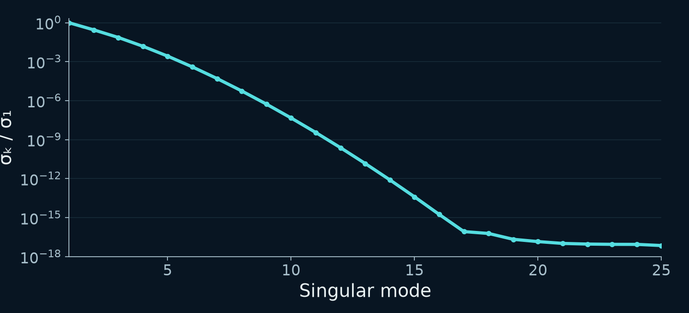

### Full speaker notes

Reference / consulta · 0 s

The minimum explanation of ill-conditioning is this exponential kernel with very similar columns. Some combinations of weights barely affect the signal; inversion amplifies noise in those directions. The example has 25 measurements and 110 weights, but the problem is not merely counting unknowns: singular values decay rapidly. A denser grid adds no measured information. Regularisation introduces a preference among compatible solutions; next we examine its cost.

Sources:

Reproducible v5 ILT ambiguity and regularization simulations

[local-source: ilt_simulations.json]

ILT method-choice and appendix guidance

[local-source: ilt_teaching_guidance.json]

## 45. Each algorithm favours a different solution

Hidden appendix

### Slide text

45

Each algorithm favours a different solution

Observed problem

Family / examples

Preference and risk

Isolated signal

Monoexp. / NNLS

Minimal model / unstable unregularized peaks

Broad distribution

Tikhonov / MaxEnt / PALMA

Regularization / may merge components

Few components

ITAMeD / L1 / VP / SCORE

Sparsity or model order / wrong assumptions

Overlapping signals

MF / TRAIn-MF / SILT

Shared structure / spurious factors

Compare solutions with the same b values, noise and preprocessing

Complete catalogue in the appendix: uses, limits and availability. FISTA/ADMM/SVD are engines, not physical models.

### Full speaker notes

Reference / consulta · 0 s

Do not select by the most fashionable name. For one expected diffusion in an isolated signal, start with a monoexponential model. For a continuous distribution, smoothing, entropy or combinations such as PALMA impose different preferences. A few discrete species call for sparse or discrete fitting with justified order and separation. Use joint routes for relationships across frequencies. FISTA, ADMM and SVD are numerical tools: they do not replace the physical model on their own. The full appendix explains each use and limitation. Its records include overlapping methods, routes and components rather than unique algorithm counts or experimental certification.

Sources:

Audited bilingual catalogue of local inversion methods and context families

[local-source: ilt_algorithm_catalog_bilingual.json]

ILT method-choice and appendix guidance

[local-source: ilt_teaching_guidance.json]
