# Contenido completo de las presentaciones

[English](../en/presentation-content.md) · [Español](../es/presentation-content.md)

45 diapositivas: 25 principales y 20 apéndices ocultos. Texto y notas extraídos de la edición pública del PPTX. El PowerPoint conserva los gráficos editables y vídeos.

## 01. DOSY en la práctica

Diapositiva principal

### Texto de la diapositiva

DOSY

Cómo resolver

sus dificultades

Un recorrido práctico · 20 minutos

Ignacio Fernández

Francisco Manuel Arrabal-Campos

Universidad de Almería · CIAIMBITAL / CIMEDES

### Notas completas del ponente

00:00–00:20 · 20 s

Quiero contar cómo pasamos de una serie de espectros a un resultado que podamos explicar y repetir. Antes de enseñar nuestros programas, veremos los dos obstáculos que motivaron su desarrollo: preparar bien el espectrómetro y procesar sin alterar la información de difusión. Después recorreremos las herramientas y tres ejemplos concretos. Empecemos por el recorrido completo.

Fuentes:

## 02. Medir, procesar y comprobar un DOSY

Diapositiva principal

### Texto de la diapositiva

02

Medir, procesar y comprobar un DOSY

01

PREPARAR LA MEDIDA

Calibración y elección de parámetros

02

ENTENDER LOS DATOS

Procesado e inversión que pueden engañar

03

USAR LAS HERRAMIENTAS

Programas propios y casos prácticos

04

COMPROBAR EL RESULTADO

Éxitos documentados y siguiente paso ultrafast

### Notas completas del ponente

00:20–00:45 · 25 s

El taller tiene cuatro partes, pero una sola historia. Primero necesitamos una intensidad que dependa de la difusión y una escala de b correcta. Después necesitamos conservar esa intensidad y comprender por qué la inversión no tiene una respuesta única. Sólo entonces presentaré cómo nuestros programas hacen este trabajo más manejable, con ejemplos guardados que se pueden revisar. La primera operación es calibrar el pulso de 90 grados.

Fuentes:

## 03. Primera dificultad: ¿es de verdad un pulso de 90°?

Diapositiva principal

### Texto de la diapositiva

03

Primera dificultad: ¿es de verdad un pulso de 90°?

Fase fija y potencia fija

p1 → zg → efp · fase fija · primer nulo → P1 / 2 → verificar

Confundir 180° con 360° cambia P90. Mantener D1 suficiente y RG fijo; revisar artefactos y coherencias.

### Valores del gráfico

- tx: Modelo ideal zg
- xVal: 0, 0.4, 0.8, 1.2, 1.6, 2, 2.4, 2.8, 3.2, 3.6, 4, 4.4, 4.8, 5.2, 5.6, 6, 6.4, 6.8, 7.2, 7.6, 8, 8.4, 8.8, 9.2, 9.6, 10, 10.4, 10.8, 11.2, 11.6, 12, 12.4, 12.8, 13.2, 13.6, 14, 14.4, 14.8, 15.2, 15.6, 16, 16.4, 16.8, 17.2, 17.6, 18, 18.4, 18.8, 19.2, 19.6, 20, 20.4, 20.8, 21.2, 21.6, 22, 22.4, 22.8, 23.2, 23.6, 24, 24.4, 24.8, 25.2, 25.6, 26, 26.4, 26.8, 27.2, 27.6, 28, 28.4, 28.8, 29.2, 29.6, 30, 30.4, 30.8, 31.2, 31.6, 32, 32.4, 32.8, 33.2, 33.6, 34, 34.4, 34.8, 35.2, 35.6, 36, 36.4, 36.8, 37.2, 37.6, 38, 38.4, 38.8, 39.2, 39.6, 40, 40.4, 40.8, 41.2, 41.6, 42, 42.4, 42.8, 43.2, 43.6, 44, 44.4, 44.8, 45.2, 45.6, 46, 46.4, 46.8, 47.2, 47.6, 48
- yVal: 0, 0.0570888108628, 0.113991409891, 0.170522192633, 0.226496767426, 0.281732556841, 0.336049393215, 0.389270106317, 0.441221101243, 0.491732924646, 0.540640817456, 0.587785252292, 0.633012453809, 0.676174900274, 0.717131804759, 0.755749574354, 0.791902245922, 0.825471896963, 0.856349030252, 0.884432930998, 0.909631995355, 0.931864029211, 0.951056516295, 0.967146854702, 0.980082561092, 0.989821441881, 0.996331730863, 0.999592192828, 0.999592192828, 0.996331730863, 0.989821441881, 0.980082561092, 0.967146854702, 0.951056516295, 0.931864029211, 0.909631995355, 0.884432930998, 0.856349030252, 0.825471896963, 0.791902245922, 0.755749574354, 0.717131804759, 0.676174900274, 0.633012453809, 0.587785252292, 0.540640817456, 0.491732924646, 0.441221101243, 0.389270106317, 0.336049393215, 0.281732556841, 0.226496767426, 0.170522192633, 0.113991409891, 0.0570888108628, 5.66553889765E-16, -0.0570888108628, -0.113991409891, -0.170522192633, -0.226496767426, -0.281732556841, -0.336049393215, -0.389270106317, -0.441221101243, -0.491732924646, -0.540640817456, -0.587785252292, -0.633012453809, -0.676174900274, -0.717131804759, -0.755749574354, -0.791902245922, -0.825471896963, -0.856349030252, -0.884432930998, -0.909631995355, -0.931864029211, -0.951056516295, -0.967146854702, -0.980082561092, -0.989821441881, -0.996331730863, -0.999592192828, -0.999592192828, -0.996331730863, -0.989821441881, -0.980082561092, -0.967146854702, -0.951056516295, -0.931864029211, -0.909631995355, -0.884432930998, -0.856349030252, -0.825471896963, -0.791902245922, -0.755749574354, -0.717131804759, -0.676174900274, -0.633012453809, -0.587785252292, -0.540640817456, -0.491732924646, -0.441221101243, -0.389270106317, -0.336049393215, -0.281732556841, -0.226496767426, -0.170522192633, -0.113991409891, -0.0570888108628, -1.13310777953E-15, 0.0570888108628, 0.113991409891, 0.170522192633, 0.226496767426, 0.281732556841, 0.336049393215, 0.389270106317, 0.441221101243, 0.491732924646, 0.540640817456
- tx: 90°
- xVal: 11
- yVal: 1
- tx: 180° / 360°
- xVal: 22, 44
- yVal: 0, 0

### Notas completas del ponente

00:45–01:35 · 50 s

La duración del pulso depende de la muestra, sintonía y potencia. Copiar P1 de otra preparación puede disminuir la señal y alterar la secuencia. A potencia fija buscamos el primer cruce de señal positiva a negativa después del máximo: es el nulo de 180 grados. Mantengo fase, RG y D1; no hago autophase independiente en cada punto porque perdería el signo. La curva seno es un modelo ideal para explicar el procedimiento, no una nueva medida del espectrómetro. Ahora lo hacemos con tu experimento 1000.

Fuentes:

PLA-D1 pulse calibration: user screenshots and saved experiments 1000 / 10

[local-source: 20250321_PLA-D1_diff_CDCL3]

Bruker TopSpin 3.6 Basic Experiments, pp.109-116; UCSB NMR pulse width calibration

https://nmr.chem.ucsb.edu/protocols/pw90cal.html

&lt;TopSpin&gt;/prog/docu/English/topspin/pdf/step_basic.pdf

Read-only audit of pulse calibration and sequence-dependent timing parameters

[local-source: parameters_pulse_evidence.json]

## 04. Caso 1 · de 22 µs a P90 = 11 µs

Diapositiva principal

### Texto de la diapositiva

04

Caso 1 · de 22 µs a P90 = 11 µs

EXPNO 1000 · zg

22 µs

÷ 2

P90 = 11 µs

Nulo de 180° identificado por el usuario. Azul: 90°. Capturas con RG/NS distintos: comparación cualitativa.

### Notas completas del ponente

01:35–02:25 · 50 s

Éste es el ejemplo real PLA/CDCl3. En zg, experimento 1000, P1 está en 22 microsegundos a PLW1 de 22 vatios; el usuario identifica ese primer nulo como 180 grados. Dividimos entre dos y obtenemos 11 microsegundos. El DOSY 10 guarda P1 de 11 y P2 de 22 a la misma potencia. El resultado práctico es un valor documentado y transferible bajo las mismas condiciones; verificamos el máximo de 90 grados en zg antes de adquirir. Rojo y azul usan RG, NS y secuencias distintos: la comparación es cualitativa, no una medida absoluta de recuperación de sensibilidad. Ya tenemos RF; ahora necesitamos que el eje de difusión tenga escala física.

Fuentes:

PLA-D1 pulse calibration: user screenshots and saved experiments 1000 / 10

[local-source: 20250321_PLA-D1_diff_CDCL3]

Bruker TopSpin 3.6 Basic Experiments, pp.109-116; UCSB NMR pulse width calibration

https://nmr.chem.ucsb.edu/protocols/pw90cal.html

&lt;TopSpin&gt;/prog/docu/English/topspin/pdf/step_basic.pdf

Read-only audit of pulse calibration and sequence-dependent timing parameters

[local-source: parameters_pulse_evidence.json]

p1 evidence

[local-source: parameters_pulse_evidence.json]

## 05. El gradiente: calibrar una escala que entra al cuadrado

Diapositiva principal

### Texto de la diapositiva

05

El gradiente: calibrar una escala que entra al cuadrado

EJEMPLO HIPOTÉTICO DE ERROR

G real = 1.10 G usado

D aparente = 1.21 D

HDO / TBO

|pendiente| = 1.58627

Patrón a T real · región fija · residuos · comprobar una segunda rampa

G nueva = G previa √(D medida / Dref). Perfil TBO: Δ = 50 ms, δ = 1.20 ms, SMSQ10.100.

### Valores del gráfico

- tx: HDO medido
- xVal: 0.0064, 0.0144, 0.0256, 0.04, 0.0576, 0.0784, 0.1024, 0.1296, 0.16, 0.1936, 0.2304, 0.2704, 0.3136, 0.36, 0.4096, 0.4624, 0.5184, 0.5776, 0.64, 0.7056, 0.7744, 0.8464, 0.9216
- yVal: 0, 0.00434557991417, 0.0226195463623, 0.0454872877104, 0.0796079214162, 0.102780571484, 0.145347196992, 0.190778271256, 0.24179088834, 0.288431276242, 0.353820238552, 0.414148373105, 0.494519237685, 0.560923156696, 0.6481989569, 0.726040915482, 0.809033128399, 0.907466016238, 1.00168822472, 1.10693033448, 1.219643171, 1.32377101174, 1.4334963509
- tx: Ajuste
- xVal: 0, 1
- yVal: -0.0136077066163, 1.57266562822

### Notas completas del ponente

02:25–03:45 · 80 s

La escala del gradiente entra al cuadrado en b. En el ejemplo hipotético, G real un diez por ciento mayor que G usado produce D aparente un veintiuno por ciento mayor sin empeorar la exponencial. Calibramos con una rampa del patrón a la temperatura real, tratamiento uniforme, una región fija y un modelo de secuencia compatible. Miramos señal firmada, residuos y deriva, no sólo R cuadrado. El ejemplo experimental HDO/TBO conservado tiene pendiente 1.58627 para Delta de 50 ms, delta de 1.20 ms y SMSQ10.100. Ese perfil histórico usa extracción puntual de altura, no la integral del nuevo asistente. El valor HDO de 1.902 por diez elevado a menos nueve corresponde a 298.15 K; la rampa real tiene otra temperatura y usa una aproximación térmica documentada. Si el modelo es compatible, G nueva es G previa por la raíz de D medida sobre D de referencia. Más adelante haremos una reproducción offline por integrales con el asistente, conservando ambas extracciones separadas y sin sustituir la calibración protegida. La ecuación compatible no es un detalle: cambia el significado de b.

Fuentes:

DiffAtOnce DOSY TopSpin console assistant

[local-source: README_ES.md]

TBO HDO experimental calibration, 4 September 2026

[local-source: TBO_HDO_20260904.json]

Calibración DOSY según la sonda, secuencia, gradiente, temperatura y referencia interna

[local-source: CALIBRACION_SONDA_SECUENCIA_GRADIENTE.md]

tbo calibration

[local-source: TBO_HDO_20260904.json]

tbo calculation

[local-source: calibracion_tbo.py]

topspin readme

[local-source: README_ES.md]

topspin verification

[local-source: VERIFICACION.txt]

## 06. La secuencia decide qué significa b

Diapositiva principal

### Texto de la diapositiva

06

La secuencia decide qué significa b

R² = 1

D / 10⁻⁹ m² s⁻¹

SMSQ / bipolar: 1.000

PGSE: 0.802

Revisar secuencia + forma + δ + intervalos RF antes de ajustar D

SIMULACIÓN sin ruido, G físico fijo y sin recalibrar. El ajuste verifica la curva, no la escala de b.

### Valores del gráfico

- tx: Datos simulados
- xVal: 0.0064, 0.0144, 0.0256, 0.04, 0.0576, 0.0784, 0.1024, 0.1296, 0.16, 0.1936, 0.2304, 0.2704, 0.3136, 0.36, 0.4096, 0.4624, 0.5184, 0.5776, 0.64, 0.7056, 0.7744, 0.8464, 0.9216
- yVal: 0.993462211855, 0.985350050771, 0.974104187519, 0.959833610628, 0.942675398473, 0.922792527515, 0.900371296183, 0.875618421318, 0.848757870403, 0.820027497349, 0.789675552281, 0.757957136571, 0.725130673291, 0.691454460442, 0.657183369857, 0.622565748799, 0.587840574185, 0.553234901347, 0.518961640542, 0.48521768532, 0.452182407684, 0.420016525949, 0.388861342557
- tx: Ambos modelos
- xVal: 0, 0.0166666666667, 0.0333333333333, 0.05, 0.0666666666667, 0.0833333333333, 0.1, 0.116666666667, 0.133333333333, 0.15, 0.166666666667, 0.183333333333, 0.2, 0.216666666667, 0.233333333333, 0.25, 0.266666666667, 0.283333333333, 0.3, 0.316666666667, 0.333333333333, 0.35, 0.366666666667, 0.383333333333, 0.4, 0.416666666667, 0.433333333333, 0.45, 0.466666666667, 0.483333333333, 0.5, 0.516666666667, 0.533333333333, 0.55, 0.566666666667, 0.583333333333, 0.6, 0.616666666667, 0.633333333333, 0.65, 0.666666666667, 0.683333333333, 0.7, 0.716666666667, 0.733333333333, 0.75, 0.766666666667, 0.783333333333, 0.8, 0.816666666667, 0.833333333333, 0.85, 0.866666666667, 0.883333333333, 0.9, 0.916666666667, 0.933333333333, 0.95, 0.966666666667, 0.983333333333, 1
- yVal: 1, 0.983063671545, 0.966414182312, 0.950046674297, 0.933956371774, 0.918138579899, 0.902588683343, 0.887302144942, 0.872274504377, 0.857501376868, 0.842978451899, 0.828701491957, 0.814666331298, 0.80086887473, 0.787305096419, 0.773971038712, 0.760862810985, 0.74797658851, 0.73530861133, 0.722855183173, 0.710612670365, 0.698577500776, 0.686746162772, 0.675115204194, 0.663681231351, 0.652440908027, 0.641390954512, 0.630528146638, 0.619849314847, 0.609351343258, 0.599031168764, 0.588885780135, 0.578912217141, 0.569107569685, 0.559468976958, 0.549993626604, 0.540678753896, 0.531521640932, 0.52251961584, 0.513670052002, 0.504970367284, 0.496418023284, 0.48801052459, 0.479745418057, 0.471620292082, 0.463632775909, 0.455780538934, 0.448061290023, 0.440472776847, 0.433012785223, 0.425679138468, 0.418469696762, 0.41138235653, 0.404415049819, 0.397565743703, 0.390832439685, 0.384213173116, 0.377706012619, 0.37130905953, 0.36502044734, 0.358838341151

### Notas completas del ponente

03:45–04:30 · 45 s

No todas las ecuaciones de difusión son intercambiables. El ejemplo simulado usa gradientes bipolares con forma SMSQ y un G físico fijo. Ajustarlo con su modelo da D de 1; con PGSE rectangular da aproximadamente 0.802, con la misma curva y R cuadrado igual a uno. Revisamos pulseprogram, forma, unidades, duración total delta e intervalos RF. En stebpgp1s1d, delta es dos veces P30. Un patrón puede absorber un factor constante de b en una calibración empírica, pero eso no demuestra que se pueda transferir a otra secuencia o a otros tiempos. Las ecuaciones completas quedan en el apéndice. Incluso con b correcto, la rampa puede no tener información suficiente.

Fuentes:

Read-only comparison of the TBO software profile and acquired pulse program

[local-source: local_equation_audit.json]

D. Sinnaeve (2012), The Stejskal–Tanner Equation Generalized for Any Gradient Shape. Table 2, p.58; definitions pp.50–51

https://doi.org/10.1002/cmr.a.21223

[local-source: Mendeley] Reference Manager\userfiles\35ec08f9-3640-0c4b-0bcc-fe3f454aba96.pdf

TBO HDO experimental calibration, 4 September 2026

[local-source: TBO_HDO_20260904.json]

Ghent University repository — Sinnaeve 2012

https://biblio.ugent.be/publication/2109280

## 07. Dos rampas que ajustan bien y miden mal

Diapositiva principal

### Texto de la diapositiva

[Vídeo o recurso 7](../../presentations/assets/6e25fd257f6d62aee84c.mp4)

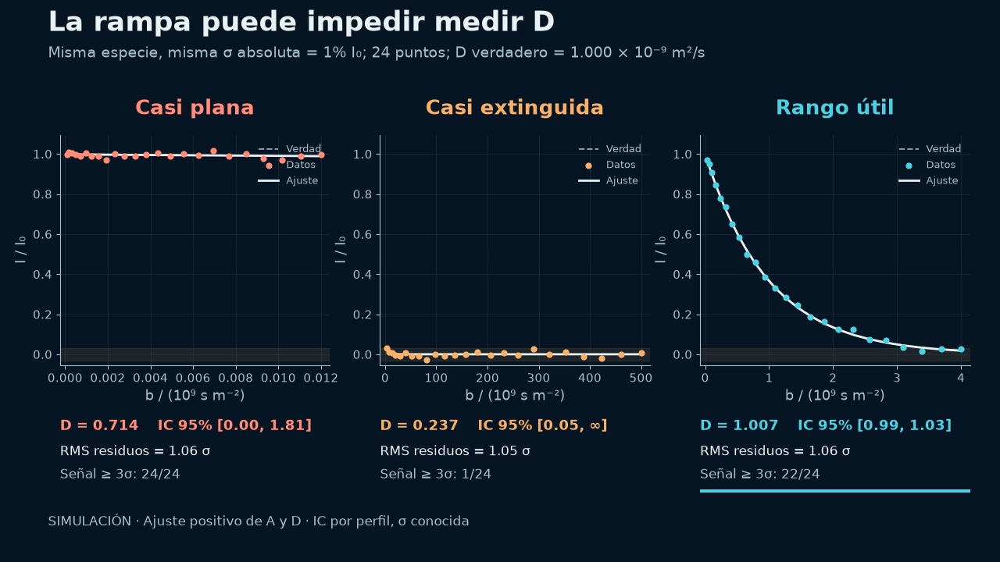

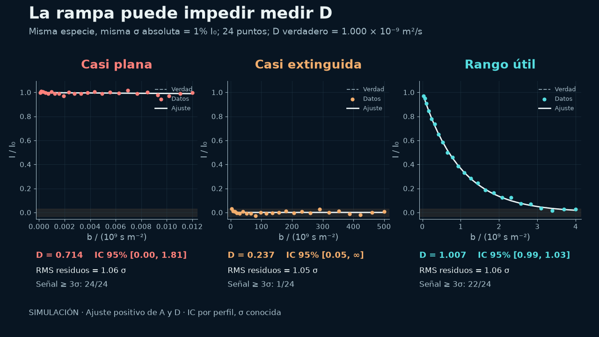

### Notas completas del ponente

04:30–05:30 · 60 s

Las tres rampas simuladas tienen la misma D verdadera de uno por diez elevado a menos nueve y ruido absoluto de uno por ciento. La casi plana estima 0.714, con intervalo nominal de cero a 1.81. La extinguida estima 0.237, con intervalo de 0.05 hasta un extremo no identificable. La útil estima 1.007, con intervalo de 0.986 a 1.029. Los residuos son similares, alrededor de una sigma. Es el contenido informativo de la adquisición, no el aspecto del ajuste, lo que cambia. Estos intervalos son condicionales al modelo y al ruido conocido de la simulación, no límites universales. La decisión práctica es repetir el piloto modificando P30/D20 o sensibilidad, no pedir al algoritmo una separación que no está en el dato. Por eso elegimos P30 y D20 a partir de un piloto.

Fuentes:

P30/D20 teaching simulation and fixed-noise model

[local-source: parameter_simulation_model.json]

Generador configurable de rampas DOSY para TopSpin

[local-source: README.md]

V6 controlled ramp and preprocessing simulations

[local-source: problem_simulations.json]

## 08. Elegir P30 y D20 es un compromiso, no una receta

Diapositiva principal

### Texto de la diapositiva

[Vídeo o recurso 8](../../presentations/assets/6361c014dce6c889ce94.mp4)

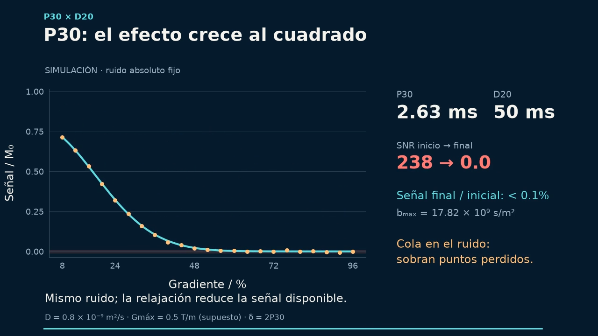

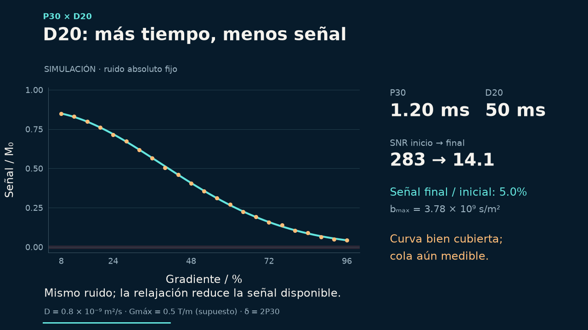

### Notas completas del ponente

05:30–06:40 · 70 s

No introducimos P30 y D20 sólo porque funcionaron en la muestra anterior. Un piloto con gradientes bajo, medio y alto muestra cuánto atenúan las señales rápidas y lentas. Si necesito más ponderación puedo aumentar delta o Delta, pero pago relajación y sensibilidad; Delta también aumenta la exposición a movimiento, intercambio u otras dinámicas. La animación separa atenuación normalizada de señal absoluta y usa tiempos de relajación hipotéticos: no prescribe límites de la sonda real. Mantengo potencia, temperatura y tratamiento comparables y busco una curva que decaiga apreciablemente conservando puntos por encima del ruido. Los retardos de recuperación también necesitan su comprobación.

Fuentes:

Read-only audit of pulse calibration and sequence-dependent timing parameters

[local-source: parameters_pulse_evidence.json]

P30/D20 teaching simulation and fixed-noise model

[local-source: parameter_simulation_model.json]

## 09. LED y doble STE: recuperar señal sin copiar retardos

Diapositiva principal

### Texto de la diapositiva

09

LED y doble STE: recuperar señal sin copiar retardos

Secuencia

Retardo relevante

Problema a controlar

ledbpgp2s / 1d

LED = D21

Recuperación de corrientes de Foucault

dstebpgp3s / 1d

D20 total · D21 LED

Convección / más RF / pérdida de sensibilidad

diffSteLED

D5 ≠ LED · LED = D19

D5: resto del intervalo de difusión

Doble STE: δ = 2P30 · 8 lóbulos · NS = 16×n

Leer el pulseprogram adquirido y sus límites antes de copiar parámetros

Revisar D1, D16, P19 y DELTA1. La compensación de convección tiene alcance y coste de señal.

### Notas completas del ponente

06:40–07:35 · 55 s

El siguiente problema es la fase y la forma después de los gradientes. LED permite recuperación, pero también cuesta tiempo y señal. En ledbpgp2s y dstebpgp3s, LED es D21 y D5 no se usa; en diffSteLED, LED es D19 y D5 es el resto del intervalo de difusión. En doble STE revisamos dos bloques DELTA1, ocho lóbulos, más pulsos RF y el ciclo de fases de dieciséis. La compensación de convección cubre un modelo de movimiento, no cualquier flujo. Tres Delta comparables y controles de temperatura ayudan a investigar D dependiente de Delta; por sí solos no identifican la causa. No hay un optimizador universal de estos tiempos. Y repetimos diferentes Delta para mirar más allá del ajuste de una sola rampa.

Fuentes:

Read-only audit of pulse calibration and sequence-dependent timing parameters

[local-source: parameters_pulse_evidence.json]

D. Sinnaeve (2012), The Stejskal–Tanner Equation Generalized for Any Gradient Shape. Table 2, p.58; definitions pp.50–51

https://doi.org/10.1002/cmr.a.21223

[local-source: Mendeley] Reference Manager\userfiles\35ec08f9-3640-0c4b-0bcc-fe3f454aba96.pdf

## 10. Cambiar Δ ayuda a descubrir que no estamos midiendo sólo difusión

Diapositiva principal

### Texto de la diapositiva

10

Cambiar Δ ayuda a descubrir que no estamos midiendo sólo difusión

Δ ↑

D aparente ↑

Convección

Intercambio

Difusión restringida

Comparar tres Δ, T y amplitudes propias por rampa; revisar el patrón

SIMULACIÓN: velocidades gaussianas, σv = 100 µm/s, pulsos estrechos. La causa necesita otras pruebas.

### Valores del gráfico

- tx: Difusión pura
- xVal: 50, 100, 150
- yVal: 0.8, 0.8, 0.8
- tx: Dispersión de velocidades
- xVal: 50, 100, 150
- yVal: 1.05, 1.3, 1.55

### Notas completas del ponente

07:35–08:10 · 35 s

GUION (35 s):

Si D cambia al cambiar Delta, la difusión puede no ser la única causa de atenuación. La simulación muestra velocidades dispersas: D aparente aumenta aunque D verdadera sea constante, y el ajuste sigue siendo excelente. No diagnostico convección sólo con esa observación; reviso temperatura, amplitudes y patrón, y considero intercambio o restricción. Tres Delta sirven para plantear la siguiente comprobación.

DETALLES DE CONSULTA (no leer durante el pase):

En esta simulación idealizada, dispersión gaussiana de velocidades de 100 micrómetros por segundo hace que la D aparente aumente de 1.05 a 1.30 y 1.55 al aumentar Delta de 50 a 100 y 150 ms, aunque la D verdadera permanece en 0.8. La exponencial sigue ajustando perfectamente. La expresión procede del modelo de pulsos estrechos y velocidades constantes durante cada codificación; no es una ley universal de convección ni el modelo exacto de nuestro pulseprogram. En la muestra real, dependencia de Delta puede tener causas distintas. Revisamos temperatura, amplitudes propias por rampa y controles del patrón antes de atribuirla a convección. Superado el instrumento, empieza la segunda dificultad: el procesado.

Fuentes:

Idealised velocity-distribution attenuation and Delta dependence

[local-source: convection_idealized_model.json]

prime readme

[local-source: README.md]

Read-only audit of pulse calibration and sequence-dependent timing parameters

[local-source: parameters_pulse_evidence.json]

Williamson et al. (2020), Limits to flow detection in phase contrast MRI

https://pmc.ncbi.nlm.nih.gov/articles/PMC7745993/

Gottwald et al. (2003), Separation of velocity distribution and diffusion using PFG NMR

https://pubmed.ncbi.nlm.nih.gov/12810021/

## 11. El segundo gran obstáculo: conservar la atenuación

Diapositiva principal

### Texto de la diapositiva

[Vídeo o recurso 11](../../presentations/assets/d37dd0bce41d01048112.mp4)

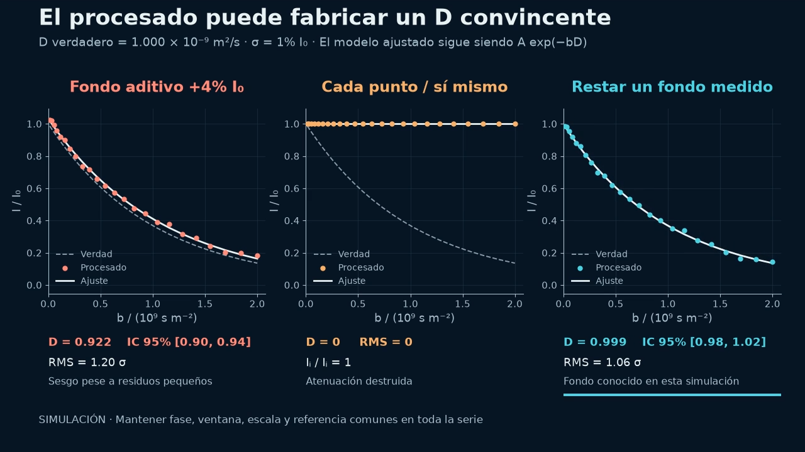

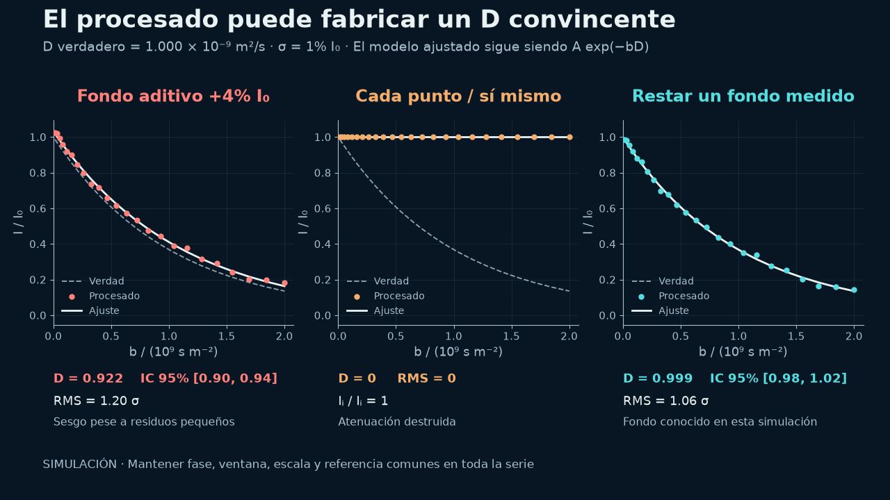

### Notas completas del ponente

08:10–09:10 · 60 s

Una serie DOSY no se procesa como espectros independientes a los que buscamos la mejor apariencia. Fase, línea base, eje ppm, RG, NS y escala NC_PROC deben permitir comparar intensidades. En la simulación, un fondo aditivo de sólo cuatro por ciento del primer punto hace que D pase de uno a 0.922; los residuos no gritan error. Quitando el fondo conocido recuperamos 0.999. Normalizar cada espectro por su propia señal destruye la atenuación y produce una D cero artificial. En el experimento el fondo no es conocido por decreto: se inspeccionan regiones sin señal, superposición y desplazamiento de picos. Si una señal se mueve fuera de la ventana, tampoco estamos midiendo sólo difusión. La primera intervención es corregir el procesado de una copia, conservando los originales. Con intensidades comparables todavía debemos decidir qué información podemos reconstruir.

Fuentes:

V6 controlled ramp and preprocessing simulations

[local-source: problem_simulations.json]

prime guide

[local-source: GUIA_PRIME.md]

V6 audit of software actions, observable checks and limitations

[local-source: solutions_mapping.json]

## 12. Una atenuación no determina una distribución única

Diapositiva principal

### Texto de la diapositiva

[Vídeo o recurso 12](../../presentations/assets/cfb1c2ac0ae33f2a2d33.mp4)

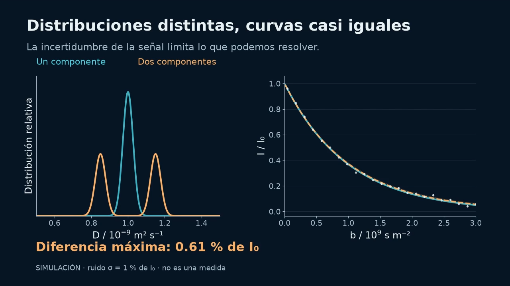

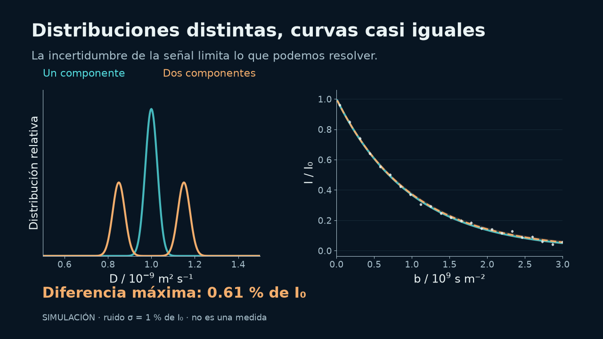

### Notas completas del ponente

09:10–10:20 · 70 s

Ésta es la dificultad central de la ILT. Una distribución estrecha y dos componentes cercanas producen curvas que difieren como máximo aproximadamente 0.61 por ciento del primer punto en este diseño; el ruido simulado tiene sigma de uno por ciento. Esto no es una prueba universal de imposibilidad, pero muestra lo fácil que es pedir más resolución de la que la adquisición soporta. Al invertir el kernel de Laplace, las direcciones débiles amplifican el ruido. La pregunta útil no es qué algoritmo dibuja dos picos, sino si los datos, la repetición y los controles sostienen dos comportamientos difusivos. Necesitamos una preferencia explícita y una forma de comprobar su efecto.

Fuentes:

Reproducible v5 ILT ambiguity and regularization simulations

[local-source: ilt_simulations.json]

## 13. Cómo lo resolvemos: regularizar y comparar hipótesis

Diapositiva principal

### Texto de la diapositiva

[Vídeo o recurso 13](../../presentations/assets/c1f7921649e279402530.mp4)

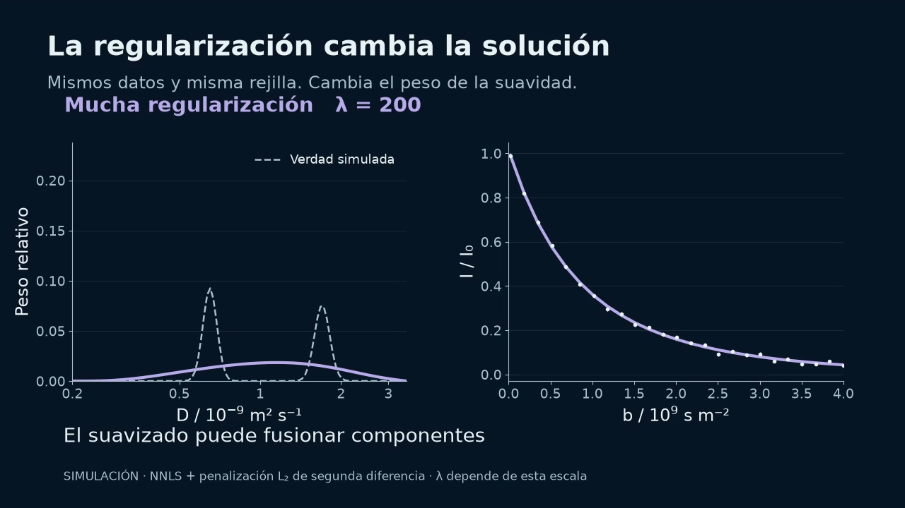

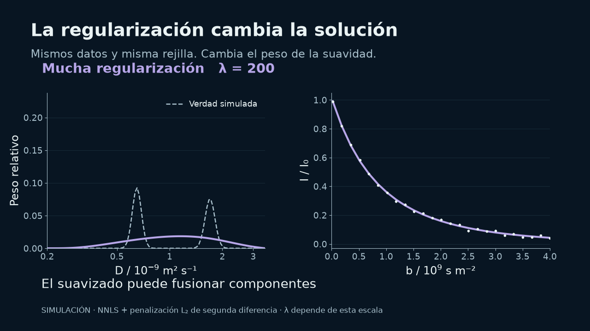

### Notas completas del ponente

10:20–11:15 · 55 s

La regularización estabiliza la inversión imponiendo una preferencia. En este ejemplo real del cálculo simulado, tres lambda dan residuos RMS de aproximadamente 0.00833, 0.00834 y 0.00842, pero soluciones con picos, moderadas o excesivamente anchas. No elegimos por un residuo mínimo aislado. Para una señal sencilla empezamos por un modelo mínimo; para una distribución ancha comparamos suavidad o entropía; para pocas componentes, esparsidad u orden; para solapamientos, estructura compartida. NNLS, Tikhonov, MaxEnt/PALMA, métodos L1/ITAMeD, VP/SCORE y MF/TRAIn-MF/SILT responden a hipótesis distintas. SVD, FISTA y ADMM son motores numéricos, no pruebas de especies. El catálogo de uso y límites permanece como material de consulta, no ocupa el relato. Y no siempre necesitamos resolver cada frecuencia por separado.

Fuentes:

Reproducible v5 ILT ambiguity and regularization simulations

[local-source: ilt_simulations.json]

ILT method-choice and appendix guidance

[local-source: ilt_teaching_guidance.json]

## 14. El espectro ofrece información compartida

Diapositiva principal

### Texto de la diapositiva

[Vídeo o recurso 14](../../presentations/assets/b7a6ce44706ce0fe5566.mp4)

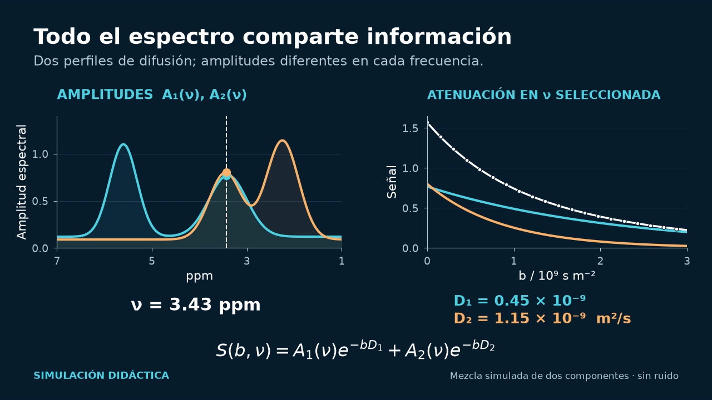

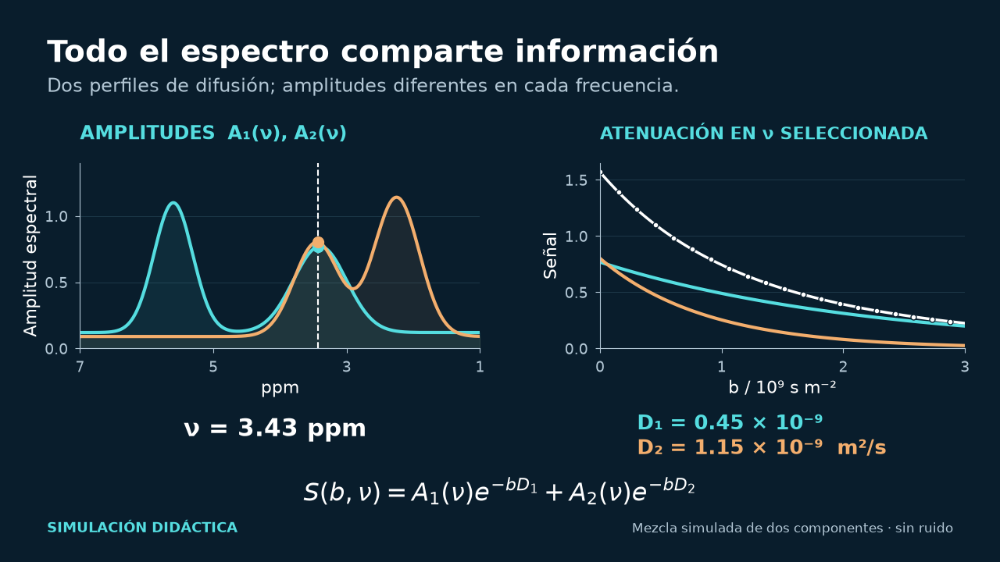

### Notas completas del ponente

11:15–11:50 · 35 s

Varias señales pueden compartir perfiles de difusión con amplitudes distintas. Un cálculo conjunto aprovecha esa redundancia: una región fuerte ayuda a otra débil. No impongo una única D a todo el espectro. MF y TRAIn-MF comparten factores; TRAIn por bin mantiene una comparación independiente. Este vídeo es conceptual, sin ruido añadido. La correlación no demuestra interacción ni identidad química; el rango tampoco cuenta moléculas. Veremos cómo mantener la curva local a la vista cuando trabajemos con el mapa. Ya podemos explicar para qué desarrollamos nuestras herramientas.

Fuentes:

Native signed TRAIn-MF and rank selection

ILT method-choice and appendix guidance

[local-source: ilt_teaching_guidance.json]

Audited bilingual catalogue of local inversion methods and context families

[local-source: ilt_algorithm_catalog_bilingual.json]

University of Manchester NMR — Multivariate DOSY

https://www.nmr.chemistry.manchester.ac.uk/?q=node%2F26

## 15. El trabajo que nuestros programas ayudan a resolver

Diapositiva principal

### Texto de la diapositiva

15

El trabajo que nuestros programas ayudan a resolver

Ya sabemos qué debemos revisar.

Ahora lo hacemos con nuestros programas:

preparar, analizar y conservar el resultado.

Rampa y calibración

Una señal y el espectro completo

Series de muestras y controles

Estos son los problemas para los que hemos desarrollado nuestras herramientas.

### Notas completas del ponente

11:50–12:10 · 20 s

GUION (20 s):

Ya conocemos los obstáculos y cómo se revisan. Ahora mostramos para qué hemos desarrollado los programas: preparar sin transcribir, conservar la medida, analizar una señal o el espectro y comprobar el resultado. Cada caso parte de una entrada, realiza una operación y conserva su salida.

DETALLES DE CONSULTA (no leer durante el pase):

Los programas se han desarrollado precisamente para estos obstáculos. Automatizan preparación, lectura y comparación; conservan los pasos que deben revisarse. La ventaja que mostraré es concreta: menos transcripción, trazabilidad de la calibración, de una atenuación al espectro y controles junto al resultado. Una herramienta no rescata una rampa sin información ni sustituye la calibración. Cada programa resuelve una tarea concreta del recorrido.

Fuentes:

## 16. Nuestros programas y sus funciones

Diapositiva principal

### Texto de la diapositiva

16

Nuestros programas y sus funciones

Herramienta

Entrada

Qué aporta

TopSpin · xpy

Plantilla y serie 1D

Preparar rampas e integrar el patrón

DiffAtOnce Prime

Serie Bruker procesada

Señal local, mapa y diagnóstico

ResinAtOnce

Serie de resina / polímero

Flujo guiado, referencias y exportación

DALTAIL · MATLAB

Datos y configuración guardada

Procesar lotes y reproducir tablas

En los siguientes casos veremos la entrada, las operaciones y el resultado.

### Notas completas del ponente

12:10–12:45 · 35 s

GUION (35 s):

El asistente TopSpin prepara rampas y registra una calibración. Prime permite explorar una señal, un mapa y sus diagnósticos. ResinAtOnce guía el análisis de resinas y polímeros, separando patrones y resultados condicionados. DALTAIL permite ejecutar por lotes con MATLAB y Python y reproducir tablas desde una configuración guardada. Son herramientas del flujo; TRAIn, MF o SILT son motores que utilizan. Veamos qué trabajo nos evitan y qué resultado dejan.

DETALLES DE CONSULTA (no leer durante el pase):

El asistente TopSpin prepara rampas y calibra una señal del patrón desde la consola. Prime reúne análisis DOSY general: señal local, espectro completo, métodos y comprobaciones. ResinAtOnce organiza resinas y polímeros por muestras y rampas, separa patrones y acompaña resultados D, Rh y masa aparente con sus hipótesis. DALTAIL es el recorrido MATLAB/Python reproducible por lotes; comparte funciones y guarda tablas, factores y diagnóstico. Son productos y recorridos, no cuatro algoritmos ILT nuevos: TRAIn, MF, SILT o RAI-S son motores dentro del análisis. Vamos a recorrer casos que muestran qué trabajo se resuelve en cada etapa. Primero volvemos a la calibración del HDO.

Fuentes:

V6 audit of software actions, observable checks and limitations

[local-source: solutions_mapping.json]

prime readme

[local-source: README.md]

prime guide

[local-source: GUIA_PRIME.md]

Read-only audit of pulse calibration and sequence-dependent timing parameters

[local-source: parameters_pulse_evidence.json]

## 17. TopSpin: un informe de calibración HDO

Diapositiva principal

### Texto de la diapositiva

17

TopSpin: un informe de calibración HDO

xpy dosy_workshop.py

1  Seleccionar la serie y una región fija

2  Integrar y aportar Dref(T)

3  Revisar ajuste y guardar la propuesta

HDO REAL · REPLAY OFFLINE

R² = 0.999775

ΔTE = 0.77 K

Límite configurado: 0.50 K

El programa detecta la deriva: estabilizar y repetir antes de calibrar

Replay offline. Candidato ilustrativo a 0.80 K; el límite habitual de 0.50 K rechaza la serie.

### Notas completas del ponente

12:45–13:50 · 65 s

GUION (65 s):

Seleccionamos la serie HDO 10 a 32 y una ventana fija de 4.5 a 4.9 ppm. El asistente integra, ajusta y genera el informe. El replay offline da R cuadrado de 0.99977, pero detecta deriva térmica de 0.77 K, por encima del límite de 0.5 K, y avisa de fase y DS variables. El éxito es impedir que un ajuste atractivo se confunda con calibración aceptada. La propuesta ilustrativa por integral no sustituye la calibración histórica por altura. Revisamos, estabilizamos y repetimos; el instrumento permanece intacto.

DETALLES DE CONSULTA (no leer durante el pase):

Abrimos xpy dosy_workshop.py y Calibrar con serie 1D. Introducimos EXPNO 10 a 32, ventana 4.5 a 4.9 ppm, el patrón HDO y una D de referencia documentada. El asistente integra áreas firmadas y comprueba metadatos antes de aceptar el ajuste. Mostramos una reproducción offline con datos experimentales reales: su candidato tiene pendiente 1.55703 y R cuadrado de 0.99977, pero la revisión térmica por defecto rechaza la rampa porque TE varía 0.77 K y supera la tolerancia de 0.5 K. También detecta fase y DS variables. Para producir el informe ilustrativo se elevó explícitamente la tolerancia a 0.8 K; eso no significa aceptar la calibración. El éxito es que el software convierte un buen ajuste engañosamente tranquilizador en una decisión trazable. El informe conserva entrada, integral, residuos, avisos y propuesta de escala. El perfil histórico protegido usa altura puntual y pendiente 1.58627: no se sustituye ni se confunde con la integral. No es una ejecución nueva en consola 3.6.4, ni escribe la constante del espectrómetro. Debemos estabilizar temperatura y revisar fase y preparación antes de usar el candidato como calibración. La misma consola puede eliminar la transcripción de las tres rampas.

Fuentes:

DiffAtOnce DOSY TopSpin console assistant

[local-source: README_ES.md]

V6 audit of software actions, observable checks and limitations

[local-source: solutions_mapping.json]

prime readme

[local-source: README.md]

prime guide

[local-source: GUIA_PRIME.md]

Read-only audit of pulse calibration and sequence-dependent timing parameters

[local-source: parameters_pulse_evidence.json]

HDO signed-area offline calibration summary

[local-source: summary.json]

HDO signed-area candidate with thermal rejection

[local-source: calibracion_integral_offline.json]

HDO signed-area extracted attenuation

[local-source: atenuacion_integral_residuos.csv]

HDO offline calibration report

[local-source: informe_integral_offline.html]

integral replay summary

[local-source: summary.json]

integral replay result

[local-source: calibracion_integral_offline.json]

integral replay csv

[local-source: atenuacion_integral_residuos.csv]

integral replay script

[local-source: replay_integral_calibration.py]

integral replay spectrum

[local-source: HDO_spectral_inspection.png]

topspin calibration source

[local-source: dosy_calibration.py]

topspin console source

[local-source: dosy_console_ui.py]

tbo calibration

[local-source: TBO_HDO_20260904.json]

## 18. TopSpin: tres rampas con Δ configurable

Diapositiva principal

### Texto de la diapositiva

18

TopSpin: tres rampas con Δ configurable

xpy dosy_workshop.py

Ejemplo configurable

D20 / s

EXPNO

Δ 50 ms

0.050

100–122

Δ 100 ms

0.100

200–222

Δ 150 ms

0.150

300–322

Misma plantilla · P30 fijo · gradientes completos · integrar el patrón

El asistente prepara parámetros y calibra desde la serie 1D. Revisar destinos, unidades y límites antes de adquirir.

### Notas completas del ponente

13:50–14:35 · 45 s

GUION (45 s):

Partimos de una plantilla revisada y elegimos tres Delta configurables. En el ejemplo: 50, 100 y 150 ms, P30 fijo y 23 gradientes de 8 a 96 por ciento. Son 69 destinos que no necesitamos transcribir. Revisamos el plan y las colisiones antes de crear; guardamos CSV y JSON. El generador puede preparar desde consola o exportar macro y Python. Esta demostración es preparación del plan, no una adquisición nueva.

DETALLES DE CONSULTA (no leer durante el pase):

Partimos de una plantilla revisada. Definimos tres valores Delta, que aquí son ejemplos editables de 50, 100 y 150 ms, y la lista GPZ6 de 8 a 96 en pasos de cuatro. Son 23 puntos por rampa, 69 experimentos, con destinos configurables. Antes de crear revisamos el plan, unidades ms a s y colisiones EXPNO. El programa conserva P30 y hereda la plantilla; guarda el plan y vuelve al experimento abierto. No inicia adquisición ni decide los límites de la sonda. El mismo generador puede exportar macro o preparar desde Python. El éxito de esta demostración es crear un plan coherente y auditable sin transcripción repetida; no es una adquisición nueva de 69 espectros. Con datos adquiridos y procesados de manera comparable, abrimos Prime.

Fuentes:

DiffAtOnce DOSY TopSpin console assistant

[local-source: README_ES.md]

V6 audit of software actions, observable checks and limitations

[local-source: solutions_mapping.json]

prime readme

[local-source: README.md]

prime guide

[local-source: GUIA_PRIME.md]

Read-only audit of pulse calibration and sequence-dependent timing parameters

[local-source: parameters_pulse_evidence.json]

topspin readme

[local-source: README_ES.md]

topspin verification

[local-source: VERIFICACION.txt]

topspin console source

[local-source: dosy_console_ui.py]

## 19. Prime: ajustar una señal real antes del mapa

Diapositiva principal

### Texto de la diapositiva

19

Prime: ajustar una señal real antes del mapa

1  Abrir la serie

2  Fijar la región

3  Ajustar y revisar

D final = 0.3267

Resultado guardado con sus puntos, calibración y correcciones

TP194 · 4.4182 ± 0.04 ppm · 23 puntos, 0 excluidos · D / 10⁻⁹ m² s⁻¹, condicionada a calibración y modelo.

### Notas completas del ponente

14:35–15:30 · 55 s

En TP194 seleccionamos 4.4182 más/menos 0.04 ppm. Prime muestra la extracción firmada, los 23 puntos y un ajuste sin exclusiones: D final aproximada de 0.327 por diez elevado a menos nueve. Esa D procede de un ajuste local monoexponencial, distinto del máximo de distribución que veremos en otra región. Primero miro todos los puntos, cola y residuos, y después comparo métodos cuando la información lo justifique. El promedio firmado de puntos del panel no es la integral trapezoidal del calibrador. El resultado guardado conserva parámetros y calibración: D medida 0.3723534, factor de referencia 0.8772583, factor térmico uno y D final 0.3266501. El error OLS mostrado de 0.00249 es condicional y no incertidumbre total. El éxito práctico es pasar del espectro a una atenuación trazable y revisable, no identificar una molécula por R cuadrado ni optimizar eliminando puntos. Una nueva dificultad aparece cuando dos rutas dibujan distribuciones diferentes para el mismo punto.

Fuentes:

prime guide

[local-source: GUIA_PRIME.md]

prime readme

[local-source: README.md]

V6 audit of software actions, observable checks and limitations

[local-source: solutions_mapping.json]

Read-only audit of pulse calibration and sequence-dependent timing parameters

[local-source: parameters_pulse_evidence.json]

## 20. Prime y ResinAtOnce: coherencia entre señal y mapa

Diapositiva principal

### Texto de la diapositiva

20

Prime y ResinAtOnce: coherencia entre señal y mapa

Rampa / EXPNO

D pico local

D pico mapa

Diferencia de forma

10:32

0.3270

0.3270

0.0 %

33:55

0.3426

0.3426

0.0 %

56:78

0.3806

0.3806

0.0 %

TP194 · ≈7.736 ppm · rejilla de 2048 puntos D

Antes: 84.87 % de diferencia de forma entre la señal local TRAIn y el mapa MF

Misma extracción, rejilla, algoritmo y calibración en ambas rutas

D / 10⁻⁹ m² s⁻¹ · comprobación interna sobre datos reales. La concordancia no identifica especies.

### Notas completas del ponente

15:30–16:30 · 60 s

GUION (60 s):

En TP194, a unos 7.736 ppm, el mapa antiguo y la curva local parecían tener medias parecidas, pero diferían mucho en la distribución. La solución fue usar la misma extracción, rejilla de 2048 y protocolo TRAIn, no cambiar factores para forzar igualdad. Ahora los picos y formas de ambas rutas coinciden en las tres rampas, como muestra la tabla. Es un éxito de coherencia del análisis sobre datos reales. Las diferencias entre rampas permanecen visibles; esta igualdad numérica no identifica moléculas ni demuestra exactitud absoluta.

DETALLES DE CONSULTA (no leer durante el pase):

Ahora usamos un punto experimental distinto de TP194, aproximadamente 7.736 ppm. En la comparación archivada, el mapa antiguo tenía D pico de 0.2982 y media de 0.3673; la media parecía cercana a la ruta local, pero la diferencia de forma normalizada era 84.87 por ciento. La solución no fue modificar factores para que coincidieran. Con extracción, rejilla de 2048 y protocolo TRAIn iguales, la ruta local y el mapa coinciden numéricamente en las tres rampas documentadas. Los picos respectivos son 0.3270, 0.3426 y 0.3806 por diez elevado a menos nueve; la diferencia de forma entre rutas es cero. El éxito es eliminar una inconsistencia numérica del análisis y detectar cuándo otra ruta requiere revisión. Las diferencias entre rampas siguen visibles; la coincidencia de rutas no demuestra una identidad química ni valida D absoluta. Una captura de 256 bins tiene otros valores y no debe mezclarse con esta tabla de 2048. ResinAtOnce y DALTAIL extienden este cuidado al lote completo.

Fuentes:

ILT method-choice and appendix guidance

[local-source: ilt_teaching_guidance.json]

Read-only comparison of the TBO software profile and acquired pulse program

[local-source: local_equation_audit.json]

prime guide

[local-source: GUIA_PRIME.md]

V6 audit of software actions, observable checks and limitations

[local-source: solutions_mapping.json]

prime readme

[local-source: README.md]

Read-only audit of pulse calibration and sequence-dependent timing parameters

[local-source: parameters_pulse_evidence.json]

local coherence doc

[local-source: DOSY_COHERENCIA_0.46.0.md]

tp194 parity

[local-source: real-tp194-parity.json]

local signal screenshot

[local-source: resin-local-signal.png]

local signal ui check

[local-source: local-signal-ui.json]

## 21. DALTAIL: un lote KK2 reproducible

Diapositiva principal

### Texto de la diapositiva

21

DALTAIL: un lote KK2 reproducible

1  Leer FID con parámetros

2  Procesar igual cada bloque

3  Extraer y exportar las curvas

KK2-50 · OCH₃

3.45–3.70 ppm

Lote: 230 espectros · 10 rampas

DALTAIL permite repetir el análisis desde una configuración guardada

Atenuaciones archivadas. D principal incorpora TTMS y temperatura conjuntamente; masas aparentes condicionadas.

### Valores del gráfico

- tx: Δ 75 ms
- xVal: 0.0685762998078, 0.154296674568, 0.274305199231, 0.428601873799, 0.61718669827, 0.840059672645, 1.09722079692, 1.38867007111, 1.71440749519, 2.07443306919, 2.46874679308, 2.89734866688, 3.36023869058, 3.85741686419, 4.3888831877, 4.95463766111, 5.55468028443, 6.18901105765, 6.85762998078, 7.56053705381, 8.29773227674, 9.06921564958, 9.87498717232
- yVal: 1, 0.984813707185, 0.961385350058, 0.940433796897, 0.910124426195, 0.872415755608, 0.841199538826, 0.798340807415, 0.751406104049, 0.712133028694, 0.662532667294, 0.616454791877, 0.568991026631, 0.52494140114, 0.476974077153, 0.43554312328, 0.398382831889, 0.35521865344, 0.318128395405, 0.284410629113, 0.252847511853, 0.224260792505, 0.197732257656
- tx: Δ 100 ms
- xVal: 0.0919248648244, 0.206830945855, 0.367699459298, 0.574530405153, 0.82732378342, 1.1260795941, 1.47079783719, 1.86147851269, 2.29812162061, 2.78072716094, 3.30929513368, 3.88382553883, 4.5043183764, 5.17077364637, 5.88319134876, 6.64157148357, 7.44591405078, 8.29621905041, 9.19248648244, 10.1347163469, 11.1229086438, 12.157063373, 13.2371805347
- yVal: 1, 0.983775772572, 0.955662114868, 0.921338355631, 0.879438209732, 0.835942928689, 0.786810924578, 0.736563920545, 0.685144108298, 0.627462501069, 0.572136659558, 0.520877161564, 0.467363616784, 0.416974624969, 0.371566462236, 0.32718233106, 0.286487604023, 0.248724020972, 0.214805178098, 0.18453632497, 0.157992934039, 0.134507878226, 0.112686116413
- tx: Δ 125 ms
- xVal: 0.115273429841, 0.259365217142, 0.461093719364, 0.720458936507, 1.03746086857, 1.41209951555, 1.84437487746, 2.33428695428, 2.88183574603, 3.48702125269, 4.14984347428, 4.87030241079, 5.64839806221, 6.48413042856, 7.37749950983, 8.32850530602, 9.33714781713, 10.4034270432, 11.5273429841, 12.70889564, 13.9480850108, 15.2449110965, 16.5993738971
- yVal: 1, 0.977532485881, 0.945283007011, 0.90277968356, 0.85573930472, 0.802511336499, 0.740859622288, 0.681235995359, 0.622429157655, 0.560609583812, 0.501007940654, 0.443652877455, 0.388418698365, 0.339287238145, 0.291913806275, 0.250501709049, 0.212379462572, 0.177687468235, 0.149556065758, 0.12281196579, 0.102244824719, 0.084551871128, 0.0665560025127

### Notas completas del ponente

16:30–17:25 · 55 s

GUION (55 s):

El flujo DALTAIL conserva configuración, atenuaciones, factores y tablas. Este caso KK2 es un informe archivado de 230 espectros y diez rampas. KK2-50 y KK2-51 se resumen por bloques; KK2-52 conserva un caso exploratorio y no se promedian rampas artefactadas. TTMS y temperatura se aplican juntos una sola vez, con sus factores guardados. El éxito es automatizar el lote conservando también lo que falla. No es un replay del procesado actual ni una validación de masa absoluta; ResinAtOnce ofrece el recorrido guiado complementario.

DETALLES DE CONSULTA (no leer durante el pase):

ResinAtOnce organiza muestras, referencias y rampas para este tipo de análisis. El caso mostrado se calculó en el flujo DALTAIL MATLAB/Python y no lo atribuimos a un replay de ResinAtOnce. El informe archivado KK2 recoge 230 espectros y diez rampas. Se guardan fTTMS, fT de 293 sobre T y su producto, aplicados una sola vez al eje completo. KK2-50 y KK2-51 resumen tres bloques cada una; KK2-52 conserva un bloque exploratorio y no promedia rampas largas artefactadas. Los resultados archivados a 293 K, con TTMS, son D de 0.1433 para KK2-50 y 0.08861 para KK2-51, por diez elevado a menos nueve. Las desviaciones entre bloques son 0.00826 y 0.00658, no intervalos poblacionales. El éxito está en procesar el lote sin ocultar qué parte falla. Las masas siguen siendo aparentes para arquitecturas ramificadas. La auditoría actual encuentra 213 archivos procesados distintos del manifiesto archivado; FID y metadatos adquiridos comprobados coinciden. Por eso estos números se citan como resultados archivados, no como una nueva ejecución de todos los archivos actuales. El resultado también debe conservar lo que aún no explica el modelo.

Fuentes:

V6 audit of software actions, observable checks and limitations

[local-source: solutions_mapping.json]

prime readme

[local-source: README.md]

prime guide

[local-source: GUIA_PRIME.md]

Read-only audit of pulse calibration and sequence-dependent timing parameters

[local-source: parameters_pulse_evidence.json]

root readme

[local-source: README.md]

kk2 results

[local-source: resumen_principal.csv]

kk2 factors

[local-source: factores_TTMS_temperatura.csv]

kk2 verification

[local-source: validacion.json]

kk2 source manifest

[local-source: fuentes_sha256.csv]

kk2 fid check

[local-source: verificacion_FID.csv]

kk2 region fits

[local-source: ajustes_todas_senales.csv]

## 22. Caso TP194 · dejar visible lo que el modelo no explica

Diapositiva principal

### Texto de la diapositiva

22

Caso TP194 · dejar visible lo que el modelo no explica

≈6 %

sin asignar

Conservar la señal

Comparar métodos

Reservar gradientes

Un mapa útil permite revisar lo ajustado y lo que queda pendiente

TP194 real · caso de proyección archivado. Los controles predictivos son un paso posterior del Laboratorio científico.

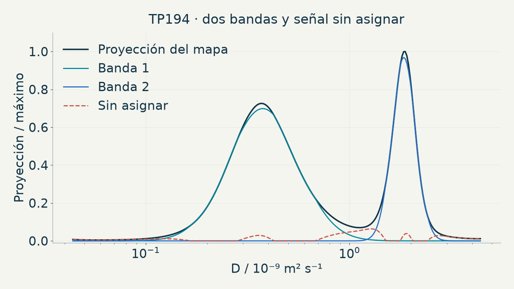

### Notas completas del ponente

17:25–18:10 · 45 s

GUION (45 s):

El modelo describe dos bandas, pero conserva aproximadamente un seis por ciento de señal sin asignar. No la borramos ni la convertimos en otra especie para completar la historia. Prime permite volver a las señales, comparar métodos y abrir el Laboratorio científico para explorar estabilidad y predicción de gradientes reservados. Esos controles son un paso posterior, no pruebas ya ejecutadas en este ejemplo. El éxito es conservar lo explicado y lo pendiente junto al resultado guardado.

DETALLES DE CONSULTA (no leer durante el pase):

En la proyección modelada TP194 aparecen dos bandas descriptivas centradas aproximadamente en 0.375 y 1.847 por diez elevado a menos nueve, pero queda 5.96 por ciento de área sin asignar y el estado sigue siendo review_residuals. La proyección original da resultados cercanos y 6.42 por ciento sin asignar. Esa señal residual no se borra ni se convierte en otra especie por conveniencia. El éxito es una representación que conserva la duda y permite rastrear qué señales soportan cada banda. Desde Prime abrimos el Laboratorio científico para comparar métodos, rejillas y parámetros, y revisar predicción de b reservados cuando el diseño y convergencia lo permiten. Estos controles están implementados; no afirmamos que se hayan ejecutado todos sobre TP194. Las capturas QA de controles se identifican como tales. Guardar la revisión no sobrescribe D ni calibración. Después de hacer fiable el recorrido convencional, pensamos en su siguiente cuello de botella: el tiempo.

Fuentes:

ILT method-choice and appendix guidance

[local-source: ilt_teaching_guidance.json]

Read-only comparison of the TBO software profile and acquired pulse program

[local-source: local_equation_audit.json]

prime guide

[local-source: GUIA_PRIME.md]

V6 audit of software actions, observable checks and limitations

[local-source: solutions_mapping.json]

prime readme

[local-source: README.md]

Read-only audit of pulse calibration and sequence-dependent timing parameters

[local-source: parameters_pulse_evidence.json]

tp194 projection doc

[local-source: DOSY_PROJECTION_0.46.1.md]

tp194 projection audit

[local-source: audit.json]

tp194 projection screenshot

[local-source: prime-projection-map.png]

tp194 projection ui check

[local-source: projection-ui.json]

tp194 saved project

[local-source: DiffAtOnce] Prime Results\Calibracion_20260929_084154_43b4f1\calibrado.prime.json

## 23. Cuando repetir gradientes tarda demasiado: ultrafast / SPEN-DOSY

Diapositiva principal

### Texto de la diapositiva

[Vídeo o recurso 23](../../presentations/assets/d4be43f7405ec5c3cd49.mp4)

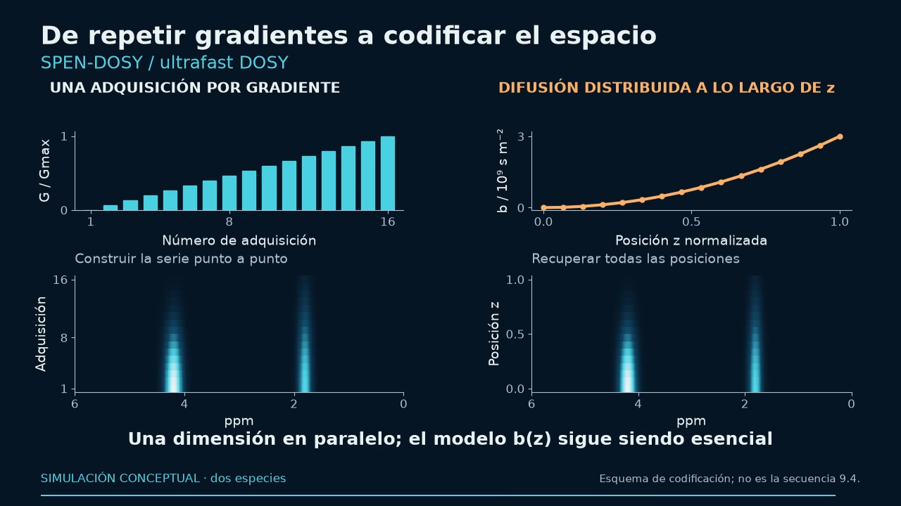

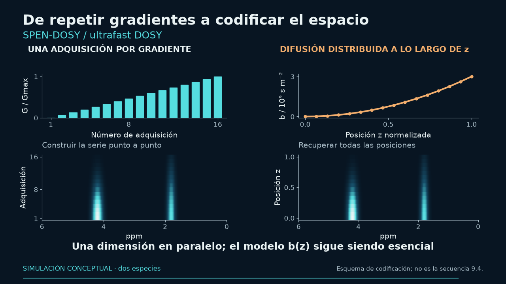

### Notas completas del ponente

18:10–19:10 · 60 s

La adquisición convencional repite gradientes y supone que la preparación sigue siendo comparable durante la serie. Para procesos rápidos, reacciones y señales hiperpolarizadas, ese tiempo puede ser el cuello de botella. Ultrafast DOSY utiliza codificación espacial: distintas posiciones reciben distintas ponderaciones, seguidas de una lectura espacial. SPEN es la codificación espacial usada en estas rutas, no un competidor completamente separado. La ventaja temporal desplaza las dificultades a fase, sensibilidad espacial, ancho de banda y calibración b de z. La literatura citada demuestra aplicaciones; no atribuyo esas demostraciones a nuestro prototipo. El recorrido guiado de Prime obliga a revisar orden de ecos, perfil y kernel y comparar con controles convencionales. Esa es también la dirección de nuestro desarrollo para sondas con gradiente z.

Fuentes:

Single-scan 2D DOSY NMR spectroscopy

https://pubmed.ncbi.nlm.nih.gov/18835796/

Spatially encoded 2D and 3D diffusion-ordered NMR spectroscopy

https://pubs.rsc.org/en/content/articlehtml/2017/cc/c6cc09028a

Spatially encoded diffusion-ordered NMR spectroscopy of reaction mixtures in organic solvents

https://pubs.rsc.org/en/content/articlelanding/2018/an/c8an00434j

Single-Scan 13C Diffusion-Ordered NMR Spectroscopy of DNP-Hyperpolarised Substrates

https://chemistry-europe.onlinelibrary.wiley.com/doi/10.1002/chem.201703300

Ultrafast diffusion-based unmixing of 1H NMR spectra

https://pubs.rsc.org/en/content/articlehtml/2021/cc/d0cc07757g

Accounting for gradient non-uniformity in spatially-encoded diffusion-ordered NMR spectroscopy

https://www.sciencedirect.com/science/article/pii/S1090780723001787

## 24. Ultrafast: difusión y relajación en un mapa

Diapositiva principal

### Texto de la diapositiva

24

Ultrafast: difusión y relajación en un mapa

UF D–T₂

Experimento 10

4 transitorios · 32 ecos

≈28 segundos

DESARROLLO ACTUAL

Gradiente z

+ lectura EPSI

Validar b(z)

y sensibilidad

TRAIN2D · experimento de 2025, previo a EPSI v9.4 · exactitud de D y T₂ pendiente de validación

### Notas completas del ponente

19:10–19:50 · 40 s

Esta imagen es una reconstrucción TRAIN2D del experimento UF D–T2 número 10, adquirido el 3 de junio de 2025 con 4 transitorios y 32 ecos en 27.768 s. Muestra difusión en el eje vertical y T2 en el horizontal; las proyecciones resumen ambos ejes. Es un ejemplo experimental previo al desarrollo UF_DT2_CS_EPSI v9.4, no un resultado de ese programa ni un mapa D–ppm. El notebook usa un G máximo nominal y un umbral gráfico del 1%; el máximo dominante alcanza el borde inferior de D. No interpretar ese borde como una especie validada. La exactitud absoluta de D y T2 requiere controles de calibración. Nuestro desarrollo actual utiliza gradiente z y lectura EPSI; siguen pendientes b(z), sensibilidad y exactitud con patrones.

Detalles técnicos del desarrollo EPSI:

GUION (40 s):

Estamos desarrollando ultrafast para sondas convencionales con gradiente z y RF formada. Hay programas chirp/STE, CPMG y lectura EPSI, calculadora y reconstrucción diagnóstica. La dificultad se desplaza a calibrar b de z y verificar sensibilidad y exactitud con patrones y controles convencionales. Esa validación experimental cuantitativa sigue pendiente: presentamos una línea de desarrollo concreta, no una nueva prueba de DOSY absoluto en un scan.

DETALLES DE CONSULTA (no leer durante el pase):

Nuestro desarrollo actual implementa codificación chirp con eco estimulado, CPMG y lectura EPSI bipolar, con programas para PABBO, TBI y TBO, calculadora y reconstrucción diagnóstica. Una sonda convencional aquí necesita gradiente z y RF formada; no significa una sonda sin gradientes. El objetivo actual es Avance III 500 con TopSpin 3.8.0 y NS múltiplo de dieciséis, distinto del asistente preparado para 3.6.4. Hay programas y software; la validación cuantitativa experimental de DOSY absoluto sigue pendiente. El siguiente éxito que debemos demostrar es calibrar b de z con patrón y verificar exactitud y estabilidad frente a DOSY convencional. Esta es una perspectiva concreta, no un resultado experimental anunciado. Volvamos a lo que la audiencia puede aplicar mañana.

Fuentes:

local_readme

[local-source: README.md]

local_audit

[local-source: AUDITORIA_METODO_UF_DT2_CS_2026-09-19.md]

local_pp

[local-source: UF_DT2_CS_EPSI_v9_4_TBO]

local_calc

[local-source: UF_DT2_CS_calculator_v9_4.py]

local_recon

[local-source: reconstruct_uf_dt2_cs_v9_4.py]

Spatially encoded diffusion-ordered NMR spectroscopy of reaction mixtures in organic solvents

https://pubs.rsc.org/en/content/articlelanding/2018/an/c8an00434j

Single-Scan 13C Diffusion-Ordered NMR Spectroscopy of DNP-Hyperpolarised Substrates

https://chemistry-europe.onlinelibrary.wiley.com/doi/10.1002/chem.201703300

Experimental UF D–T2 experiment 10 (2025), TRAIN2D reconstruction

[local-source: DT2_map_10.png]

## 25. Un resultado que podemos repetir y comprobar

Diapositiva principal

### Texto de la diapositiva

25

Una medida cuidada.

Un análisis reproducible.

Un resultado comprobable.

Calibrar y conservar información útil

Automatizar los pasos repetitivos

Revisar el resultado con ejemplos y controles

DiffAtOnce Prime · ifernan@ual.es · fmarrabal@ual.es

### Notas completas del ponente

19:50–20:00 · 10 s

Calibrar y procesar DOSY es difícil. Los ejemplos muestran cómo hacerlo y dónde ayudan nuestros programas. El resultado defendible conserva la medida, la hipótesis y la comprobación.

Fuentes:

## 26. Prime · ILT local 1/4

Apéndice oculto

### Texto de la diapositiva

26

Prime · ILT local 1/4

Método / componente

Para qué se usa

Precaución principal

NNLS

Referencia positiva sin suavizado; diagnóstico del residuo mínimo.

No elige suavidad, soporte ni número de especies.

Tikhonov

Distribuciones continuas con suavidad controlada; polímeros/polidispersidad.

No selecciona λ; penaliza diferencias de índices, no derivadas físicas.

FLINT quadratic objective

Objetivo L2 positivo para inversión estable; motor NNLS de esta biblioteca.

Es un port del objetivo, no la iteración original. Para la iteración use flint_fista.

GNAT ILT NNLS

Comparar la rama ILT positiva de GNAT a λ manual.

No incluye GCV, curva L, interfaz gráfica ni toda la aplicación GNAT.

TRAIn-style trust region

Inversión positiva iterativa con región de confianza; controlar criterio de parada.

Prime usa termFac × residuo NNLS; no intercambiar con radios de ruido.

Catálogo de consulta · detalle, disponibilidad y fuentes en notas y CSV / TXT adjunto

### Notas completas del ponente

Reference / consulta · 0 s

Positive least squares [nnls]

Uso: Referencia positiva sin suavizado; diagnóstico del residuo mínimo.

Límites: No elige suavidad, soporte ni número de especies.

Disponibilidad: Selector ILT de Prime

Objetivo: `0.5 ‖AC-Y‖F², C&gt;=0`.

Fuente: [local-source: METHOD_REFERENCE.es.md#nnls]

Positive Tikhonov [tikhonov]

Uso: Distribuciones continuas con suavidad controlada; polímeros/polidispersidad.

Límites: Diferencias en índices, no derivadas físicas adaptadas al espaciado de D. Sin selección automática de lambda.

Disponibilidad: Selector ILT de Prime

Objetivo: `0.5 ‖AC-Y‖F² + lambda/2 ‖RC‖F², C&gt;=0`.

Fuente: [local-source: METHOD_REFERENCE.es.md#tikhonov]

FLINT quadratic objective [flint]

Uso: Objetivo L2 positivo para inversión estable; motor NNLS de esta biblioteca.

Límites: Es un port del objetivo, no la iteración original. Para la iteración use flint_fista.

Disponibilidad: Selector ILT de Prime

Objetivo: `0.5 ‖AC-Y‖F² + lambda/2 ‖C‖F², C&gt;=0`.

Fuente: [local-source: METHOD_REFERENCE.es.md#flint]

GNAT positive ILT branch [gnat_ilt_nnls]

Uso: Comparar la rama ILT positiva de GNAT a λ manual.

Límites: No incluye GCV, curva L, interfaz gráfica ni toda la aplicación GNAT.

Disponibilidad: Selector ILT de Prime

Objetivo: `0.5 ‖AC-Y‖F² + lambda²/2 ‖RC‖F², C&gt;=0`.

Fuente: [local-source: METHOD_REFERENCE.es.md#gnat_ilt_nnls]

TRAIn-style trust region [train]

Uso: Inversión positiva iterativa con región de confianza; controlar criterio de parada.

Límites: En Prime, el selector TRAIn usa el motor compartido original: termFac × residuo NNLS. La ficha de biblioteca describe otra variante con radio de ruido explícito; no intercambiar los parámetros.

Disponibilidad: Selector ILT de Prime

Objetivo: `RSS(A*(eta elementwise squared),Y); discrepancy stopping`.

Fuente: [local-source: METHOD_REFERENCE.es.md#train]

Fuentes: [ilt_catalog] Audited bilingual catalogue of local inversion methods and context families: [local-source: ilt_algorithm_catalog_bilingual.json]

[catalog_nnls] Positive least squares: [local-source: METHOD_REFERENCE.es.md#nnls]

[catalog_tikhonov] Positive Tikhonov: [local-source: METHOD_REFERENCE.es.md#tikhonov]

[catalog_flint] FLINT quadratic objective: [local-source: METHOD_REFERENCE.es.md#flint]

[catalog_gnat_ilt_nnls] GNAT positive ILT branch: [local-source: METHOD_REFERENCE.es.md#gnat_ilt_nnls]

[catalog_train] TRAIn-style trust region: [local-source: METHOD_REFERENCE.es.md#train]

nnls — Positive least squares

Selector ILT de Prime

Referencia positiva sin suavizado; diagnóstico del residuo mínimo.

No elige suavidad, soporte ni número de especies.

`0.5 ‖AC-Y‖F², C&gt;=0`.

[local-source: METHOD_REFERENCE.es.md#nnls]

tikhonov — Positive Tikhonov

Selector ILT de Prime

Distribuciones continuas con suavidad controlada; polímeros/polidispersidad.

Diferencias en índices, no derivadas físicas adaptadas al espaciado de D. Sin selección automática de lambda.

`0.5 ‖AC-Y‖F² + lambda/2 ‖RC‖F², C&gt;=0`.

[local-source: METHOD_REFERENCE.es.md#tikhonov]

flint — FLINT quadratic objective

Selector ILT de Prime

Objetivo L2 positivo para inversión estable; motor NNLS de esta biblioteca.

Es un port del objetivo, no la iteración original. Para la iteración use flint_fista.

`0.5 ‖AC-Y‖F² + lambda/2 ‖C‖F², C&gt;=0`.

[local-source: METHOD_REFERENCE.es.md#flint]

gnat_ilt_nnls — GNAT positive ILT branch

Selector ILT de Prime

Comparar la rama ILT positiva de GNAT a λ manual.

No incluye GCV, curva L, interfaz gráfica ni toda la aplicación GNAT.

`0.5 ‖AC-Y‖F² + lambda²/2 ‖RC‖F², C&gt;=0`.

[local-source: METHOD_REFERENCE.es.md#gnat_ilt_nnls]

train — TRAIn-style trust region

Selector ILT de Prime

Inversión positiva iterativa con región de confianza; controlar criterio de parada.

En Prime, el selector TRAIn usa el motor compartido original: termFac × residuo NNLS. La ficha de biblioteca describe otra variante con radio de ruido explícito; no intercambiar los parámetros.

`RSS(A*(eta elementwise squared),Y); discrepancy stopping`.

[local-source: METHOD_REFERENCE.es.md#train]

Fuentes:

Audited bilingual catalogue of local inversion methods and context families

[local-source: ilt_algorithm_catalog_bilingual.json]

Positive least squares

[local-source: METHOD_REFERENCE.es.md#nnls]

Positive Tikhonov

[local-source: METHOD_REFERENCE.es.md#tikhonov]

FLINT quadratic objective

[local-source: METHOD_REFERENCE.es.md#flint]

GNAT positive ILT branch

[local-source: METHOD_REFERENCE.es.md#gnat_ilt_nnls]

TRAIn-style trust region

[local-source: METHOD_REFERENCE.es.md#train]

## 27. Prime · ILT local 2/4

Apéndice oculto

### Texto de la diapositiva

27

Prime · ILT local 2/4

Método / componente

Para qué se usa

Precaución principal

ITAMeD positive FISTA

Distribuciones escasas con pocos máximos mediante L1 y FISTA.

Malla fija; comprobar el escalado del objetivo antes de comparar λ.

Positive smooth sparse inversion

Compromiso entre pocos máximos y suavidad.

No es un alias de CONTIN ni selecciona sus pesos automáticamente.

Positive maximum entropy

Distribuciones positivas regularizadas por entropía respecto a una referencia.

La referencia depende de los datos; revisar convergencia y motor.

PALMA entropy/L1 PPXA+

Combinar picos y distribuciones anchas con entropía/L1 y radio de ruido.

Primera observación positiva; comprobar factibilidad al terminar.

Local curvature reweighted Tikhonov

Ajustar suavizado local según curvatura; comparar sensibilidad.

Cambia pesos y objetivo. No es UPEN2D/MUPEN2D auténtico ni aporta certificado convexo fijo.

Catálogo de consulta · detalle, disponibilidad y fuentes en notas y CSV / TXT adjunto

### Notas completas del ponente

Reference / consulta · 0 s

ITAMeD positive FISTA [itamed]

Uso: Distribuciones escasas con pocos máximos mediante L1 y FISTA.

Límites: La malla permanece fija. El objetivo usa RSS sin factor 1/2; no copie lambda entre métodos sin comprobar escalas.

Disponibilidad: Selector ILT de Prime

Objetivo: `RSS + lambda sum(C), C&gt;=0`.

Fuente: [local-source: METHOD_REFERENCE.es.md#itamed]

Positive smooth sparse inversion [elastic_net]

Uso: Compromiso entre pocos máximos y suavidad.

Límites: No es un alias de CONTIN ni selecciona sus pesos automáticamente.

Disponibilidad: Selector ILT de Prime

Objetivo: `0.5 ‖AC-Y‖F² + lambda/2 ‖RC‖F² + l1 sum(C), C&gt;=0`.

Fuente: [local-source: METHOD_REFERENCE.es.md#elastic_net]

Positive maximum entropy [maxent]

Uso: Distribuciones positivas regularizadas por entropía respecto a una referencia.

Límites: El valor de referencia se fija a partir de los datos. Motores Python y MATLAB/C# distintos; comprobar gradiente proyectado.

Disponibilidad: Selector ILT de Prime

Objetivo: `0.5 ‖AC-Y‖F² + lambda sum(C log(C/ref)-C)`.

Fuente: [local-source: METHOD_REFERENCE.es.md#maxent]

PALMA entropy/L1 PPXA+ [palma]

Uso: Combinar picos y distribuciones anchas con entropía/L1 y radio de ruido.

Límites: La primera observación debe ser positiva. Se excluye la variante con signo w=0. El presupuesto puede acabar sin factibilidad.

Disponibilidad: Selector ILT de Prime

Objetivo: `(1-w)‖x‖1 + w sum(x log x), ‖Ax-Y/scale‖2&lt;=eta/scale`.

Fuente: [local-source: METHOD_REFERENCE.es.md#palma]

Local curvature reweighted Tikhonov [curvature_reweighted]

Uso: Ajustar suavizado local según curvatura; comparar sensibilidad.

Límites: Cambia pesos y objetivo. No es UPEN2D/MUPEN2D auténtico ni aporta certificado convexo fijo.

Disponibilidad: Selector ILT de Prime

Objetivo: `Sequence of positive quadratic fits with local curvature weights`.

Fuente: [local-source: METHOD_REFERENCE.es.md#curvature_reweighted]

Fuentes: [ilt_catalog] Audited bilingual catalogue of local inversion methods and context families: [local-source: ilt_algorithm_catalog_bilingual.json]

[catalog_itamed] ITAMeD positive FISTA: [local-source: METHOD_REFERENCE.es.md#itamed]

[catalog_elastic_net] Positive smooth sparse inversion: [local-source: METHOD_REFERENCE.es.md#elastic_net]

[catalog_maxent] Positive maximum entropy: [local-source: METHOD_REFERENCE.es.md#maxent]

[catalog_palma] PALMA entropy/L1 PPXA+: [local-source: METHOD_REFERENCE.es.md#palma]

[catalog_curvature_reweighted] Local curvature reweighted Tikhonov: [local-source: METHOD_REFERENCE.es.md#curvature_reweighted]

itamed — ITAMeD positive FISTA

Selector ILT de Prime

Distribuciones escasas con pocos máximos mediante L1 y FISTA.

La malla permanece fija. El objetivo usa RSS sin factor 1/2; no copie lambda entre métodos sin comprobar escalas.

`RSS + lambda sum(C), C&gt;=0`.

[local-source: METHOD_REFERENCE.es.md#itamed]

elastic_net — Positive smooth sparse inversion

Selector ILT de Prime

Compromiso entre pocos máximos y suavidad.

No es un alias de CONTIN ni selecciona sus pesos automáticamente.

`0.5 ‖AC-Y‖F² + lambda/2 ‖RC‖F² + l1 sum(C), C&gt;=0`.

[local-source: METHOD_REFERENCE.es.md#elastic_net]

maxent — Positive maximum entropy

Selector ILT de Prime

Distribuciones positivas regularizadas por entropía respecto a una referencia.

El valor de referencia se fija a partir de los datos. Motores Python y MATLAB/C# distintos; comprobar gradiente proyectado.

`0.5 ‖AC-Y‖F² + lambda sum(C log(C/ref)-C)`.

[local-source: METHOD_REFERENCE.es.md#maxent]

palma — PALMA entropy/L1 PPXA+

Selector ILT de Prime

Combinar picos y distribuciones anchas con entropía/L1 y radio de ruido.

La primera observación debe ser positiva. Se excluye la variante con signo w=0. El presupuesto puede acabar sin factibilidad.

`(1-w)‖x‖1 + w sum(x log x), ‖Ax-Y/scale‖2&lt;=eta/scale`.

[local-source: METHOD_REFERENCE.es.md#palma]

curvature_reweighted — Local curvature reweighted Tikhonov

Selector ILT de Prime

Ajustar suavizado local según curvatura; comparar sensibilidad.

Cambia pesos y objetivo. No es UPEN2D/MUPEN2D auténtico ni aporta certificado convexo fijo.

`Sequence of positive quadratic fits with local curvature weights`.

[local-source: METHOD_REFERENCE.es.md#curvature_reweighted]

Fuentes:

Audited bilingual catalogue of local inversion methods and context families

[local-source: ilt_algorithm_catalog_bilingual.json]

ITAMeD positive FISTA

[local-source: METHOD_REFERENCE.es.md#itamed]

Positive smooth sparse inversion

[local-source: METHOD_REFERENCE.es.md#elastic_net]

Positive maximum entropy

[local-source: METHOD_REFERENCE.es.md#maxent]

PALMA entropy/L1 PPXA+

[local-source: METHOD_REFERENCE.es.md#palma]

Local curvature reweighted Tikhonov

[local-source: METHOD_REFERENCE.es.md#curvature_reweighted]

## 28. Prime · ILT local 3/4

Apéndice oculto

### Texto de la diapositiva

28

Prime · ILT local 3/4

Método / componente

Para qué se usa

Precaución principal

BRD dual positive L2

Resolver L2 positivo mediante formulación dual; λ explícito.

Alpha fijo; no incluye selección automática ni compresión OSILAP.

Chambolle-Pock positive L1

Resolver inversión escasa L1 mediante división primal-dual.

No es PDHGM2; comprobar el residuo de gradiente proyectado.

Regularized block Kaczmarz

Resolver inversión regularizada mediante actualizaciones por filas/bloques.

El orden de filas importa; el adaptador usa opciones internas.

L1-LS positivo

Solución positiva L1 por punto interior; referencia de optimización.

λ fijo y Newton denso; no es el PCG original de gran escala.

FLINT-FISTA

Resolver iterativamente el objetivo cuadrático positivo FLINT.

Paso y parada modificados respecto al original; revisar convergencia.

Catálogo de consulta · detalle, disponibilidad y fuentes en notas y CSV / TXT adjunto

### Notas completas del ponente

Reference / consulta · 0 s

BRD dual positive L2 [brd]

Uso: Resolver L2 positivo mediante formulación dual; λ explícito.

Límites: Alpha fijo, sin selección automática ni compresión OSILAP. Inicialización externa no admitida en el adaptador.

Disponibilidad: Selector ILT de Prime

Objetivo: `0.5 ‖AC-Y‖F² + alpha/2 ‖C‖F², C&gt;=0, solved through dual`.

Fuente: [local-source: METHOD_REFERENCE.es.md#brd]

Chambolle-Pock positive L1 [pdhg_l1]

Uso: Resolver inversión escasa L1 mediante división primal-dual.

Límites: No es la recurrencia PDHGM2 archivada. Inicialización cero; verificar residuo de gradiente proyectado.

Disponibilidad: Selector ILT de Prime

Objetivo: `0.5 ‖AC-Y‖F² + alpha sum(C), C&gt;=0`.

Fuente: [local-source: METHOD_REFERENCE.es.md#pdhg_l1]

Regularized block Kaczmarz [kaczmarz]

Uso: Resolver inversión regularizada mediante actualizaciones por filas/bloques.

Límites: Generador de orden portable distinto del NumPy histórico. RowOrders permite comparar trayectorias explícitas; fallos de búsqueda se conservan. El adaptador de malla usa opciones internas: para semilla, bloques y órdenes explícitos use linear_fit / linearFit / LinearEngines.Fit.

Disponibilidad: Selector ILT de Prime

Objetivo: `0.5 ‖AC-Y‖F² + alpha/2 ‖C‖F², C&gt;=0`.

Fuente: [local-source: METHOD_REFERENCE.es.md#kaczmarz]

Nonnegative L1 interior point [l1_ls_nonnegative]

Uso: Solución positiva L1 por punto interior; referencia de optimización.

Límites: Newton denso sustituye PCG original. Brecha absoluta-escalada cuando el objetivo es menor que uno.

Disponibilidad: Selector ILT de Prime

Objetivo: `RSS + alpha ‖C‖1, C&gt;=0`.

Fuente: [local-source: METHOD_REFERENCE.es.md#l1_ls_nonnegative]

FLINT positive quadratic iterative core [flint_fista]

Uso: Resolver iterativamente el objetivo cuadrático positivo FLINT.

Límites: Paso espectral y parada por gradiente proyectado difieren de la potencia/estancamiento original.

Disponibilidad: Selector ILT de Prime

Objetivo: `RSS + alpha ‖C‖F², C&gt;=0`.

Fuente: [local-source: METHOD_REFERENCE.es.md#flint_fista]

Fuentes: [ilt_catalog] Audited bilingual catalogue of local inversion methods and context families: [local-source: ilt_algorithm_catalog_bilingual.json]

[catalog_brd] BRD dual positive L2: [local-source: METHOD_REFERENCE.es.md#brd]

[catalog_pdhg_l1] Chambolle-Pock positive L1: [local-source: METHOD_REFERENCE.es.md#pdhg_l1]

[catalog_kaczmarz] Regularized block Kaczmarz: [local-source: METHOD_REFERENCE.es.md#kaczmarz]

[catalog_l1_ls_nonnegative] Nonnegative L1 interior point: [local-source: METHOD_REFERENCE.es.md#l1_ls_nonnegative]

[catalog_flint_fista] FLINT positive quadratic iterative core: [local-source: METHOD_REFERENCE.es.md#flint_fista]

brd — BRD dual positive L2

Selector ILT de Prime

Resolver L2 positivo mediante formulación dual; λ explícito.

Alpha fijo, sin selección automática ni compresión OSILAP. Inicialización externa no admitida en el adaptador.

`0.5 ‖AC-Y‖F² + alpha/2 ‖C‖F², C&gt;=0, solved through dual`.

[local-source: METHOD_REFERENCE.es.md#brd]

pdhg_l1 — Chambolle-Pock positive L1

Selector ILT de Prime

Resolver inversión escasa L1 mediante división primal-dual.

No es la recurrencia PDHGM2 archivada. Inicialización cero; verificar residuo de gradiente proyectado.

`0.5 ‖AC-Y‖F² + alpha sum(C), C&gt;=0`.

[local-source: METHOD_REFERENCE.es.md#pdhg_l1]

kaczmarz — Regularized block Kaczmarz

Selector ILT de Prime

Resolver inversión regularizada mediante actualizaciones por filas/bloques.

Generador de orden portable distinto del NumPy histórico. RowOrders permite comparar trayectorias explícitas; fallos de búsqueda se conservan. El adaptador de malla usa opciones internas: para semilla, bloques y órdenes explícitos use linear_fit / linearFit / LinearEngines.Fit.

`0.5 ‖AC-Y‖F² + alpha/2 ‖C‖F², C&gt;=0`.

[local-source: METHOD_REFERENCE.es.md#kaczmarz]

l1_ls_nonnegative — Nonnegative L1 interior point

Selector ILT de Prime

Solución positiva L1 por punto interior; referencia de optimización.

Newton denso sustituye PCG original. Brecha absoluta-escalada cuando el objetivo es menor que uno.

`RSS + alpha ‖C‖1, C&gt;=0`.

[local-source: METHOD_REFERENCE.es.md#l1_ls_nonnegative]

flint_fista — FLINT positive quadratic iterative core

Selector ILT de Prime

Resolver iterativamente el objetivo cuadrático positivo FLINT.

Paso espectral y parada por gradiente proyectado difieren de la potencia/estancamiento original.

`RSS + alpha ‖C‖F², C&gt;=0`.

[local-source: METHOD_REFERENCE.es.md#flint_fista]

Fuentes:

Audited bilingual catalogue of local inversion methods and context families

[local-source: ilt_algorithm_catalog_bilingual.json]

BRD dual positive L2

[local-source: METHOD_REFERENCE.es.md#brd]

Chambolle-Pock positive L1

[local-source: METHOD_REFERENCE.es.md#pdhg_l1]

Regularized block Kaczmarz

[local-source: METHOD_REFERENCE.es.md#kaczmarz]

Nonnegative L1 interior point

[local-source: METHOD_REFERENCE.es.md#l1_ls_nonnegative]

FLINT positive quadratic iterative core

[local-source: METHOD_REFERENCE.es.md#flint_fista]

## 29. Prime · estructura compartida

Apéndice oculto

### Texto de la diapositiva

29

Prime · estructura compartida

Método / componente

Para qué se usa

Precaución principal

Positive row-group sparse inversion

Soporte D compartido entre varias frecuencias.

El soporte compartido no identifica moléculas; una columna equivale a L1.

Nonnegative sparse nuclear regularization

Mapa conjunto con pocos perfiles y pocos coeficientes significativos.

Comprobar residuo primal y dual. No sustituye la recurrencia ADSpLRU por llevar norma nuclear.

Reweighted nuclear heuristic

Reforzar selección de rango/soporte mediante pesos adaptativos.

El coste nuclear reportado es diagnóstico; no es un certificado del objetivo variable.

Orthogonal matching pursuit dictionary adapter

Seleccionar pocos átomos D de un diccionario; límite de soporte explícito.

La escala de las columnas afecta la selección; no estima el ruido.

Catálogo de consulta · detalle, disponibilidad y fuentes en notas y CSV / TXT adjunto

### Notas completas del ponente

Reference / consulta · 0 s

Positive row-group sparse inversion [group_sparse]

Uso: Soporte D compartido entre varias frecuencias.

Límites: Un soporte compartido favorecido por la penalización no identifica moléculas; con una columna se reduce a L1.

Disponibilidad: Selector ILT de Prime

Objetivo: `0.5 ‖AC-Y‖F² + lambda sum_k ‖C[k,:]‖2, C&gt;=0`.

Fuente: [local-source: METHOD_REFERENCE.es.md#group_sparse]

Nonnegative sparse nuclear regularization [lowrank_sparse]

Uso: Mapa conjunto con pocos perfiles y pocos coeficientes significativos.

Límites: Comprobar residuo primal y dual. No sustituye la recurrencia ADSpLRU por llevar norma nuclear.

Disponibilidad: Selector ILT de Prime

Objetivo: `0.5 ‖AC-Y‖F² + l1 sum(C) + low_rank ‖C‖*, C&gt;=0`.

Fuente: [local-source: METHOD_REFERENCE.es.md#lowrank_sparse]

Reweighted nuclear heuristic [reweighted_lowrank_sparse]

Uso: Reforzar selección de rango/soporte mediante pesos adaptativos.

Límites: El coste nuclear reportado es diagnóstico; no es un certificado del objetivo variable.

Disponibilidad: Selector ILT de Prime

Objetivo: `Adaptive singular-value thresholds inside ADMM`.

Fuente: [local-source: METHOD_REFERENCE.es.md#reweighted_lowrank_sparse]

Orthogonal matching pursuit dictionary adapter [omp]

Uso: Seleccionar pocos átomos D de un diccionario; límite de soporte explícito.

Límites: No normaliza columnas. La escala afecta la selección; no se traslada el muestreo Fourier del original.

Disponibilidad: Selector ILT de Prime

Objetivo: `Greedy dictionary correlation + restricted LS/NNLS refit`.

Fuente: [local-source: METHOD_REFERENCE.es.md#omp]

Fuentes: [ilt_catalog] Audited bilingual catalogue of local inversion methods and context families: [local-source: ilt_algorithm_catalog_bilingual.json]

[catalog_group_sparse] Positive row-group sparse inversion: [local-source: METHOD_REFERENCE.es.md#group_sparse]

[catalog_lowrank_sparse] Nonnegative sparse nuclear regularization: [local-source: METHOD_REFERENCE.es.md#lowrank_sparse]

[catalog_reweighted_lowrank_sparse] Reweighted nuclear heuristic: [local-source: METHOD_REFERENCE.es.md#reweighted_lowrank_sparse]

[catalog_omp] Orthogonal matching pursuit dictionary adapter: [local-source: METHOD_REFERENCE.es.md#omp]

group_sparse — Positive row-group sparse inversion

Selector ILT de Prime

Soporte D compartido entre varias frecuencias.

Un soporte compartido favorecido por la penalización no identifica moléculas; con una columna se reduce a L1.

`0.5 ‖AC-Y‖F² + lambda sum_k ‖C[k,:]‖2, C&gt;=0`.

[local-source: METHOD_REFERENCE.es.md#group_sparse]

lowrank_sparse — Nonnegative sparse nuclear regularization

Selector ILT de Prime

Mapa conjunto con pocos perfiles y pocos coeficientes significativos.

Comprobar residuo primal y dual. No sustituye la recurrencia ADSpLRU por llevar norma nuclear.

`0.5 ‖AC-Y‖F² + l1 sum(C) + low_rank ‖C‖*, C&gt;=0`.

[local-source: METHOD_REFERENCE.es.md#lowrank_sparse]

reweighted_lowrank_sparse — Reweighted nuclear heuristic

Selector ILT de Prime

Reforzar selección de rango/soporte mediante pesos adaptativos.

El coste nuclear reportado es diagnóstico; no es un certificado del objetivo variable.

`Adaptive singular-value thresholds inside ADMM`.

[local-source: METHOD_REFERENCE.es.md#reweighted_lowrank_sparse]

omp — Orthogonal matching pursuit dictionary adapter

Selector ILT de Prime

Seleccionar pocos átomos D de un diccionario; límite de soporte explícito.

No normaliza columnas. La escala afecta la selección; no se traslada el muestreo Fourier del original.

`Greedy dictionary correlation + restricted LS/NNLS refit`.

[local-source: METHOD_REFERENCE.es.md#omp]

Fuentes:

Audited bilingual catalogue of local inversion methods and context families

[local-source: ilt_algorithm_catalog_bilingual.json]

Positive row-group sparse inversion

[local-source: METHOD_REFERENCE.es.md#group_sparse]

Nonnegative sparse nuclear regularization

[local-source: METHOD_REFERENCE.es.md#lowrank_sparse]

Reweighted nuclear heuristic

[local-source: METHOD_REFERENCE.es.md#reweighted_lowrank_sparse]

Orthogonal matching pursuit dictionary adapter

[local-source: METHOD_REFERENCE.es.md#omp]

## 30. Prime · mapas conjuntos 1/2

Apéndice oculto

### Texto de la diapositiva

30

Prime · mapas conjuntos 1/2

Método / componente

Para qué se usa

Precaución principal

MF-NNLS

Mapa conjunto de distribuciones con factores compartidos.

Rango predictivo ≠ moléculas; revisar λS, λA, límites y residuos.

TRAIn-MF

Modelo conjunto con atenuaciones con signo; reproducción legacy explícita.

La etiqueta del identificador histórico no describe la ruta revisada. No equivaler a TRAIn por bin.

TRAIn por bin

Mismo ajuste local en todas las frecuencias de una región.

No impone correlaciones ni factores compartidos entre frecuencias.

RAI-S

Pocos D discretos con selección de soporte en el espectro.

No es RAI-Net ni una red entrenada; distribución ancha puede violar el modelo discreto.

DOME-S

Tasas discretas compartidas con revisión de cobertura y soporte.

Comprobar límites, predicción reservada y número de componentes.

Catálogo de consulta · detalle, disponibilidad y fuentes en notas y CSV / TXT adjunto

### Notas completas del ponente

Reference / consulta · 0 s

MF-NNLS256 [mf-nnls256]

Uso: Mapa conjunto de distribuciones con factores compartidos.

Límites: Rango predictivo ≠ moléculas; revisar λS, λA, límites y residuos.

Disponibilidad: Ruta nativa Prime

Fuente: [local-source: StudioWindows.Library.cs]

TRAIn-MF (protocolo revisado) [train-mf-historical]

Uso: Modelo conjunto con atenuaciones con signo; reproducción legacy explícita.

Límites: La etiqueta del identificador histórico no describe la ruta revisada. No equivaler a TRAIn por bin.

Disponibilidad: Ruta nativa Prime

Fuente: [local-source: StudioWindows.Library.cs]

TRAIn por bin / per bin [train-per-bin]

Uso: Mismo ajuste local en todas las frecuencias de una región.

Límites: No impone correlaciones ni factores compartidos entre frecuencias.

Disponibilidad: Ruta nativa Prime

Fuente: [local-source: StudioWindows.Library.cs]

RAI-S [rai-s]

Uso: Pocos D discretos con selección de soporte en el espectro.

Límites: No es RAI-Net ni una red entrenada; distribución ancha puede violar el modelo discreto.

Disponibilidad: Ruta nativa Prime

Fuente: [local-source: StudioWindows.Library.cs]

DOME-S [dome-s]

Uso: Tasas discretas compartidas con revisión de cobertura y soporte.

Límites: Comprobar límites, predicción reservada y número de componentes.

Disponibilidad: Ruta nativa Prime

Fuente: [local-source: StudioWindows.Library.cs]

Fuentes: [ilt_catalog] Audited bilingual catalogue of local inversion methods and context families: [local-source: ilt_algorithm_catalog_bilingual.json]

[catalog_mf-nnls256] MF-NNLS256: [local-source: StudioWindows.Library.cs]

[catalog_train-mf-historical] TRAIn-MF (protocolo revisado): [local-source: StudioWindows.Library.cs]

[catalog_train-per-bin] TRAIn por bin / per bin: [local-source: StudioWindows.Library.cs]

[catalog_rai-s] RAI-S: [local-source: StudioWindows.Library.cs]

[catalog_dome-s] DOME-S: [local-source: StudioWindows.Library.cs]

mf-nnls256 — MF-NNLS256

Ruta nativa Prime

Mapa conjunto de distribuciones con factores compartidos.

Rango predictivo ≠ moléculas; revisar λS, λA, límites y residuos.

[local-source: StudioWindows.Library.cs]

train-mf-historical — TRAIn-MF (protocolo revisado)

Ruta nativa Prime

Modelo conjunto con atenuaciones con signo; reproducción legacy explícita.

La etiqueta del identificador histórico no describe la ruta revisada. No equivaler a TRAIn por bin.

[local-source: StudioWindows.Library.cs]

train-per-bin — TRAIn por bin / per bin

Ruta nativa Prime

Mismo ajuste local en todas las frecuencias de una región.

No impone correlaciones ni factores compartidos entre frecuencias.

[local-source: StudioWindows.Library.cs]

rai-s — RAI-S

Ruta nativa Prime

Pocos D discretos con selección de soporte en el espectro.

No es RAI-Net ni una red entrenada; distribución ancha puede violar el modelo discreto.

[local-source: StudioWindows.Library.cs]

dome-s — DOME-S

Ruta nativa Prime

Tasas discretas compartidas con revisión de cobertura y soporte.

Comprobar límites, predicción reservada y número de componentes.

[local-source: StudioWindows.Library.cs]

Fuentes:

Audited bilingual catalogue of local inversion methods and context families

[local-source: ilt_algorithm_catalog_bilingual.json]

MF-NNLS256

[local-source: StudioWindows.Library.cs]

TRAIn-MF (protocolo revisado)

[local-source: StudioWindows.Library.cs]

TRAIn por bin / per bin

[local-source: StudioWindows.Library.cs]

RAI-S

[local-source: StudioWindows.Library.cs]

DOME-S

[local-source: StudioWindows.Library.cs]

## 31. Prime · mapas conjuntos y 2D

Apéndice oculto

### Texto de la diapositiva

31

Prime · mapas conjuntos y 2D

Método / componente

Para qué se usa

Precaución principal

SILT-DOSY

Mapa conjunto con penalizaciones escasas y de bajo rango.

Reponderado no convexo; parada operacional ≠ óptimo global.

SILT original

ADSpLRU

Reproducir el núcleo original aportado con diagnósticos.

Parada histórica ≠ certificado KKT; versión separada de SILT revisado.

TRAIn2D · C#

Inversión separable D–T₂ u otros dos operadores.

No usa λ; termFac y residuo NNLS. Kernel/perfil físico deben estar revisados.

FISTA 2D · C#

Inversión 2D positiva L1 mediante operador separable.

No es copia literal de ITAMeD; KKT no valida el modelo físico.

Catálogo de consulta · detalle, disponibilidad y fuentes en notas y CSV / TXT adjunto

### Notas completas del ponente

Reference / consulta · 0 s

SILT revisado / revised [silt-dosy]

Uso: Mapa conjunto con penalizaciones escasas y de bajo rango.

Límites: Reponderado no convexo; parada operacional ≠ óptimo global.

Disponibilidad: Ruta nativa Prime

Fuente: [local-source: StudioWindows.Library.cs]

SILT original / ADSpLRU [silt-original]

Uso: Reproducir el núcleo original aportado con diagnósticos.

Límites: Parada histórica ≠ certificado KKT; versión separada de SILT revisado.

Disponibilidad: Ruta nativa Prime

Fuente: [local-source: StudioWindows.Library.cs]

TRAIn2D (adaptación C#) [train2d_prime]

Uso: Inversión separable D–T₂ u otros dos operadores.

Límites: No usa λ; termFac y residuo NNLS. Kernel/perfil físico deben estar revisados.

Disponibilidad: Ruta nativa Prime

Fuente: [local-source: UfNotebookWindow.cs]

FISTA 2D (variante C# inspirada en ITAMeD) [fista2d_prime]

Uso: Inversión 2D positiva L1 mediante operador separable.

Límites: No es copia literal de ITAMeD; KKT no valida el modelo físico.

Disponibilidad: Ruta nativa Prime

Fuente: [local-source: UfNotebookWindow.cs]

Fuentes: [ilt_catalog] Audited bilingual catalogue of local inversion methods and context families: [local-source: ilt_algorithm_catalog_bilingual.json]

[catalog_silt-dosy] SILT revisado / revised: [local-source: StudioWindows.Library.cs]

[catalog_silt-original] SILT original / ADSpLRU: [local-source: StudioWindows.Library.cs]

[catalog_train2d_prime] TRAIn2D (adaptación C#): [local-source: UfNotebookWindow.cs]

[catalog_fista2d_prime] FISTA 2D (variante C# inspirada en ITAMeD): [local-source: UfNotebookWindow.cs]

silt-dosy — SILT revisado / revised

Ruta nativa Prime

Mapa conjunto con penalizaciones escasas y de bajo rango.

Reponderado no convexo; parada operacional ≠ óptimo global.

[local-source: StudioWindows.Library.cs]

silt-original — SILT original / ADSpLRU

Ruta nativa Prime

Reproducir el núcleo original aportado con diagnósticos.

Parada histórica ≠ certificado KKT; versión separada de SILT revisado.

[local-source: StudioWindows.Library.cs]

train2d_prime — TRAIn2D (adaptación C#)

Ruta nativa Prime

Inversión separable D–T₂ u otros dos operadores.

No usa λ; termFac y residuo NNLS. Kernel/perfil físico deben estar revisados.

[local-source: UfNotebookWindow.cs]

fista2d_prime — FISTA 2D (variante C# inspirada en ITAMeD)

Ruta nativa Prime

Inversión 2D positiva L1 mediante operador separable.

No es copia literal de ITAMeD; KKT no valida el modelo físico.

[local-source: UfNotebookWindow.cs]

Fuentes:

Audited bilingual catalogue of local inversion methods and context families

[local-source: ilt_algorithm_catalog_bilingual.json]

SILT revisado / revised

[local-source: StudioWindows.Library.cs]

SILT original / ADSpLRU

[local-source: StudioWindows.Library.cs]

TRAIn2D (adaptación C#)

[local-source: UfNotebookWindow.cs]

FISTA 2D (variante C# inspirada en ITAMeD)

[local-source: UfNotebookWindow.cs]

## 32. Biblioteca · componentes discretos 1/2

Apéndice oculto

### Texto de la diapositiva

32

Biblioteca · componentes discretos 1/2

Método / componente

Para qué se usa

Precaución principal

Positive variable projection

Ajustar un número fijado de componentes exponenciales sin malla D.

Rango fijado y mínimos locales; no garantiza identificación.

SCORE

Separar espectros de componentes compartiendo D en el conjunto de frecuencias.

Declarar amplitudes con signo; el valor genérico de VP es positivo.

OUTSCORE

Desmezcla que penaliza solapamiento entre espectros de componentes.

Menor solapamiento algebraico no garantiza componentes físicas. No es un objetivo de mínimo residuo.

HYSCORE

Equilibrar reconstrucción y separación espectral en un modelo discreto.

Los términos tienen escalas distintas. Mantener peso, normalización y ruido explícitos.

AIC/BIC selection over VP

Elegir orden entre modelos de proyección variable con AIC/BIC.

No incluye K=0. No es DISCRETE ni SPLMOD original; el ruido debe estar especificado.

Catálogo de consulta · detalle, disponibilidad y fuentes en notas y CSV / TXT adjunto

### Notas completas del ponente

Reference / consulta · 0 s

Positive variable projection [vp]

Uso: Ajustar un número fijado de componentes exponenciales sin malla D.

Límites: Rango fijado por el usuario, mínimos locales; motores distintos entre lenguajes. Ninguna garantía universal de identificación.

Disponibilidad: API especializada; no en selector ILT de Prime

Objetivo: `min over log(D): 0.5 ‖A(D) C*(D)-Y‖F², C*(D)&gt;=0`.

Fuente: [local-source: METHOD_REFERENCE.es.md#vp]

SCORE [score]

Uso: Separar espectros de componentes compartiendo D en el conjunto de frecuencias.

Límites: El valor por defecto genérico de VP es positivo: declare false si desea amplitudes con signo de SCORE.

Disponibilidad: API especializada; no en selector ILT de Prime

Objetivo: `Variable projection with signed linear amplitudes when Positive=false`.

Fuente: [local-source: METHOD_REFERENCE.es.md#score]

OUTSCORE [outscore]

Uso: Desmezcla que penaliza solapamiento entre espectros de componentes.

Límites: Menor solapamiento algebraico no garantiza componentes físicas. No es un objetivo de mínimo residuo.

Disponibilidad: API especializada; no en selector ILT de Prime

Objetivo: `GNAT constant + pairwise overlap of absolute area-normalized spectra`.

Fuente: [local-source: METHOD_REFERENCE.es.md#outscore]

HYSCORE [hyscore]

Uso: Equilibrar reconstrucción y separación espectral en un modelo discreto.

Límites: Los términos tienen escalas distintas. Mantener peso, normalización y ruido explícitos.

Disponibilidad: API especializada; no en selector ILT de Prime

Objetivo: `hybrid_weight * RSS + (1-hybrid_weight) * OUTSCORE`.

Fuente: [local-source: METHOD_REFERENCE.es.md#hyscore]

AIC/BIC selection over VP [discrete_selection]

Uso: Elegir orden entre modelos de proyección variable con AIC/BIC.

Límites: No incluye K=0. No es DISCRETE ni SPLMOD original; el ruido debe estar especificado.

Disponibilidad: API especializada; no en selector ILT de Prime

Objetivo: `Known-noise RSS plus AIC/BIC/AICc model penalty over K&gt;=1`.

Fuente: [local-source: METHOD_REFERENCE.es.md#discrete_selection]

Fuentes: [ilt_catalog] Audited bilingual catalogue of local inversion methods and context families: [local-source: ilt_algorithm_catalog_bilingual.json]

[catalog_vp] Positive variable projection: [local-source: METHOD_REFERENCE.es.md#vp]

[catalog_score] SCORE: [local-source: METHOD_REFERENCE.es.md#score]

[catalog_outscore] OUTSCORE: [local-source: METHOD_REFERENCE.es.md#outscore]

[catalog_hyscore] HYSCORE: [local-source: METHOD_REFERENCE.es.md#hyscore]

[catalog_discrete_selection] AIC/BIC selection over VP: [local-source: METHOD_REFERENCE.es.md#discrete_selection]

vp — Positive variable projection

API especializada; no en selector ILT de Prime

Ajustar un número fijado de componentes exponenciales sin malla D.

Rango fijado por el usuario, mínimos locales; motores distintos entre lenguajes. Ninguna garantía universal de identificación.

`min over log(D): 0.5 ‖A(D) C*(D)-Y‖F², C*(D)&gt;=0`.

[local-source: METHOD_REFERENCE.es.md#vp]

score — SCORE

API especializada; no en selector ILT de Prime

Separar espectros de componentes compartiendo D en el conjunto de frecuencias.

El valor por defecto genérico de VP es positivo: declare false si desea amplitudes con signo de SCORE.

`Variable projection with signed linear amplitudes when Positive=false`.

[local-source: METHOD_REFERENCE.es.md#score]

outscore — OUTSCORE

API especializada; no en selector ILT de Prime

Desmezcla que penaliza solapamiento entre espectros de componentes.

Menor solapamiento algebraico no garantiza componentes físicas. No es un objetivo de mínimo residuo.

`GNAT constant + pairwise overlap of absolute area-normalized spectra`.

[local-source: METHOD_REFERENCE.es.md#outscore]

hyscore — HYSCORE

API especializada; no en selector ILT de Prime

Equilibrar reconstrucción y separación espectral en un modelo discreto.

Los términos tienen escalas distintas. Mantener peso, normalización y ruido explícitos.

`hybrid_weight * RSS + (1-hybrid_weight) * OUTSCORE`.

[local-source: METHOD_REFERENCE.es.md#hyscore]

discrete_selection — AIC/BIC selection over VP

API especializada; no en selector ILT de Prime

Elegir orden entre modelos de proyección variable con AIC/BIC.

No incluye K=0. No es DISCRETE ni SPLMOD original; el ruido debe estar especificado.

`Known-noise RSS plus AIC/BIC/AICc model penalty over K&gt;=1`.

[local-source: METHOD_REFERENCE.es.md#discrete_selection]

Fuentes:

Audited bilingual catalogue of local inversion methods and context families

[local-source: ilt_algorithm_catalog_bilingual.json]

Positive variable projection

[local-source: METHOD_REFERENCE.es.md#vp]

SCORE

[local-source: METHOD_REFERENCE.es.md#score]

OUTSCORE

[local-source: METHOD_REFERENCE.es.md#outscore]

HYSCORE

[local-source: METHOD_REFERENCE.es.md#hyscore]

AIC/BIC selection over VP

[local-source: METHOD_REFERENCE.es.md#discrete_selection]

## 33. Biblioteca · componentes discretos 2/2

Apéndice oculto

### Texto de la diapositiva

33

Biblioteca · componentes discretos 2/2

Método / componente

Para qué se usa

Precaución principal

DECRA

Descomposición algebraica de componentes exponenciales con b uniforme.

Exige pasos b uniformes y rango suficiente; puede dar polos no físicos.

Explicit-region local SCORE

Aplicar SCORE a regiones ppm elegidas explícitamente.

Usar regiones disjuntas; no segmenta automáticamente.

Automatic LOCODOSY local inversion

Segmentar regiones, estimar orden local y reducir componentes.

Segmentación adaptada; los intervalos no son incertidumbre calibrada.

ESPIRA-II AAA-selected Loewner pencil

Identificar sumas de exponenciales mediante polos y rango fijo.

Muestreo uniforme y rango fijo; conservar los polos no físicos.

Catálogo de consulta · detalle, disponibilidad y fuentes en notas y CSV / TXT adjunto

### Notas completas del ponente

Reference / consulta · 0 s

DECRA [decra]

Uso: Descomposición algebraica de componentes exponenciales con b uniforme.

Límites: Requiere rango suficiente y pasos b uniformes. Autovalores no físicos producen fallo, no picos recortados.

Disponibilidad: API especializada; no en selector ILT de Prime

Objetivo: `SVD and eigenvalues of shifted equally spaced attenuation blocks`.

Fuente: [local-source: METHOD_REFERENCE.es.md#decra]

Explicit-region local SCORE [local_score]

Uso: Aplicar SCORE a regiones ppm elegidas explícitamente.

Límites: Use regiones disjuntas para uso portable: MATLAB no comprueba el solapamiento entre regiones. No segmenta automáticamente.

Disponibilidad: API especializada; no en selector ILT de Prime

Objetivo: `SCORE independently on explicit column-index regions`.

Fuente: [local-source: METHOD_REFERENCE.es.md#local_score]

Automatic LOCODOSY local inversion [locodosy_auto]

Uso: Segmentar regiones, estimar orden local y reducir componentes.

Límites: SVD usa suma de valores singulares, no energía cuadrática. Intervalos de error/display no son incertidumbre calibrada.

Disponibilidad: API especializada; no en selector ILT de Prime

Objetivo: `Threshold segmentation, SVD order, local SCORE/OUTSCORE/DECRA, component reduction`.

Fuente: [local-source: METHOD_REFERENCE.es.md#locodosy_auto]

ESPIRA-II AAA-selected Loewner pencil [espira2]

Uso: Identificar sumas de exponenciales mediante polos y rango fijo.

Límites: Muestreo uniforme. Polos no físicos se conservan con máscara, no se recortan a picos de difusión; no incluye ESPIRA-I ni block-AAA general.

Disponibilidad: API especializada; no en selector ILT de Prime

Objetivo: `AAA-selected Loewner pencil + complex exponential amplitude fit`.

Fuente: [local-source: METHOD_REFERENCE.es.md#espira2]

Fuentes: [ilt_catalog] Audited bilingual catalogue of local inversion methods and context families: [local-source: ilt_algorithm_catalog_bilingual.json]

[catalog_decra] DECRA: [local-source: METHOD_REFERENCE.es.md#decra]

[catalog_local_score] Explicit-region local SCORE: [local-source: METHOD_REFERENCE.es.md#local_score]

[catalog_locodosy_auto] Automatic LOCODOSY local inversion: [local-source: METHOD_REFERENCE.es.md#locodosy_auto]

[catalog_espira2] ESPIRA-II AAA-selected Loewner pencil: [local-source: METHOD_REFERENCE.es.md#espira2]

decra — DECRA

API especializada; no en selector ILT de Prime

Descomposición algebraica de componentes exponenciales con b uniforme.

Requiere rango suficiente y pasos b uniformes. Autovalores no físicos producen fallo, no picos recortados.

`SVD and eigenvalues of shifted equally spaced attenuation blocks`.

[local-source: METHOD_REFERENCE.es.md#decra]

local_score — Explicit-region local SCORE

API especializada; no en selector ILT de Prime

Aplicar SCORE a regiones ppm elegidas explícitamente.

Use regiones disjuntas para uso portable: MATLAB no comprueba el solapamiento entre regiones. No segmenta automáticamente.

`SCORE independently on explicit column-index regions`.

[local-source: METHOD_REFERENCE.es.md#local_score]

locodosy_auto — Automatic LOCODOSY local inversion

API especializada; no en selector ILT de Prime

Segmentar regiones, estimar orden local y reducir componentes.

SVD usa suma de valores singulares, no energía cuadrática. Intervalos de error/display no son incertidumbre calibrada.

`Threshold segmentation, SVD order, local SCORE/OUTSCORE/DECRA, component reduction`.

[local-source: METHOD_REFERENCE.es.md#locodosy_auto]

espira2 — ESPIRA-II AAA-selected Loewner pencil

API especializada; no en selector ILT de Prime

Identificar sumas de exponenciales mediante polos y rango fijo.

Muestreo uniforme. Polos no físicos se conservan con máscara, no se recortan a picos de difusión; no incluye ESPIRA-I ni block-AAA general.

`AAA-selected Loewner pencil + complex exponential amplitude fit`.

[local-source: METHOD_REFERENCE.es.md#espira2]

Fuentes:

Audited bilingual catalogue of local inversion methods and context families

[local-source: ilt_algorithm_catalog_bilingual.json]

DECRA

[local-source: METHOD_REFERENCE.es.md#decra]

Explicit-region local SCORE

[local-source: METHOD_REFERENCE.es.md#local_score]

Automatic LOCODOSY local inversion

[local-source: METHOD_REFERENCE.es.md#locodosy_auto]

ESPIRA-II AAA-selected Loewner pencil

[local-source: METHOD_REFERENCE.es.md#espira2]

## 34. Biblioteca · descomposición y FID

Apéndice oculto

### Texto de la diapositiva

34

Biblioteca · descomposición y FID

Método / componente

Para qué se usa

Precaución principal

MCR-ALS

Descomposición multivariada con restricciones y posibles perfiles exponenciales.

Ambigüedad rotacional; requiere ajuste exponencial para obtener D.

Symmetric FastICA

Explorar factores estadísticamente independientes; ajustar D después si procede.

La independencia estadística no estima D ni identifica moléculas.

Three-way CP-ALS

Datos de tres dimensiones con factores compartidos entre modos.

Solución local; por sí solo no realiza la inversión DOSY.

GNAT Fourier RRT

Reconstrucción Fourier-Laplace a partir de FID complejo y b uniforme.

Exige b uniforme y FID orientado correctamente; el mapa es complejo.

GNAT Fourier FDM

Resolver polos/frecuencias desde FID mediante diagonalización filtrada.

Las políticas numéricas difieren; la salida no es una densidad calibrada.

Catálogo de consulta · detalle, disponibilidad y fuentes en notas y CSV / TXT adjunto

### Notas completas del ponente

Reference / consulta · 0 s

MCR-ALS [mcr_als]

Uso: Descomposición multivariada con restricciones y posibles perfiles exponenciales.

Límites: Conserva ambigüedad rotacional. Sin ajuste exponencial no se obtienen D automáticamente; requiere ruido isotrópico.

Disponibilidad: API especializada; no en selector ILT de Prime

Objetivo: `Alternating LS/NNLS of decay and spectral factors`.

Fuente: [local-source: METHOD_REFERENCE.es.md#mcr_als]

Symmetric FastICA [fastica]

Uso: Explorar factores estadísticamente independientes; ajustar D después si procede.

Límites: No estima D ni constituye una asignación molecular. La independencia estadística no es especificidad química.

Disponibilidad: API especializada; no en selector ILT de Prime

Objetivo: `Whitening + symmetric tanh fixed-point iteration`.

Fuente: [local-source: METHOD_REFERENCE.es.md#fastica]

Three-way CP-ALS [parafac]

Uso: Datos de tres dimensiones con factores compartidos entre modos.

Límites: Solución local; parada por estabilidad, no certificado de estacionariedad. No es un inversor DOSY por sí solo.

Disponibilidad: API especializada; no en selector ILT de Prime

Objetivo: `Three-way CP least squares by alternating LS/NNLS`.

Fuente: [local-source: METHOD_REFERENCE.es.md#parafac]

GNAT Fourier RRT [rrt]

Uso: Reconstrucción Fourier-Laplace a partir de FID complejo y b uniforme.

Límites: FID se orienta tiempo directo × adquisiciones, al contrario que read_raw. Salida compleja de visualización, no masas.

Disponibilidad: API especializada; no en selector ILT de Prime

Objetivo: `Regularized resolvent of complex Fourier pencils`.

Fuente: [local-source: METHOD_REFERENCE.es.md#rrt]

GNAT Fourier FDM [fdm]

Uso: Resolver polos/frecuencias desde FID mediante diagonalización filtrada.

Límites: La política legacy no pasó concordancia de representación entre lenguajes. Portable cambia convenciones numéricas; no certifica densidades.

Disponibilidad: API especializada; no en selector ILT de Prime

Objetivo: `Generalized-eigen Fourier filter diagonalization`.

Fuente: [local-source: METHOD_REFERENCE.es.md#fdm]

Fuentes: [ilt_catalog] Audited bilingual catalogue of local inversion methods and context families: [local-source: ilt_algorithm_catalog_bilingual.json]

[catalog_mcr_als] MCR-ALS: [local-source: METHOD_REFERENCE.es.md#mcr_als]

[catalog_fastica] Symmetric FastICA: [local-source: METHOD_REFERENCE.es.md#fastica]

[catalog_parafac] Three-way CP-ALS: [local-source: METHOD_REFERENCE.es.md#parafac]

[catalog_rrt] GNAT Fourier RRT: [local-source: METHOD_REFERENCE.es.md#rrt]

[catalog_fdm] GNAT Fourier FDM: [local-source: METHOD_REFERENCE.es.md#fdm]

mcr_als — MCR-ALS

API especializada; no en selector ILT de Prime

Descomposición multivariada con restricciones y posibles perfiles exponenciales.

Conserva ambigüedad rotacional. Sin ajuste exponencial no se obtienen D automáticamente; requiere ruido isotrópico.

`Alternating LS/NNLS of decay and spectral factors`.

[local-source: METHOD_REFERENCE.es.md#mcr_als]

fastica — Symmetric FastICA

API especializada; no en selector ILT de Prime

Explorar factores estadísticamente independientes; ajustar D después si procede.

No estima D ni constituye una asignación molecular. La independencia estadística no es especificidad química.

`Whitening + symmetric tanh fixed-point iteration`.

[local-source: METHOD_REFERENCE.es.md#fastica]

parafac — Three-way CP-ALS

API especializada; no en selector ILT de Prime

Datos de tres dimensiones con factores compartidos entre modos.

Solución local; parada por estabilidad, no certificado de estacionariedad. No es un inversor DOSY por sí solo.

`Three-way CP least squares by alternating LS/NNLS`.

[local-source: METHOD_REFERENCE.es.md#parafac]

rrt — GNAT Fourier RRT

API especializada; no en selector ILT de Prime

Reconstrucción Fourier-Laplace a partir de FID complejo y b uniforme.

FID se orienta tiempo directo × adquisiciones, al contrario que read_raw. Salida compleja de visualización, no masas.

`Regularized resolvent of complex Fourier pencils`.

[local-source: METHOD_REFERENCE.es.md#rrt]

fdm — GNAT Fourier FDM

API especializada; no en selector ILT de Prime

Resolver polos/frecuencias desde FID mediante diagonalización filtrada.

La política legacy no pasó concordancia de representación entre lenguajes. Portable cambia convenciones numéricas; no certifica densidades.

`Generalized-eigen Fourier filter diagonalization`.

[local-source: METHOD_REFERENCE.es.md#fdm]

Fuentes:

Audited bilingual catalogue of local inversion methods and context families

[local-source: ilt_algorithm_catalog_bilingual.json]

MCR-ALS

[local-source: METHOD_REFERENCE.es.md#mcr_als]

Symmetric FastICA

[local-source: METHOD_REFERENCE.es.md#fastica]

Three-way CP-ALS

[local-source: METHOD_REFERENCE.es.md#parafac]

GNAT Fourier RRT

[local-source: METHOD_REFERENCE.es.md#rrt]

GNAT Fourier FDM

[local-source: METHOD_REFERENCE.es.md#fdm]

## 35. Biblioteca · núcleos lineales

Apéndice oculto

### Texto de la diapositiva

35

Biblioteca · núcleos lineales

Método / componente

Para qué se usa

Precaución principal

Signed L1 interior point

Ajustes lineales escasos con signo; no distribución positiva automática.

La salida puede ser negativa; no representa masas positivas sin restricciones.

PLSS residual recursive solver

Sistemas lineales compatibles; núcleo auxiliar sin regularización.

Para sistemas consistentes; salida con signo y sin regularización.

IRLS (fixed p)

dictionary adapter

Explorar soluciones escasas mediante mínimos cuadrados reponderados.

Salida con signo; estabilidad no demuestra óptimo global.

Weighted PLSS recursive core

Sistema lineal compatible ponderado; núcleo auxiliar.

Sistemas consistentes y salida con signo; no incluye todas las variantes PLSS.

CP-ALS 3D / 4D

Factorizar tensores de tres/cuatro modos; estudios multi-experimento.

Solución local; estabilidad no certifica estacionariedad.

Catálogo de consulta · detalle, disponibilidad y fuentes en notas y CSV / TXT adjunto

### Notas completas del ponente

Reference / consulta · 0 s

Signed L1 interior point [l1_ls]

Uso: Ajustes lineales escasos con signo; no distribución positiva automática.

Límites: Los coeficientes negativos no son masas físicas. No es un motor matricial disperso de gran escala certificado.

Disponibilidad: API especializada; no en selector ILT de Prime

Objetivo: `RSS + alpha ‖C‖1, C signed`.

Fuente: [local-source: METHOD_REFERENCE.es.md#l1_ls]

PLSS residual recursive solver [plss_r]

Uso: Sistemas lineales compatibles; núcleo auxiliar sin regularización.

Límites: Sistema consistente, salida con signo; breakdown preservado. No convierte un problema inverso mal condicionado en identificable.

Disponibilidad: API especializada; no en selector ILT de Prime

Objetivo: `Unregularized recursive residual sketches for A*C=Y`.

Fuente: [local-source: METHOD_REFERENCE.es.md#plss_r]

Fixed-p smoothed IRLS dictionary adapter [irls]

Uso: Explorar soluciones escasas mediante mínimos cuadrados reponderados.

Límites: Salida con signo. Estabilidad no acredita óptimo global; el objective de salida es RSS diagnóstico, no todo el coste regularizado.

Disponibilidad: API especializada; no en selector ILT de Prime

Objetivo: `Fixed-p smoothed iteratively reweighted least squares`.

Fuente: [local-source: METHOD_REFERENCE.es.md#irls]

Weighted PLSS recursive core [plss_rw2]

Uso: Sistema lineal compatible ponderado; núcleo auxiliar.

Límites: Sin regularización ni positividad; sólo sistemas compatibles. No incluye RW1/KZ.

Disponibilidad: API especializada; no en selector ILT de Prime

Objetivo: `Diagonal variable transform + guarded residual PLSS recursion`.

Fuente: [local-source: METHOD_REFERENCE.es.md#plss_rw2]

Three/four-way CP-ALS [parafac_nd]

Uso: Factorizar tensores de tres/cuatro modos; estudios multi-experimento.

Límites: No incorpora todo el paquete N-way, sus restricciones ni incertidumbres.

Disponibilidad: API especializada; no en selector ILT de Prime

Objetivo: `Three/four-way CP alternating LS/NNLS`.

Fuente: [local-source: METHOD_REFERENCE.es.md#parafac_nd]

Fuentes: [ilt_catalog] Audited bilingual catalogue of local inversion methods and context families: [local-source: ilt_algorithm_catalog_bilingual.json]

[catalog_l1_ls] Signed L1 interior point: [local-source: METHOD_REFERENCE.es.md#l1_ls]

[catalog_plss_r] PLSS residual recursive solver: [local-source: METHOD_REFERENCE.es.md#plss_r]

[catalog_irls] Fixed-p smoothed IRLS dictionary adapter: [local-source: METHOD_REFERENCE.es.md#irls]

[catalog_plss_rw2] Weighted PLSS recursive core: [local-source: METHOD_REFERENCE.es.md#plss_rw2]

[catalog_parafac_nd] Three/four-way CP-ALS: [local-source: METHOD_REFERENCE.es.md#parafac_nd]

l1_ls — Signed L1 interior point

API especializada; no en selector ILT de Prime

Ajustes lineales escasos con signo; no distribución positiva automática.

Los coeficientes negativos no son masas físicas. No es un motor matricial disperso de gran escala certificado.

`RSS + alpha ‖C‖1, C signed`.

[local-source: METHOD_REFERENCE.es.md#l1_ls]

plss_r — PLSS residual recursive solver

API especializada; no en selector ILT de Prime

Sistemas lineales compatibles; núcleo auxiliar sin regularización.

Sistema consistente, salida con signo; breakdown preservado. No convierte un problema inverso mal condicionado en identificable.

`Unregularized recursive residual sketches for A*C=Y`.

[local-source: METHOD_REFERENCE.es.md#plss_r]

irls — Fixed-p smoothed IRLS dictionary adapter

API especializada; no en selector ILT de Prime

Explorar soluciones escasas mediante mínimos cuadrados reponderados.

Salida con signo. Estabilidad no acredita óptimo global; el objective de salida es RSS diagnóstico, no todo el coste regularizado.

`Fixed-p smoothed iteratively reweighted least squares`.

[local-source: METHOD_REFERENCE.es.md#irls]

plss_rw2 — Weighted PLSS recursive core

API especializada; no en selector ILT de Prime

Sistema lineal compatible ponderado; núcleo auxiliar.

Sin regularización ni positividad; sólo sistemas compatibles. No incluye RW1/KZ.

`Diagonal variable transform + guarded residual PLSS recursion`.

[local-source: METHOD_REFERENCE.es.md#plss_rw2]

parafac_nd — Three/four-way CP-ALS

API especializada; no en selector ILT de Prime

Factorizar tensores de tres/cuatro modos; estudios multi-experimento.

No incorpora todo el paquete N-way, sus restricciones ni incertidumbres.

`Three/four-way CP alternating LS/NNLS`.

[local-source: METHOD_REFERENCE.es.md#parafac_nd]

Fuentes:

Audited bilingual catalogue of local inversion methods and context families

[local-source: ilt_algorithm_catalog_bilingual.json]

Signed L1 interior point

[local-source: METHOD_REFERENCE.es.md#l1_ls]

PLSS residual recursive solver

[local-source: METHOD_REFERENCE.es.md#plss_r]

Fixed-p smoothed IRLS dictionary adapter

[local-source: METHOD_REFERENCE.es.md#irls]

Weighted PLSS recursive core

[local-source: METHOD_REFERENCE.es.md#plss_rw2]

Three/four-way CP-ALS

[local-source: METHOD_REFERENCE.es.md#parafac_nd]

## 36. Biblioteca · otros núcleos Laplace

Apéndice oculto

### Texto de la diapositiva

36

Biblioteca · otros núcleos Laplace

Método / componente

Para qué se usa

Precaución principal

ADSpLRU archived reweighted ADMM

Desmezcla conjunta escasa/de bajo rango con ADMM reponderado.

Parada histórica; no certifica un objetivo convexo fijo.

IPSpLRU incremental proximal recurrence

Desmezcla conjunta con recurrencia proximal incremental.

Inicialización y número de pasos explícitos; no garantiza convergencia.

LRSpILT archived ADMM recurrence

Reconstrucción DOSY conjunta con estructura de bajo rango y escasez.

Umbrales adaptativos; la parada relativa no certifica optimalidad.

PDHGM2

NMRInversions.jl

Reproducir recurrencia NMRInversions.jl y comprobar KKT por separado.

La proyección no garantiza el objetivo positivo; comprobar KKT real.

ILT.jl

positive ridge

Inversión positiva con término de línea base con signo.

NNLS sustituye Ipopt; el fondo también se penaliza y alpha es fijo.

Catálogo de consulta · detalle, disponibilidad y fuentes en notas y CSV / TXT adjunto

### Notas completas del ponente

Reference / consulta · 0 s

ADSpLRU archived reweighted ADMM [adsplru]

Uso: Desmezcla conjunta escasa/de bajo rango con ADMM reponderado.

Límites: Pesos cambiantes; parada legacy no certifica objetivo convexo fijo. Todas las columnas se devuelven.

Disponibilidad: API especializada; no en selector ILT de Prime

Objetivo: `RMS-scaled ADMM with adaptive singular-value and entry shrinkage`.

Fuente: [local-source: METHOD_REFERENCE.es.md#adsplru]

IPSpLRU incremental proximal recurrence [ipsplru]

Uso: Desmezcla conjunta con recurrencia proximal incremental.

Límites: Presupuesto fijo, sin certificado de convergencia; no selecciona sólo el píxel central.

Disponibilidad: API especializada; no en selector ILT de Prime

Objetivo: `Quadratic prox -&gt; reweighted SVT -&gt; reweighted entry shrinkage -&gt; positivity`.

Fuente: [local-source: METHOD_REFERENCE.es.md#ipsplru]

LRSpILT archived ADMM recurrence [lrspilt]

Uso: Reconstrucción DOSY conjunta con estructura de bajo rango y escasez.

Límites: Parada relativa legacy y pesos variables; no aporta una cota dual fija.

Disponibilidad: API especializada; no en selector ILT de Prime

Objetivo: `ADMM with adaptive singular thresholds and fixed L1 threshold`.

Fuente: [local-source: METHOD_REFERENCE.es.md#lrspilt]

NMRInversions.jl PDHGM2 recurrence [pdhgm2]

Uso: Reproducir recurrencia NMRInversions.jl y comprobar KKT por separado.

Límites: Proyectar después del inverso cuadrático no garantiza resolver el objetivo positivo. Se reporta KKT real aparte; no confundir estabilidad y convergencia.

Disponibilidad: API especializada; no en selector ILT de Prime

Objetivo: `alpha/2 ‖AC-Y‖F² + sum(C), C&gt;=0 (checked target)`.

Fuente: [local-source: METHOD_REFERENCE.es.md#pdhgm2]

ILT.jl positive ridge with signed baseline [ilt_julia]

Uso: Inversión positiva con término de línea base con signo.

Límites: Eliminación exacta y NNLS sustituyen Ipopt. Fondo y coeficientes se penalizan; no hay selección automática de alpha.

Disponibilidad: API especializada; no en selector ILT de Prime

Objetivo: `RSS(A C+z beta,Y) + alpha² (‖C‖F²+‖beta‖2²), C&gt;=0, beta signed`.

Fuente: [local-source: METHOD_REFERENCE.es.md#ilt_julia]

Fuentes: [ilt_catalog] Audited bilingual catalogue of local inversion methods and context families: [local-source: ilt_algorithm_catalog_bilingual.json]

[catalog_adsplru] ADSpLRU archived reweighted ADMM: [local-source: METHOD_REFERENCE.es.md#adsplru]

[catalog_ipsplru] IPSpLRU incremental proximal recurrence: [local-source: METHOD_REFERENCE.es.md#ipsplru]

[catalog_lrspilt] LRSpILT archived ADMM recurrence: [local-source: METHOD_REFERENCE.es.md#lrspilt]

[catalog_pdhgm2] NMRInversions.jl PDHGM2 recurrence: [local-source: METHOD_REFERENCE.es.md#pdhgm2]

[catalog_ilt_julia] ILT.jl positive ridge with signed baseline: [local-source: METHOD_REFERENCE.es.md#ilt_julia]

adsplru — ADSpLRU archived reweighted ADMM

API especializada; no en selector ILT de Prime

Desmezcla conjunta escasa/de bajo rango con ADMM reponderado.

Pesos cambiantes; parada legacy no certifica objetivo convexo fijo. Todas las columnas se devuelven.

`RMS-scaled ADMM with adaptive singular-value and entry shrinkage`.

[local-source: METHOD_REFERENCE.es.md#adsplru]

ipsplru — IPSpLRU incremental proximal recurrence

API especializada; no en selector ILT de Prime

Desmezcla conjunta con recurrencia proximal incremental.

Presupuesto fijo, sin certificado de convergencia; no selecciona sólo el píxel central.

`Quadratic prox -&gt; reweighted SVT -&gt; reweighted entry shrinkage -&gt; positivity`.

[local-source: METHOD_REFERENCE.es.md#ipsplru]

lrspilt — LRSpILT archived ADMM recurrence

API especializada; no en selector ILT de Prime

Reconstrucción DOSY conjunta con estructura de bajo rango y escasez.

Parada relativa legacy y pesos variables; no aporta una cota dual fija.

`ADMM with adaptive singular thresholds and fixed L1 threshold`.

[local-source: METHOD_REFERENCE.es.md#lrspilt]

pdhgm2 — NMRInversions.jl PDHGM2 recurrence

API especializada; no en selector ILT de Prime

Reproducir recurrencia NMRInversions.jl y comprobar KKT por separado.

Proyectar después del inverso cuadrático no garantiza resolver el objetivo positivo. Se reporta KKT real aparte; no confundir estabilidad y convergencia.

`alpha/2 ‖AC-Y‖F² + sum(C), C&gt;=0 (checked target)`.

[local-source: METHOD_REFERENCE.es.md#pdhgm2]

ilt_julia — ILT.jl positive ridge with signed baseline

API especializada; no en selector ILT de Prime

Inversión positiva con término de línea base con signo.

Eliminación exacta y NNLS sustituyen Ipopt. Fondo y coeficientes se penalizan; no hay selección automática de alpha.

`RSS(A C+z beta,Y) + alpha² (‖C‖F²+‖beta‖2²), C&gt;=0, beta signed`.

[local-source: METHOD_REFERENCE.es.md#ilt_julia]

Fuentes:

Audited bilingual catalogue of local inversion methods and context families

[local-source: ilt_algorithm_catalog_bilingual.json]

ADSpLRU archived reweighted ADMM

[local-source: METHOD_REFERENCE.es.md#adsplru]

IPSpLRU incremental proximal recurrence

[local-source: METHOD_REFERENCE.es.md#ipsplru]

LRSpILT archived ADMM recurrence

[local-source: METHOD_REFERENCE.es.md#lrspilt]

NMRInversions.jl PDHGM2 recurrence

[local-source: METHOD_REFERENCE.es.md#pdhgm2]

ILT.jl positive ridge with signed baseline

[local-source: METHOD_REFERENCE.es.md#ilt_julia]

## 37. Biblioteca · regularización y desmezcla

Apéndice oculto

### Texto de la diapositiva

37

Biblioteca · regularización y desmezcla

Método / componente

Para qué se usa

Precaución principal

TailoredNorm archived p sweep

Explorar barrido de norma p; reproducir la política numérica archivada.

El umbral original puede anular la salida; no ocultar este fallo.

UPEN2D adaptive spatial penalties

Distribuciones 2D con suavizado local adaptativo; dos operadores físicos.

NNLS interno; no incluye la compresión original. Revisar ambos operadores.

MUPEN2D spatial multi-penalty FISTA

Inversión 2D con múltiples penalizaciones adaptativas; salida con signo.

Salida con signo; distinguir adjunto corregido y política histórica.

SUnSAL unmixing ADMM

Desmezcla escasa con diccionario explícito y restricciones opcionales.

Positividad y suma uno deben justificarse; en simplex positivo L1 es constante.

CLSUnSAL collaborative unmixing

Desmezcla colaborativa que comparte soporte entre columnas.

La parada histórica no certifica optimalidad.

Catálogo de consulta · detalle, disponibilidad y fuentes en notas y CSV / TXT adjunto

### Notas completas del ponente

Reference / consulta · 0 s

TailoredNorm archived p sweep [tailored_norm]

Uso: Explorar barrido de norma p; reproducir la política numérica archivada.

Límites: El umbral original produce cero en la prueba archivada. Cambiarlo es otra política; no ocultar ese fallo. Distinto orden de ejes entre lenguajes.

Disponibilidad: API especializada; no en selector ILT de Prime

Objetivo: `Archived fixed p=1..2 recurrence and absolute pinv cutoff`.

Fuente: [local-source: METHOD_REFERENCE.es.md#tailored_norm]

UPEN2D adaptive spatial penalties [upen2d]

Uso: Distribuciones 2D con suavizado local adaptativo; dos operadores físicos.

Límites: NNLS interno sustituye Newton-CG; sin compresión SVD. La segunda dimensión puede ser frecuencia sólo si Kr=I y se declara esa hipótesis.

Disponibilidad: API especializada; no en selector ILT de Prime

Objetivo: `‖Kc X Kr^T-Y‖F² + spatial quadratic penalties updated from residual/derivatives`.

Fuente: [local-source: METHOD_REFERENCE.es.md#upen2d]

MUPEN2D spatial multi-penalty FISTA [mupen2d]

Uso: Inversión 2D con múltiples penalizaciones adaptativas; salida con signo.

Límites: AT legacy no es el adjunto correcto con pesos variables. Adjoint se etiqueta aparte. Peso L1 indefinido en inicialización cero con datos no nulos queda como fallo.

Disponibilidad: API especializada; no en selector ILT de Prime

Objetivo: `Adaptive quadratic spatial penalty + signed L1 FISTA; legacy or adjoint policy`.

Fuente: [local-source: METHOD_REFERENCE.es.md#mupen2d]

SUnSAL unmixing ADMM [sunsal]

Uso: Desmezcla escasa con diccionario explícito y restricciones opcionales.

Límites: No imponga suma uno a señales DOSY sin normalización física justificada. En simplex positivo L1 es constante.

Disponibilidad: API especializada; no en selector ILT de Prime

Objetivo: `0.5 RSS + lambda ‖C‖1 with optional positivity/simplex`.

Fuente: [local-source: METHOD_REFERENCE.es.md#sunsal]

CLSUnSAL collaborative unmixing [clsunsal]

Uso: Desmezcla colaborativa que comparte soporte entre columnas.

Límites: Conserva inicialización dual y cambio de mu sin reescalado dual originales. No incluye S2WSU ni MUA.

Disponibilidad: API especializada; no en selector ILT de Prime

Objetivo: `Collaborative row-L2 sparsity with archived ADMM policy`.

Fuente: [local-source: METHOD_REFERENCE.es.md#clsunsal]

Fuentes: [ilt_catalog] Audited bilingual catalogue of local inversion methods and context families: [local-source: ilt_algorithm_catalog_bilingual.json]

[catalog_tailored_norm] TailoredNorm archived p sweep: [local-source: METHOD_REFERENCE.es.md#tailored_norm]

[catalog_upen2d] UPEN2D adaptive spatial penalties: [local-source: METHOD_REFERENCE.es.md#upen2d]

[catalog_mupen2d] MUPEN2D spatial multi-penalty FISTA: [local-source: METHOD_REFERENCE.es.md#mupen2d]

[catalog_sunsal] SUnSAL unmixing ADMM: [local-source: METHOD_REFERENCE.es.md#sunsal]

[catalog_clsunsal] CLSUnSAL collaborative unmixing: [local-source: METHOD_REFERENCE.es.md#clsunsal]

tailored_norm — TailoredNorm archived p sweep

API especializada; no en selector ILT de Prime

Explorar barrido de norma p; reproducir la política numérica archivada.

El umbral original produce cero en la prueba archivada. Cambiarlo es otra política; no ocultar ese fallo. Distinto orden de ejes entre lenguajes.

`Archived fixed p=1..2 recurrence and absolute pinv cutoff`.

[local-source: METHOD_REFERENCE.es.md#tailored_norm]

upen2d — UPEN2D adaptive spatial penalties

API especializada; no en selector ILT de Prime

Distribuciones 2D con suavizado local adaptativo; dos operadores físicos.

NNLS interno sustituye Newton-CG; sin compresión SVD. La segunda dimensión puede ser frecuencia sólo si Kr=I y se declara esa hipótesis.

`‖Kc X Kr^T-Y‖F² + spatial quadratic penalties updated from residual/derivatives`.

[local-source: METHOD_REFERENCE.es.md#upen2d]

mupen2d — MUPEN2D spatial multi-penalty FISTA

API especializada; no en selector ILT de Prime

Inversión 2D con múltiples penalizaciones adaptativas; salida con signo.

AT legacy no es el adjunto correcto con pesos variables. Adjoint se etiqueta aparte. Peso L1 indefinido en inicialización cero con datos no nulos queda como fallo.

`Adaptive quadratic spatial penalty + signed L1 FISTA; legacy or adjoint policy`.

[local-source: METHOD_REFERENCE.es.md#mupen2d]

sunsal — SUnSAL unmixing ADMM

API especializada; no en selector ILT de Prime

Desmezcla escasa con diccionario explícito y restricciones opcionales.

No imponga suma uno a señales DOSY sin normalización física justificada. En simplex positivo L1 es constante.

`0.5 RSS + lambda ‖C‖1 with optional positivity/simplex`.

[local-source: METHOD_REFERENCE.es.md#sunsal]

clsunsal — CLSUnSAL collaborative unmixing

API especializada; no en selector ILT de Prime

Desmezcla colaborativa que comparte soporte entre columnas.

Conserva inicialización dual y cambio de mu sin reescalado dual originales. No incluye S2WSU ni MUA.

`Collaborative row-L2 sparsity with archived ADMM policy`.

[local-source: METHOD_REFERENCE.es.md#clsunsal]

Fuentes:

Audited bilingual catalogue of local inversion methods and context families

[local-source: ilt_algorithm_catalog_bilingual.json]

TailoredNorm archived p sweep

[local-source: METHOD_REFERENCE.es.md#tailored_norm]

UPEN2D adaptive spatial penalties

[local-source: METHOD_REFERENCE.es.md#upen2d]

MUPEN2D spatial multi-penalty FISTA

[local-source: METHOD_REFERENCE.es.md#mupen2d]

SUnSAL unmixing ADMM

[local-source: METHOD_REFERENCE.es.md#sunsal]

CLSUnSAL collaborative unmixing

[local-source: METHOD_REFERENCE.es.md#clsunsal]

## 38. Biblioteca · dominios específicos

Apéndice oculto

### Texto de la diapositiva

38

Biblioteca · dominios específicos

Método / componente

Para qué se usa

Precaución principal

Fully constrained least squares

Desmezcla positiva con suma uno, sólo si la normalización lo justifica.

Suma uno obligatoria: justificarla para intensidades DOSY.

MRI mixture of Wisharts/tensors matrix core

Difusión MRI direccional mediante mezclas Wishart/tensores.

No es ILT DOSY escalar; necesita codificación direccional.

MRI Q-ball harmonic transform

Reconstrucción angular Q-ball MRI en base armónica suministrada.

Base armónica externa; no es ILT escalar ni probabilidad normalizada.

Catálogo de consulta · detalle, disponibilidad y fuentes en notas y CSV / TXT adjunto

### Notas completas del ponente

Reference / consulta · 0 s

Fully constrained least squares [fcls]

Uso: Desmezcla positiva con suma uno, sólo si la normalización lo justifica.

Límites: Mismo objetivo, FISTA proyectado en lugar de cvxopt. Suma uno siempre: hipótesis fuerte para intensidades sin normalizar.

Disponibilidad: API especializada; no en selector ILT de Prime

Objetivo: `0.5 RSS, C&gt;=0, each column sums to 1`.

Fuente: [local-source: METHOD_REFERENCE.es.md#fcls]

MRI mixture of Wisharts/tensors matrix core [mow]

Uso: Difusión MRI direccional mediante mezclas Wishart/tensores.

Límites: No es ILT escalar DOSY. Requiere codificación direccional; sin lector MRI ni estimación S0. Perfil de capa no normalizado.

Disponibilidad: API especializada; no en selector ILT de Prime

Objetivo: `Wishart kernel (1+tr(BD)/shape)^(-shape), or tensor exponential`.

Fuente: [local-source: METHOD_REFERENCE.es.md#mow]

MRI Q-ball harmonic transform [qbi]

Uso: Reconstrucción angular Q-ball MRI en base armónica suministrada.

Límites: Convención archivada sin factor 2*pi. No genera base, no normaliza probabilidades ni identifica moléculas.

Disponibilidad: API especializada; no en selector ILT de Prime

Objetivo: `Least-squares real even-harmonic fit followed by P_l(0) multipliers`.

Fuente: [local-source: METHOD_REFERENCE.es.md#qbi]

Fuentes: [ilt_catalog] Audited bilingual catalogue of local inversion methods and context families: [local-source: ilt_algorithm_catalog_bilingual.json]

[catalog_fcls] Fully constrained least squares: [local-source: METHOD_REFERENCE.es.md#fcls]

[catalog_mow] MRI mixture of Wisharts/tensors matrix core: [local-source: METHOD_REFERENCE.es.md#mow]

[catalog_qbi] MRI Q-ball harmonic transform: [local-source: METHOD_REFERENCE.es.md#qbi]

fcls — Fully constrained least squares

API especializada; no en selector ILT de Prime

Desmezcla positiva con suma uno, sólo si la normalización lo justifica.

Mismo objetivo, FISTA proyectado en lugar de cvxopt. Suma uno siempre: hipótesis fuerte para intensidades sin normalizar.

`0.5 RSS, C&gt;=0, each column sums to 1`.

[local-source: METHOD_REFERENCE.es.md#fcls]

mow — MRI mixture of Wisharts/tensors matrix core

API especializada; no en selector ILT de Prime

Difusión MRI direccional mediante mezclas Wishart/tensores.

No es ILT escalar DOSY. Requiere codificación direccional; sin lector MRI ni estimación S0. Perfil de capa no normalizado.

`Wishart kernel (1+tr(BD)/shape)^(-shape), or tensor exponential`.

[local-source: METHOD_REFERENCE.es.md#mow]

qbi — MRI Q-ball harmonic transform

API especializada; no en selector ILT de Prime

Reconstrucción angular Q-ball MRI en base armónica suministrada.

Convención archivada sin factor 2*pi. No genera base, no normaliza probabilidades ni identifica moléculas.

`Least-squares real even-harmonic fit followed by P_l(0) multipliers`.

[local-source: METHOD_REFERENCE.es.md#qbi]

Fuentes:

Audited bilingual catalogue of local inversion methods and context families

[local-source: ilt_algorithm_catalog_bilingual.json]

Fully constrained least squares

[local-source: METHOD_REFERENCE.es.md#fcls]

MRI mixture of Wisharts/tensors matrix core

[local-source: METHOD_REFERENCE.es.md#mow]

MRI Q-ball harmonic transform

[local-source: METHOD_REFERENCE.es.md#qbi]

## 39. Contexto · modelos y motores

Apéndice oculto

### Texto de la diapositiva

39

Contexto · modelos y motores

Método / componente

Para qué se usa

Precaución principal

Mono / multi-exponential fitting

Pocos componentes conocidos; empezar por monoexponencial en señal aislada.

El ajuste de k exponentes presupone k; dos D próximos son difíciles de resolver.

CONTIN

Distribución continua positiva con regularización y selección propia del parámetro.

Tikhonov a λ fijo no es el programa CONTIN completo.

SVD / TSVD

Diagnosticar rango informativo; comprimir el problema o truncar modos débiles.

SVD sola no garantiza positividad; más bins no crean resolución.

FISTA

Motor numérico para objetivos L1 o L2 con proyección/proximales.

El motor no define por sí mismo el prior ni el experimento.

UPEN / 2DUPEN / MUPEN2D

Suavizado local adaptativo para máximos estrechos y regiones anchas.

Indicar versión, positividad y operadores; no equiparar a curvature_reweighted genérico.

Catálogo de consulta · detalle, disponibilidad y fuentes en notas y CSV / TXT adjunto

### Notas completas del ponente

Reference / consulta · 0 s

Mono / multi-exponential fitting [mono_fit]

Uso: Pocos componentes conocidos; empezar por monoexponencial en señal aislada.

Límites: El ajuste de k exponentes presupone k; dos D próximos son difíciles de resolver.

Disponibilidad: Contexto bibliográfico; consultar implementación

Fuente: https://nmr.chemistry.manchester.ac.uk/?q=node/430

CONTIN [contin_original]

Uso: Distribución continua positiva con regularización y selección propia del parámetro.

Límites: Tikhonov a λ fijo no es el programa CONTIN completo.

Disponibilidad: Contexto bibliográfico; consultar implementación

Fuente: https://doi.org/10.1016/0010-4655(82)90174-6

SVD / TSVD / compression [svd_tsvd]

Uso: Diagnosticar rango informativo; comprimir el problema o truncar modos débiles.

Límites: SVD sola no garantiza positividad; más bins no crean resolución.

Disponibilidad: Contexto bibliográfico; consultar implementación

Fuente: https://arxiv.org/abs/1609.00324

FISTA / proximal acceleration [fista_general]

Uso: Motor numérico para objetivos L1 o L2 con proyección/proximales.

Límites: El motor no define por sí mismo el prior ni el experimento.

Disponibilidad: Contexto bibliográfico; consultar implementación

Fuente: https://doi.org/10.1137/080716542

UPEN / 2DUPEN / MUPEN2D [upen_family]

Uso: Suavizado local adaptativo para máximos estrechos y regiones anchas.

Límites: Indicar versión, positividad y operadores; no equiparar a curvature_reweighted genérico.

Disponibilidad: Contexto bibliográfico; consultar implementación

Fuente: https://arxiv.org/abs/1609.00324

Fuentes: [ilt_catalog] Audited bilingual catalogue of local inversion methods and context families: [local-source: ilt_algorithm_catalog_bilingual.json]

[catalog_mono_fit] Mono / multi-exponential fitting: https://nmr.chemistry.manchester.ac.uk/?q=node/430

[catalog_contin_original] CONTIN: https://doi.org/10.1016/0010-4655(82)90174-6

[catalog_svd_tsvd] SVD / TSVD / compression: https://arxiv.org/abs/1609.00324

[catalog_fista_general] FISTA / proximal acceleration: https://doi.org/10.1137/080716542

[catalog_upen_family] UPEN / 2DUPEN / MUPEN2D: https://arxiv.org/abs/1609.00324

mono_fit — Mono / multi-exponential fitting

Contexto bibliográfico; consultar implementación

Pocos componentes conocidos; empezar por monoexponencial en señal aislada.

El ajuste de k exponentes presupone k; dos D próximos son difíciles de resolver.

https://nmr.chemistry.manchester.ac.uk/?q=node/430

contin_original — CONTIN

Contexto bibliográfico; consultar implementación

Distribución continua positiva con regularización y selección propia del parámetro.

Tikhonov a λ fijo no es el programa CONTIN completo.

https://doi.org/10.1016/0010-4655(82)90174-6

svd_tsvd — SVD / TSVD / compression

Contexto bibliográfico; consultar implementación

Diagnosticar rango informativo; comprimir el problema o truncar modos débiles.

SVD sola no garantiza positividad; más bins no crean resolución.

https://arxiv.org/abs/1609.00324

fista_general — FISTA / proximal acceleration

Contexto bibliográfico; consultar implementación

Motor numérico para objetivos L1 o L2 con proyección/proximales.

El motor no define por sí mismo el prior ni el experimento.

https://doi.org/10.1137/080716542

upen_family — UPEN / 2DUPEN / MUPEN2D

Contexto bibliográfico; consultar implementación

Suavizado local adaptativo para máximos estrechos y regiones anchas.

Indicar versión, positividad y operadores; no equiparar a curvature_reweighted genérico.

https://arxiv.org/abs/1609.00324

Fuentes:

Audited bilingual catalogue of local inversion methods and context families

[local-source: ilt_algorithm_catalog_bilingual.json]

Mono / multi-exponential fitting

https://nmr.chemistry.manchester.ac.uk/?q=node/430

CONTIN

https://doi.org/10.1016/0010-4655(82)90174-6

SVD / TSVD / compression

https://arxiv.org/abs/1609.00324

FISTA / proximal acceleration

https://doi.org/10.1137/080716542

UPEN / 2DUPEN / MUPEN2D

https://arxiv.org/abs/1609.00324

## 40. Contexto · multidimensional y aprendizaje

Apéndice oculto

### Texto de la diapositiva

40

Contexto · multidimensional y aprendizaje

Método / componente

Para qué se usa

Precaución principal

EDMILT

ILT multidimensional con regularización adaptada; correlaciones D–T₂/T₁–T₂.

Requiere datos/operadores multidimensionales; no se asume implementado en el selector Prime.

DRECT

Reconstrucción aprendida de mapas Laplace a partir de entrenamiento sintético.

Revisar kernel, SNR y dominio; un checkpoint no es validación local.

DREAM

Reconstrucción aprendida con estimación de incertidumbre aleatoria.

Incertidumbre de la red no certifica identidad ni cobertura fuera del entrenamiento.

CoMeF / DOSY-Net / DLEMLR / DILT

Otras arquitecturas aprendidas para ILT/DOSY/multidimensional.

Revisar arquitectura, pesos y dominio; código archivado no implica uso en Prime.

Catálogo de consulta · detalle, disponibilidad y fuentes en notas y CSV / TXT adjunto

### Notas completas del ponente

Reference / consulta · 0 s

EDMILT [edmilt]

Uso: ILT multidimensional con regularización adaptada; correlaciones D–T₂/T₁–T₂.

Límites: Requiere datos/operadores multidimensionales; no se asume implementado en el selector Prime.

Disponibilidad: Contexto bibliográfico; consultar implementación

Fuente: https://pmc.ncbi.nlm.nih.gov/articles/PMC8397344/

DRECT [drect]

Uso: Reconstrucción aprendida de mapas Laplace a partir de entrenamiento sintético.

Límites: Comprobar kernel, rango, SNR y fuera de distribución; checkpoint archivado no equivale a validación local.

Disponibilidad: Contexto bibliográfico; consultar implementación

Fuente: https://github.com/WryBin/DRECT

DREAM [dream]

Uso: Reconstrucción aprendida con estimación de incertidumbre aleatoria.

Límites: Incertidumbre de la red no certifica identidad ni cobertura fuera del entrenamiento.

Disponibilidad: Contexto bibliográfico; consultar implementación

Fuente: https://pmc.ncbi.nlm.nih.gov/articles/PMC12383262/

CoMeF / DOSY-Net / DLEMLR / DILT [neural_other]

Uso: Otras arquitecturas aprendidas para ILT/DOSY/multidimensional.

Límites: Familia heterogénea: revisar artículo, pesos y dominio de cada implementación. Código archivado ≠ disponible en Prime.

Disponibilidad: Contexto bibliográfico; consultar implementación

Fuente: https://github.com/chenbo-cyber/DLEMLR

Fuentes: [ilt_catalog] Audited bilingual catalogue of local inversion methods and context families: [local-source: ilt_algorithm_catalog_bilingual.json]

[catalog_edmilt] EDMILT: https://pmc.ncbi.nlm.nih.gov/articles/PMC8397344/

[catalog_drect] DRECT: https://github.com/WryBin/DRECT

[catalog_dream] DREAM: https://pmc.ncbi.nlm.nih.gov/articles/PMC12383262/

[catalog_neural_other] CoMeF / DOSY-Net / DLEMLR / DILT: https://github.com/chenbo-cyber/DLEMLR

edmilt — EDMILT

Contexto bibliográfico; consultar implementación

ILT multidimensional con regularización adaptada; correlaciones D–T₂/T₁–T₂.

Requiere datos/operadores multidimensionales; no se asume implementado en el selector Prime.

https://pmc.ncbi.nlm.nih.gov/articles/PMC8397344/

drect — DRECT

Contexto bibliográfico; consultar implementación

Reconstrucción aprendida de mapas Laplace a partir de entrenamiento sintético.

Comprobar kernel, rango, SNR y fuera de distribución; checkpoint archivado no equivale a validación local.

https://github.com/WryBin/DRECT

dream — DREAM

Contexto bibliográfico; consultar implementación

Reconstrucción aprendida con estimación de incertidumbre aleatoria.

Incertidumbre de la red no certifica identidad ni cobertura fuera del entrenamiento.

https://pmc.ncbi.nlm.nih.gov/articles/PMC12383262/

neural_other — CoMeF / DOSY-Net / DLEMLR / DILT

Contexto bibliográfico; consultar implementación

Otras arquitecturas aprendidas para ILT/DOSY/multidimensional.

Familia heterogénea: revisar artículo, pesos y dominio de cada implementación. Código archivado ≠ disponible en Prime.

https://github.com/chenbo-cyber/DLEMLR

Fuentes:

Audited bilingual catalogue of local inversion methods and context families

[local-source: ilt_algorithm_catalog_bilingual.json]

EDMILT

https://pmc.ncbi.nlm.nih.gov/articles/PMC8397344/

DRECT

https://github.com/WryBin/DRECT

DREAM

https://pmc.ncbi.nlm.nih.gov/articles/PMC12383262/

CoMeF / DOSY-Net / DLEMLR / DILT

https://github.com/chenbo-cyber/DLEMLR

## 41. Contexto · discreto y selección

Apéndice oculto

### Texto de la diapositiva

41

Contexto · discreto y selección

Método / componente

Para qué se usa

Precaución principal

DISCRETE / SPLMOD / Prony

Sumas de un número finito de exponenciales; polos y amplitudes.

Hipótesis discreta, orden y muestreo importan; no son una distribución continua.

Landweber / CG / LSQR

Motores iterativos; parada temprana como regularización.

Convergencia del residuo no prueba resolución de componentes.

Discrepancia / L-curve / GCV

Elegir regularización o rango y estudiar estabilidad/incertidumbre.

Son estrategias de selección/diagnóstico; no nuevos solvers ni verdad experimental.

Catálogo de consulta · detalle, disponibilidad y fuentes en notas y CSV / TXT adjunto

### Notas completas del ponente

Reference / consulta · 0 s

DISCRETE / SPLMOD / Prony / matrix pencil [discrete_original]

Uso: Sumas de un número finito de exponenciales; polos y amplitudes.

Límites: Hipótesis discreta, orden y muestreo importan; no son una distribución continua.

Disponibilidad: Contexto bibliográfico; consultar implementación

Fuente: https://nmr.chemistry.manchester.ac.uk/?q=node/430

Landweber / CG / LSQR / early stopping [iterative_general]

Uso: Motores iterativos; parada temprana como regularización.

Límites: Convergencia del residuo no prueba resolución de componentes.

Disponibilidad: Contexto bibliográfico; consultar implementación

Fuente: https://web.stanford.edu/group/SOL/software/lsqr/

Discrepancy / L-curve / GCV / held-out / bootstrap [parameter_selection]

Uso: Elegir regularización o rango y estudiar estabilidad/incertidumbre.

Límites: Son estrategias de selección/diagnóstico; no nuevos solvers ni verdad experimental.

Disponibilidad: Contexto bibliográfico; consultar implementación

Fuente: https://nmr.chemistry.manchester.ac.uk/?q=node/430

Fuentes: [ilt_catalog] Audited bilingual catalogue of local inversion methods and context families: [local-source: ilt_algorithm_catalog_bilingual.json]

[catalog_discrete_original] DISCRETE / SPLMOD / Prony / matrix pencil: https://nmr.chemistry.manchester.ac.uk/?q=node/430

[catalog_iterative_general] Landweber / CG / LSQR / early stopping: https://web.stanford.edu/group/SOL/software/lsqr/

[catalog_parameter_selection] Discrepancy / L-curve / GCV / held-out / bootstrap: https://nmr.chemistry.manchester.ac.uk/?q=node/430

discrete_original — DISCRETE / SPLMOD / Prony / matrix pencil

Contexto bibliográfico; consultar implementación

Sumas de un número finito de exponenciales; polos y amplitudes.

Hipótesis discreta, orden y muestreo importan; no son una distribución continua.

https://nmr.chemistry.manchester.ac.uk/?q=node/430

iterative_general — Landweber / CG / LSQR / early stopping

Contexto bibliográfico; consultar implementación

Motores iterativos; parada temprana como regularización.

Convergencia del residuo no prueba resolución de componentes.

https://web.stanford.edu/group/SOL/software/lsqr/

parameter_selection — Discrepancy / L-curve / GCV / held-out / bootstrap

Contexto bibliográfico; consultar implementación

Elegir regularización o rango y estudiar estabilidad/incertidumbre.

Son estrategias de selección/diagnóstico; no nuevos solvers ni verdad experimental.

https://nmr.chemistry.manchester.ac.uk/?q=node/430

Fuentes:

Audited bilingual catalogue of local inversion methods and context families

[local-source: ilt_algorithm_catalog_bilingual.json]

DISCRETE / SPLMOD / Prony / matrix pencil

https://nmr.chemistry.manchester.ac.uk/?q=node/430

Landweber / CG / LSQR / early stopping

https://web.stanford.edu/group/SOL/software/lsqr/

Discrepancy / L-curve / GCV / held-out / bootstrap

https://nmr.chemistry.manchester.ac.uk/?q=node/430

## 42. Ecuaciones según secuencia

Apéndice oculto

### Texto de la diapositiva

42

Ecuaciones según secuencia

b = (γgδ)² F

Gradientes rectangulares

F

PGSE / PGSTE

Δ − δ/3

Bipolar equilibrada

Δ − δ/3 − τ/2

Doble bipolar

Δ − 2δ/3 − (τ₁ + τ₂)/2

δ bipolar: suma de lóbulos · τ: separación interna con RF

Doble: dos bloques iguales Δ/2; verificar la definición del programa

Sinnaeve (2012) · doi: 10.1002/cmr.a.21223

### Notas completas del ponente

Reference / consulta · 0 s

La relación I/I0=exp(-bD) resume la difusión libre gaussiana, pero b cambia con la secuencia. Esta tabla muestra únicamente pulsos rectangulares, adaptando la tabla 2 de Sinnaeve, página 58. En monopolar, PGSE o PGSTE, F=Delta-delta/3. Con un par bipolar equilibrado se resta la corrección tau/2 del intervalo interno. Con doble bipolar, para dos bloques iguales Delta/2, aparecen dos correcciones de duración y los intervalos tau1 y tau2. Aquí delta bipolar es la suma de las duraciones de los dos lóbulos, cada uno delta/2; no incluye el hueco entre ambos. Delta del doble experimento es el tiempo total según la definición de la tabla. No insertar nombres de parámetros Bruker en estas letras sin mirar el cronograma. Las formas sinusoidal, cuadrado de seno o rectangular suavizada cambian tanto el factor de área como la corrección temporal. Las secuencias one-shot añaden parámetros de desequilibrio; no reutilizar la columna bipolar equilibrada. Las fórmulas de la tabla no incluyen automáticamente gradientes adicionales, términos cruzados ni difusión restringida. En la práctica, abrir el pulseprogram adquirido y la forma GPNAM6, identificar la familia y usar su definición de b. Bipolar y compensado frente a convección no son sinónimos. No necesitamos derivar la tabla durante el workshop.

Fuentes: [sinnaeve_2012] D. Sinnaeve (2012), The Stejskal–Tanner Equation Generalized for Any Gradient Shape. Table 2, p.58; definitions pp.50–51: https://doi.org/10.1002/cmr.a.21223

[calibration] Calibración DOSY según la sonda, secuencia, gradiente, temperatura y referencia interna: [local-source: CALIBRACION_SONDA_SECUENCIA_GRADIENTE.md]

[parameters_audit] Read-only audit of pulse calibration and sequence-dependent timing parameters: [local-source: parameters_pulse_evidence.json]

Fuentes:

D. Sinnaeve (2012), The Stejskal–Tanner Equation Generalized for Any Gradient Shape. Table 2, p.58; definitions pp.50–51

https://doi.org/10.1002/cmr.a.21223

[local-source: Mendeley] Reference Manager\userfiles\35ec08f9-3640-0c4b-0bcc-fe3f454aba96.pdf

Calibración DOSY según la sonda, secuencia, gradiente, temperatura y referencia interna

[local-source: CALIBRACION_SONDA_SECUENCIA_GRADIENTE.md]

Read-only audit of pulse calibration and sequence-dependent timing parameters

[local-source: parameters_pulse_evidence.json]

## 43. stebpgp1s1d + SMSQ10.100

Apéndice oculto

### Texto de la diapositiva

43

stebpgp1s1d + SMSQ10.100

b = 0.81 (γgδ)² [Δ − 0.32525 δ − τ/2]

δ = 2 × P30

τ = D16 + P2

Área = 0.90

En b: 0.90² = 0.81

El perfil TBO usa τ≈D16

Se conserva su calibración medida

La forma, los tiempos, G y Dref(T) deben corresponder al mismo perfil experimental.

### Notas completas del ponente

Reference / consulta · 0 s

Este es el modelo usado por el perfil TBO compartido para stebpgp1s1d con SMSQ10.100. El factor 0,81 corresponde a 0,90 al cuadrado: 0,90 es el factor de área de esta forma, no una propiedad universal de la sonda. El coeficiente temporal teórico del rectangular suavizado bipolar es (6344*pi^2-207)/(19440*pi^2), aproximadamente 0,3252585656; el perfil conserva 0,32525. P30=600 microsegundos por lóbulo da delta=1,20 milisegundos. P1 pertenece a radiofrecuencia y no sustituye a P30. En el cronograma de este experimento, tau incluye d16 y p2; el perfil aproxima tau por D16. Para los valores guardados, D16=1 ms y P2=31,6 microsegundos, el intervalo completo es 1,0316 ms. Esta aproximación se declara y no se modifica la calibración experimental guardada. Usar segundos, teslas por metro y gamma en radianes por segundo por tesla al calcular b en s/m². GPZ6/100 es una fracción de la amplitud máxima calibrada. Verificar la secuencia y el archivo de forma, no solo el nombre de la sonda. Si cambian Delta, delta o forma, recalcular b con el modelo correspondiente y comprobar el patrón; el b100 empírico pertenece a las condiciones en que se midió.

Fuentes: [sinnaeve_2012] D. Sinnaeve (2012), The Stejskal–Tanner Equation Generalized for Any Gradient Shape. Table 2, p.58; definitions pp.50–51: https://doi.org/10.1002/cmr.a.21223

[calibration] Calibración DOSY según la sonda, secuencia, gradiente, temperatura y referencia interna: [local-source: CALIBRACION_SONDA_SECUENCIA_GRADIENTE.md]

[equation_audit] Read-only comparison of the TBO software profile and acquired pulse program: [local-source: local_equation_audit.json]

[tbo] TBO HDO experimental calibration, 4 September 2026: [local-source: TBO_HDO_20260904.json]

[parameters_audit] Read-only audit of pulse calibration and sequence-dependent timing parameters: [local-source: parameters_pulse_evidence.json]

Fuentes:

D. Sinnaeve (2012), The Stejskal–Tanner Equation Generalized for Any Gradient Shape. Table 2, p.58; definitions pp.50–51

https://doi.org/10.1002/cmr.a.21223

[local-source: Mendeley] Reference Manager\userfiles\35ec08f9-3640-0c4b-0bcc-fe3f454aba96.pdf

Calibración DOSY según la sonda, secuencia, gradiente, temperatura y referencia interna

[local-source: CALIBRACION_SONDA_SECUENCIA_GRADIENTE.md]

Read-only comparison of the TBO software profile and acquired pulse program

[local-source: local_equation_audit.json]

TBO HDO experimental calibration, 4 September 2026

[local-source: TBO_HDO_20260904.json]

Read-only audit of pulse calibration and sequence-dependent timing parameters

[local-source: parameters_pulse_evidence.json]

## 44. El ruido se amplifica al invertir la atenuación

Apéndice oculto

### Texto de la diapositiva

44

El ruido se amplifica al invertir la atenuación

S = Kf + ε

25

medidas

110

pesos por reconstruir

La regularización impone una preferencia sobre la solución

SIMULACIÓN · direcciones débiles del núcleo · residuos pequeños admiten soluciones muy diferentes

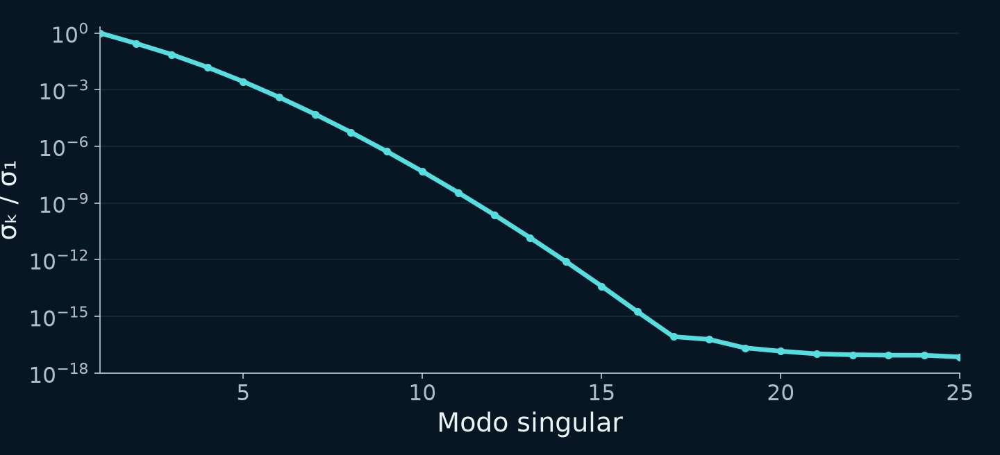

### Notas completas del ponente

Reference / consulta · 0 s

La explicación mínima del mal condicionamiento está en este núcleo: una matriz exponencial cuyas columnas son muy parecidas. Algunas combinaciones de pesos alteran muy poco la señal; al invertir, el ruido se amplifica en esas direcciones. En el ejemplo tenemos 25 medidas y 110 pesos, pero el problema no es solo contar incógnitas: los valores singulares decaen con rapidez. Aumentar la rejilla no añade información medida. Regularizar introduce una preferencia para escoger entre soluciones compatibles; ahora veremos qué coste tiene.

Fuentes:

Reproducible v5 ILT ambiguity and regularization simulations

[local-source: ilt_simulations.json]

ILT method-choice and appendix guidance

[local-source: ilt_teaching_guidance.json]

## 45. Cada algoritmo favorece una solución distinta

Apéndice oculto

### Texto de la diapositiva

45

Cada algoritmo favorece una solución distinta

Problema observado

Familia / ejemplos

Preferencia y riesgo

Señal aislada

Monoexp. / NNLS

Modelo mínimo / picos inestables sin regularizar

Distribución ancha

Tikhonov / MaxEnt / PALMA

Regularización / puede fusionar componentes

Pocos componentes

ITAMeD / L1 / VP / SCORE

Esparsidad u orden / modelo incorrecto

Señales solapadas

MF / TRAIn-MF / SILT

Estructura compartida / factores espurios

Comparar soluciones bajo el mismo b, ruido y preprocesado

Catálogo completo en el apéndice: usos, límites y disponibilidad. FISTA/ADMM/SVD son motores, no modelos físicos.

### Notas completas del ponente

Reference / consulta · 0 s

No elegimos por el nombre más moderno. Si esperamos una única difusión en una señal aislada, empezamos por el modelo monoexponencial. Si la pregunta es una distribución continua, métodos de suavizado, entropía o combinaciones como PALMA imponen preferencias distintas. Si esperamos pocas especies discretas, métodos dispersos o ajustes discretos piden justificar el número y la separación. Para relaciones entre frecuencias usamos rutas conjuntas. FISTA, ADMM y SVD son herramientas numéricas: no sustituyen por sí solas el modelo físico. El catálogo completo está en el apéndice para consultar cada uso y limitación. Sus registros incluyen métodos, rutas y componentes solapados; no son un conteo de algoritmos únicos ni una certificación experimental.

Fuentes:

Audited bilingual catalogue of local inversion methods and context families

[local-source: ilt_algorithm_catalog_bilingual.json]

ILT method-choice and appendix guidance

[local-source: ilt_teaching_guidance.json]
